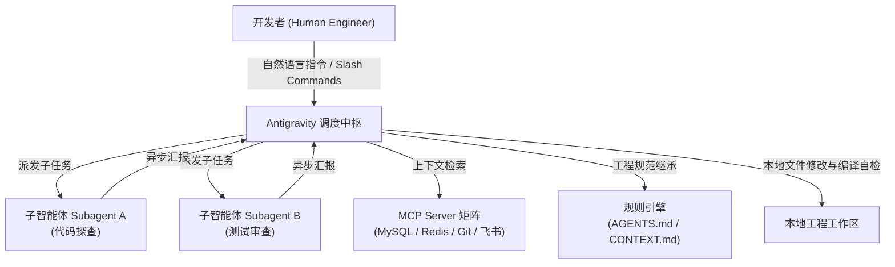

# Google Antigravity 架构全景与快速上手

| 属性 | 详情 |
| :--- | :--- |
| **文档类型** | 技术专题指南 |
| **当前状态** | 建设中 (Draft) |
| **作者** | Ateng |
| **创建日期** | 2026-09-28 |
| **关联系统/模块** | Ateng-AI / AI Agent / Google Antigravity |

---

## 1. 什么是 Google Antigravity

**Google Antigravity** 是面向下一代软件工程打造的先进 Agentic IDE 与多智能体协同引擎。它通过将模型能力深度嵌入开发者的本地文件系统、命令行与 IDE 视图中，实现了从**单点被动问答**向**自主结对编程 (Pair Programming)** 的范式转移。

---

## 2. 核心架构特性

- **多 Agent 树状派发 (Subagents)**：支持母体智能体在后台一键派发多个专门子代理，独立并发执行文档调研、架构设计与测试用例验证；
- **全栈 MCP 深度集成**：原生兼容 Model Context Protocol 协议，零门槛打通本地数据库、版本控制工具与私有服务；
- **反应式被动唤醒 (Reactive Wakeup)**：后台长任务运行无需轮询，命令执行完成或子代理产出结果时自动触发上下文恢复；
- **严密的代码保护与沙箱策略**：严格遵循开发者配置的两阶段提交铁律（禁止静默 commit/push），一切变更在本地透明可控。

---

## 3. 本模块章节导航

- 🚀 [环境安装与凭据配置](./install-and-config.md)
- 📋 [Rules / Skills 与工作流规范](./workflows-and-rules.md)
- 🤝 [子智能体编排与团队协同实战](./subagents-and-teamwork.md)
