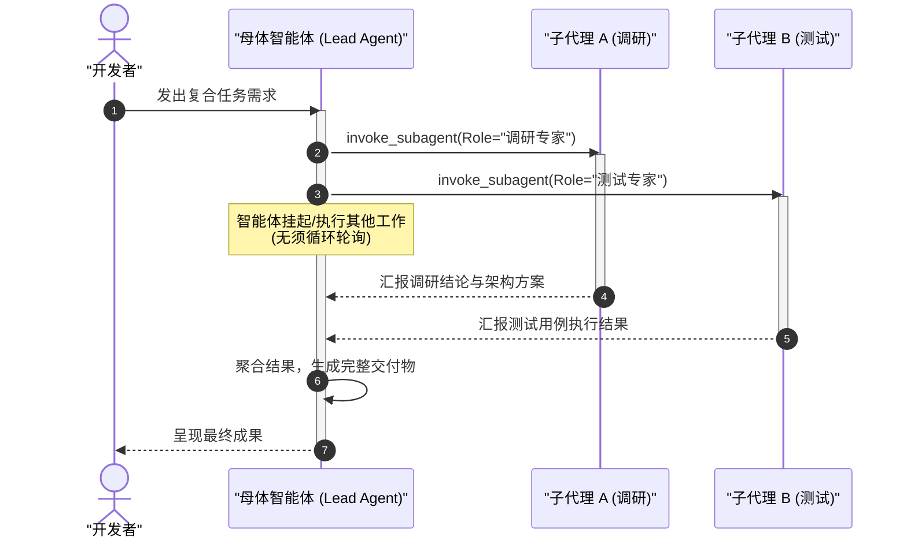

# Antigravity 子智能体编排与团队协同实战

| 属性 | 详情 |
| :--- | :--- |
| **文档类型** | 技术专题指南 |
| **当前状态** | 建设中 (Draft) |
| **作者** | Ateng |
| **创建日期** | 2026-09-28 |
| **关联系统/模块** | Ateng-AI / AI Agent / Google Antigravity |

---

## 1. 为什么需要多智能体协同 (Multi-Agent Teamwork)

单智能体在面对超大型代码库或复杂重构任务时，上下文窗口极易被大段代码探查与分析日志淹没，产生注意力漂移（Attention Drift）。

Antigravity 提供了**轻量级动态子智能体（Subagents）架构**：
- 母体智能体作为总指挥（Tech Lead），负责全局拆解任务树、控制交付节奏；
- 子智能体（Subagents）作为专业专家（如 Researcher、Reviewer、Tester），分别在隔离的上下文甚至隔离的 Worktree 分支中并行作业。

---

## 2. 子智能体调度模式

---

## 3. 反应式非阻塞通讯 (Reactive Messaging)

Antigravity 的事件中枢具备“反应式自动唤醒”机制：
- 智能体通过 `invoke_subagent` 或后台执行命令后，**不需要进行任何 `while` 轮询**；
- 当后台任务完成或子智能体发回消息时，系统会主动恢复母体智能体的执行链路，最大化节约 Token 与系统计算资源。
