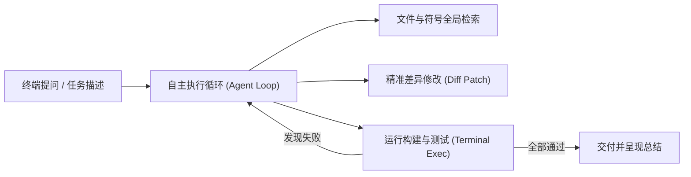

# Claude Code 架构全景与快速上手

| 属性 | 详情 |
| :--- | :--- |
| **文档类型** | 技术专题指南 |
| **当前状态** | 建设中 (Draft) |
| **作者** | Ateng |
| **创建日期** | 2026-09-28 |
| **关联系统/模块** | Ateng-AI / AI Agent / Claude Code |

---

## 1. 什么是 Claude Code

**Claude Code** 是 Anthropic 官方推出的终端原生自主编程智能体（Autonomous Coding Agent）。它具备跨目录巡检、自主执行 Shell 脚本、错误堆栈自动捕获与多轮自愈排错的核心能力。

---

## 2. 核心特性与工作方式

- **超大上下文感知**：基于 Claude 3.5 Sonnet / Opus 的超强逻辑推理能力，能一口气吞吐中大型项目的架构目录；
- **全自主自愈测试循环**：在执行代码修改后，主动执行 `pnpm test` 或 `pnpm build`，发现报错直接自主阅读错误堆栈并连续修正；
- **终端无感集成**：原生嵌入 Bash / Zsh / PowerShell 终端，与现有的 Git 和开发流水线零缝隙契合。

---

## 3. 本模块章节导航

- 📘 [架构全景与快速上手](./)
- 🛠️ [工作流规范与工程最佳实践](./best-practices.md)
