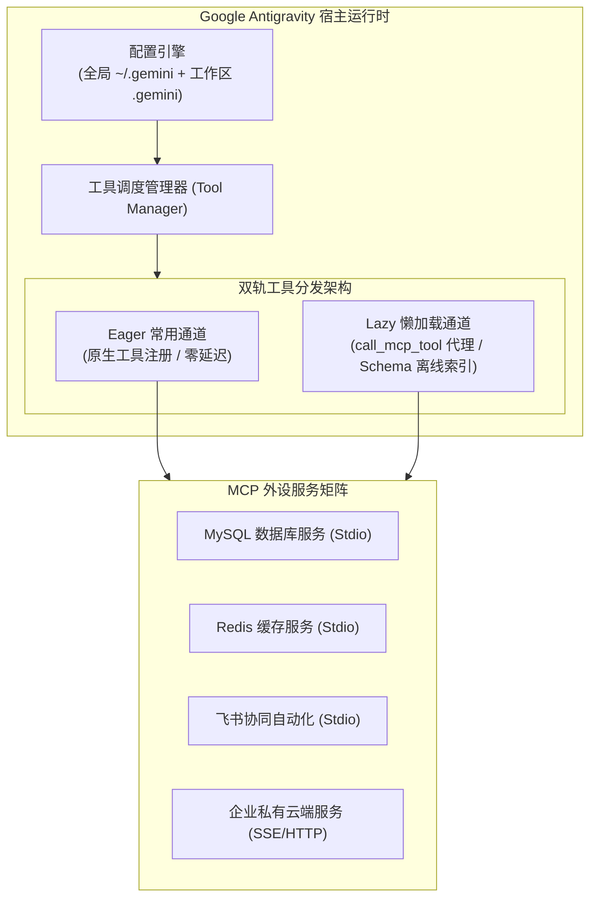
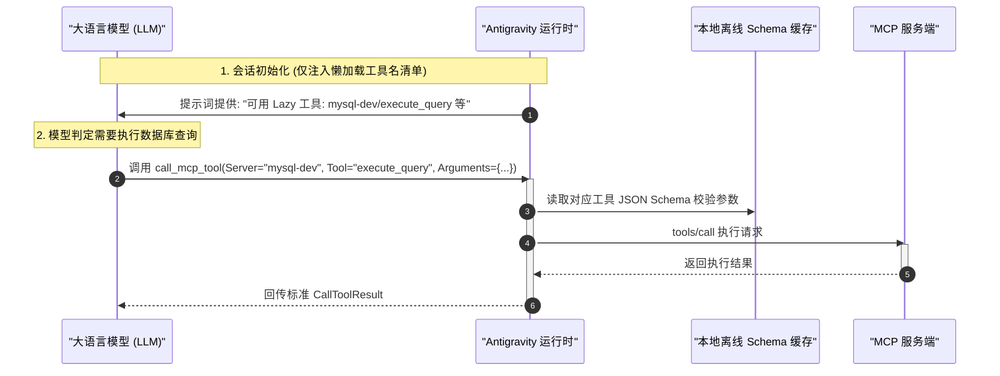

# Google Antigravity 原生 MCP 架构与上下文懒加载调优

| 属性 | 详情 |
| :--- | :--- |
| **文档类型** | 架构原理解析 / 客户端工程配置与调优 |
| **当前状态** | 已归档 (Accepted) |
| **作者** | Ateng |
| **创建日期** | 2026-09-28 |
| **关联系统/模块** | Ateng-Agent / Google Antigravity MCP Runtime |

---

## 1. Google Antigravity 中的 MCP 运行时架构

作为下一代面向多智能体协同研发的 Agentic IDE，**Google Antigravity** 将 Model Context Protocol (MCP) 作为其连通外部操作系统、开发工具链与私有数据源的基石通道。



### 1.1 双层分层配置拓扑 (Hierarchical Configuration)

Antigravity 采用“**全局默认 + 项目工作区覆盖**”的分层配置模型：

1. **全局配置层 (Global Tier)**：
   - 存储路径：`C:\Users\<username>\.gemini\antigravity\mcp_config.json`（Windows）或 `~/.gemini/antigravity/mcp_config.json`（Linux/macOS）。
   - 作用域：对当前宿主机上启动的所有 Antigravity 窗口与智能体会话生效。
   - 典型载荷：跨项目通用的个人开发外设，如本地 Git 客户端、个人只读 MySQL/Redis 调试实例、企业微信/飞书通知代理等。
2. **工作区私有配置层 (Workspace Tier)**：
   - 存储路径：`[ProjectRoot]/.gemini/mcp_config.json`。
   - 作用域：仅对当前项目工程工作区生效，具有最高优先级。
   - 典型载荷：针对该项目业务定制的专有 MCP Server、特定项目数据库连接串、私有 API 契约服务等。
3. **分层合并策略**：
   - 当两层配置同时存在时，Antigravity 会以工作区配置为主体进行深层属性合并（Deep Merge）。
   - 若出现同名服务定义（如全局和工作区都定义了 `mysql`），**工作区配置将彻底覆盖全局配置**，确保单工程环境隔离与上下文可移植性。

---

### 1.2 动态热重载机制 (Hot Reloading)

传统的命令行智能体通常在启动会话时单次加载 MCP 依赖，一旦修改配置或新增工具必须重启整个 IDE 会话。

Antigravity 内置了基于文件系统事件的 **配置观察者（File Watcher）**：
- 当开发者编辑保存 `mcp_config.json` 时，Antigravity 在后台毫秒级检测到变更。
- 自动向被修改或新增的服务发送 `initialize` 与 `tools/list` 报文完成重协商。
- 智能体在当前的活跃会话中**无需刷新窗口即可即时感知最新工具集**，极大提升了本地扩展开发与调试效率。

---

## 2. 突破上下文膨胀：Eager 与 Lazy 双轨懒加载机制

在真实的工程实践中，开发者往往会为智能体挂载大量外设（如 MySQL、Redis、飞书、Git、Apipost 等）。此时会引发严峻的**上下文膨胀危机（Context Bloat）**。

### 2.1 上下文膨胀与注意力稀释痛点

```
  传统全量注入 (System Prompt Stuffing):
  ┌──────────────────────────────────────────────────────────────┐
  │ 初始 System Prompt (含 10+ MCP Server，共 120 个工具定义)    │
  │ • 每个 Tool 携带数十行完整的 JSON Schema 字段校验契约        │
  │ • 消耗 Token：高达 18,000 ~ 30,000 Token / 单轮对话          │
  │ • 严重恶果：推理成本飙升 300%、注意力被海量无用参数稀释、    │
  │   复杂任务遵循度降低、容易触发模型上下文窗口硬限制          │
  └──────────────────────────────────────────────────────────────┘
```

为彻底解决该痛点，Antigravity 提出了 **Eager (急切常驻)** 与 **Lazy (懒加载按需索引)** 的双轨加载架构。

---

### 2.2 双轨加载机制深度解析

| 特性维度 | Eager Tools (急切模式) | Lazy Tools (懒加载模式) |
| :--- | :--- | :--- |
| **注册方式** | 作为 Native Tool 直接注入当前会话 | 仅在系统提示词中声明名称与概要，离线生成 Schema 索引 |
| **Token 消耗** | 完整 Schema 占用初始窗口（高消耗） | 仅占用极小行内列表，**节约 75%~85% 初始上下文** |
| **执行机制** | 模型直接发起原生工具调用 | 模型通过 `call_mcp_tool` 代理网关按需调度 |
| **调用延迟** | 0 额外开销，直接下发 | 首次调用会有轻微的动态 Schema 解析耗时 |
| **最佳适配工具** | 极高频基础设施（如 `run_command`、`view_file`） | 垂直业务类工具（如 `feishu_bitable`、`redis_stream`、`mysql_query`） |

#### 1. Lazy 工具在 Antigravity 中的工作流程



#### 2. 离线缓存与工具索引目录

Antigravity 会自动将扫描到的 Lazy 工具解析为结构化离线 JSON 索引文件，集中存放在应用数据目录中：
```text
C:\Users\admin\.gemini\antigravity\mcp\
├── mysql-dev\
│   ├── execute_query.json      <-- 预提取的入参 JSON Schema
│   └── describe_table.json
├── feishu\
│   ├── bitable_v1_record.json
│   └── docx_v1_block.json
└── redis-dev\
    └── hgetall.json
```

当模型发起代理调用时，宿主直接基于本地离线 Schema 完成参数合法性预检，无需向远程或子进程再次发起耗时的网络协商。

---

## 3. Antigravity 生产级配置模板与环境变量注入

以下是针对 Windows 与 Linux 双环境优化后的 `mcp_config.json` 规范配置模板：

```json
{
  "mcpServers": {
    "mysql-dev": {
      "command": "uvx",
      "args": [
        "--with",
        "mcp<2",
        "mcp-server-mysql"
      ],
      "env": {
        "MYSQL_HOST": "127.0.0.1",
        "MYSQL_PORT": "3306",
        "MYSQL_USER": "readonly_audit",
        "MYSQL_PASSWORD": "${MYSQL_READONLY_PWD}",
        "MYSQL_DATABASE": "app_db"
      }
    },
    "redis-dev": {
      "command": "npx",
      "args": [
        "-y",
        "@modelcontextprotocol/server-redis"
      ],
      "env": {
        "REDIS_URL": "redis://127.0.0.1:6379"
      }
    },
    "qq-email": {
      "command": "uv",
      "args": [
        "run",
        "d:/My/dev/Ateng-Agent/scripts/qq_email_server.py"
      ],
      "env": {
        "SMTP_AUTH_CODE": "${SMTP_AUTH_CODE}"
      }
    }
  }
}
```

> [!CAUTION] 凭据安全红线：零明文不变量 (Zero-Secret Invariant)
> 严禁在 `mcp_config.json` 中直接硬编码明文密码、API Token 或邮箱授权码！
> 必须使用 `${ENVIRONMENT_VARIABLE}` 动态插值语法，由宿主系统在拉起子进程时从安全环境变量或凭据管理器中动态注入，遵循 ADR-0003 治理红线。

---

## 4. 故障排查与运行期日志诊断

当 MCP 服务启动失败或工具调用异常时，可依据以下步骤定位根因：

### 4.1 日志文件与跟踪

Antigravity 会为每个 MCP Server 单独开辟审计日志：
- 日志路径：`C:\Users\<username>\.gemini\antigravity\logs\mcp\<server-name>.log`
- 关键排查项：
  1. **Exit Code 127 / File Not Found**：可执行文件（如 `uvx`、`npx`）未在系统 `PATH` 中，需填写可执行文件的绝对路径。
  2. **Exit Code 1 / SyntaxError**：Python 或 Node.js 脚本存在依赖缺失或代码语法错误，直接查看日志末尾的完整堆栈。
  3. **`-32700 Parse Error`**：服务端在 `stdout` 中打印了额外的 print/console.log 纯文本，干扰了 JSON-RPC 反序列化，应强制重定向至 `stderr`。

### 4.2 Windows 平台特化防御

1. **绝对路径反斜杠转义**：
   - 在 JSON 中书写 Windows 绝对路径必须双转义：`"d:\\tools\\uvx.exe"`，或推荐统一使用正斜杠格式：`"d:/tools/uvx.exe"`。
2. **终端代码页 UTF-8 锁定**：
   - 若服务包含中文字符，子进程启动前确保终端启用代码页 `65001`（`chcp 65001`），或在 Python 服务中显式指定标准输出编码 `sys.stdout.reconfigure(encoding='utf-8')`。
