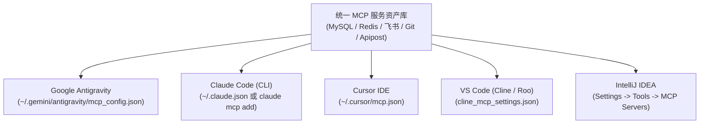

# 多宿主 MCP 客户端工程集成与跨端迁移矩阵

| 属性 | 详情 |
| :--- | :--- |
| **文档类型** | 跨端工程配置 / 客户端集成矩阵 |
| **当前状态** | 已归档 (Accepted) |
| **作者** | Ateng |
| **创建日期** | 2026-09-28 |
| **关联系统/模块** | Ateng-Agent / Multi-Host MCP Matrix |

---

## 1. 主流 AI 编程宿主客户端生态全景

随着 Model Context Protocol (MCP) 成为智能体扩展的开放工业标准，主流 AI 编程客户端（包括独立终端 CLI、AI 原生 IDE 与传统 IDE 插件体系）均已全面提供原生或插件级接入支持。



### 1.1 主流客户端能力与特征对比矩阵

| 客户端 (Host) | 宿主形态 | 配置文件定位 | 传输支持 | 工具免授权执行 (Auto Approve) | 环境变量自动展开 |
| :--- | :--- | :--- | :--- | :--- | :--- |
| **Google Antigravity** | Agentic IDE / CLI | `~/.gemini/antigravity/mcp_config.json` | Stdio / SSE | 支持精细化沙箱与白名单 | ✅ 支持 `${VAR}` 动态插值 |
| **Claude Code** | 终端自治 CLI | `~/.claude.json` (全局) / `claude.json` (项目) | Stdio / SSE | 支持 `-y` 全局放行或规则白名单 | ⚠️ 依赖系统环境变量 |
| **Cursor** | AI 原生 IDE | `~/.cursor/mcp.json` / 项目级 `.cursor/mcp.json` | Stdio / SSE | 需在设置界面逐个手动勾选开启 | ⚠️ 仅静态字符串 |
| **VS Code (Cline/Roo)** | IDE 插件体系 | `cline_mcp_settings.json` | Stdio / SSE | 支持按工具单独勾选 `alwaysAllow` | ✅ 基础支持 |
| **IntelliJ IDEA** | 传统工程 IDE | 插件专属界面配置或 `settings.json` | Stdio / 本地网络 | 依赖 JetBrains 权限确认弹窗 | ⚠️ 依赖 IDE 启动环境变量 |

---

## 2. 跨端核心配置转换与语法对照

尽管各宿主客户端在交互 UI 上存在差异，但底层均遵循由 Anthropic 牵头制定的 `mcpServers` JSON Schema 规范。

### 2.1 通用配置结构映射表

| 字段名称 | 类型 | 适用通道 | 语法功能与跨端差异说明 |
| :--- | :--- | :--- | :--- |
| `command` | `string` | Stdio | 可执行程序路径。在 Windows 下若包含空格必须使用全路径或带引号。 |
| `args` | `string[]` | Stdio | 传递给子进程的参数数组。注意不要把多个空格分隔的参数合并在单个元素中。 |
| `env` | `object` | Stdio | 环境变量字典。所有 Key 和 Value 必须为字符串类型。 |
| `url` / `serverUrl` | `string` | SSE / HTTP | 远程服务端访问入口。Cursor / Antigravity 使用 `url`，部分插件使用 `serverUrl`。 |
| `headers` | `object` | SSE / HTTP | 跨域鉴权请求头（如 `{"Authorization": "Bearer YOUR_TOKEN"}`）。 |
| `disabled` | `boolean` | 通用 | 临时停用开关。避免某项损坏的外设拖慢客户端初始化生命周期。 |

---

### 2.2 主流客户端实操接入配置

#### 1. Claude Code 接入配置
Claude Code 既支持 CLI 命令行指令一键挂载，也支持直接编辑配置文件：

```bash
# 方式 A：通过命令行交互添加本地 Stdio 服务
claude mcp add mysql-dev -- uvx --with mcp<2 mcp-server-mysql

# 方式 B：添加远程流式 SSE 服务
claude mcp add remote-docs https://docs-mcp.example.com/sse
```

直接编辑全局配置文件 `~/.claude.json`：
```json
{
  "mcpServers": {
    "mysql-dev": {
      "command": "uvx",
      "args": ["--with", "mcp<2", "mcp-server-mysql"],
      "env": {
        "MYSQL_HOST": "127.0.0.1",
        "MYSQL_PORT": "3306",
        "MYSQL_USER": "readonly_user",
        "MYSQL_PASSWORD": "${MYSQL_READONLY_PWD}",
        "MYSQL_DATABASE": "app_db"
      }
    }
  }
}
```

#### 2. Cursor IDE 接入配置
在 Cursor 中依次打开 **Settings $\to$ Features $\to$ MCP $\to$ Add New MCP Server**，或在项目根目录下创建 `.cursor/mcp.json`：

```json
{
  "mcpServers": {
    "redis-cache": {
      "command": "npx",
      "args": ["-y", "@modelcontextprotocol/server-redis"],
      "env": {
        "REDIS_URL": "redis://127.0.0.1:6379"
      }
    }
  }
}
```

#### 3. VS Code (Cline 插件) 接入配置
在 Cline 侧边栏点击齿轮图标进入 MCP 设置，编辑 `cline_mcp_settings.json`：

```json
{
  "mcpServers": {
    "feishu-automation": {
      "command": "python",
      "args": ["-m", "feishu_mcp_server"],
      "env": {
        "FEISHU_APP_ID": "cli_xxxxxxxxxxxx",
        "FEISHU_APP_SECRET": "${FEISHU_APP_SECRET}"
      },
      "alwaysAllow": [
        "docx_v1_document_rawContent",
        "bitable_v1_appTable_list"
      ]
    }
  }
}
```

#### 4. IntelliJ IDEA 接入配置
在 IntelliJ IDEA 中安装官方或社区推荐的 **MCP Server Integration** 插件，在 **Settings $\to$ Tools $\to$ Model Context Protocol** 中导入上述 JSON 配置，IDEA 会在启动时自动维护与子进程的 Stdio 管道连接。

---

## 3. 跨平台与跨端避坑指南 (Common Gotchas)

### 3.1 Windows 平台可执行文件与反斜杠陷阱

#### 1. 为什么 `npx` / `uvx` 在终端能运行，在 IDE 报找不到文件？
- **根因分析**：Windows 操作系统上，通过 npm 或 Python 安装的全局 CLI 实际为 `.cmd` 或 `.bat` 批处理脚本（如 `npx.cmd`、`uvx.exe`）。IDE 在拉起非 Shell 子进程时不会自动追加 `.cmd` 后缀。
- **最佳修复实践**：
  ```json
  // 推荐：显式声明 .cmd 后缀或绝对路径
  "command": "C:/Program Files/nodejs/npx.cmd"
  ```

#### 2. 路径转义排坑
- **反斜杠必须转义**：`"C:\\Users\\admin\\server.py"`；
- **跨平台通用写法**：所有客户端均完美兼容正斜杠，强烈推荐统一书写为 `"C:/Users/admin/server.py"`。

---

### 3.2 严禁标准输出污染 (Stdout Pollution)

在开发基于 Python 或 Node.js 的自定义 MCP Server 时，许多开发者习惯随手使用 `print()` 或 `console.log()` 输出调试信息。

> [!CAUTION] 核心工程禁忌：标准输出污染
> 在 Stdio 模式下，**`stdout` 是 JSON-RPC 2.0 通信的专有物理通道**！
> 任何向 `stdout` 输出的非 JSON 文本（如 `"Connecting to database..."`）都会导致客户端报文解析器崩溃，报 `-32700 Parse Error`。
> 所有调试与审计日志必须重定向输出至 **`stderr`**：
> - Python：`print("Debug log", file=sys.stderr)` 或使用 logging 库；
> - Node.js：`console.error("Debug log")`。

---

### 3.3 依赖版本锁定与破坏性升级防护

MCP 官方标准与三方 SDK 目前处于高速迭代期。配置 `uvx` 或 `npx` 时若不限制版本，每次启动拉取最新版本极易遭遇 Breaking Changes。

**防御准则**：
```json
// 推荐防御方案：使用精确版本或语义化次版本区间
"args": [
  "--with", "mcp>=1.2.0,<2.0.0",
  "mcp-server-mysql"
]
```

---

## 4. 凭据安全注入与企业级隔离规范

遵循项目规范与 [`docs/adr/0003-mcp-tool-sandboxing-and-write-guard.md`](../../adr/0003-mcp-tool-sandboxing-and-write-guard.md) 中的**零明文不变量 (Zero-Secret Invariant)**：

1. **模板与密文分离**：
   - 纳入版本控制（Git）的代码库中，仅允许提交占位符模板文件：`.cursor/mcp.json.example` 或 `mcp_config.example.json`；
   - 真实含有系统连接凭据的 `mcp.json` 必须加入 `.gitignore`。
2. **环境变量抽象**：
   - 使用本地操作系统环境变量或企业密钥管理中枢（Vault / 1Password CLI）注入机密：
     ```bash
     export MYSQL_READONLY_PWD="YOUR_SECURE_PASSWORD"
     ```
   - 配置文件内只引用 `${MYSQL_READONLY_PWD}`，严禁直接硬编码真实密码入库。
