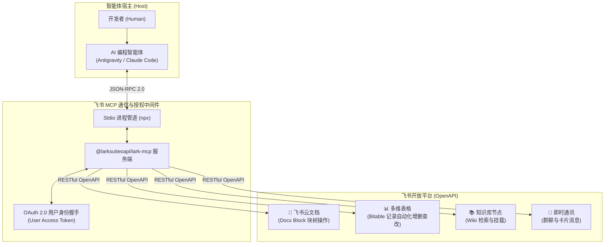

# 飞书云文档与多维表格 MCP 自动化实战

| 属性 | 详情 |
| :--- | :--- |
| **文档类型** | 办公协同外设 / 开放平台集成指南 |
| **当前状态** | 已归档 (Accepted) |
| **作者** | Ateng |
| **创建日期** | 2026-09-28 |
| **关联系统/模块** | Ateng-Agent / MCP Collaboration / Feishu |

---

## 1. 为什么智能体需要打通飞书协同中枢

在现代产研团队中，飞书不仅是即时通讯软件，更是承载核心知识资产与项目管理的工作台：
- **技术方案与规范** 托管在**飞书云文档 (Docx)** 与**企业知识库 (Wiki)**；
- **需求迭代、Bug 追踪与自动化测试报告** 沉淀在**飞书多维表格 (Bitable)**；
- **研发动态、故障告警与协作评审** 在**研发群聊 (IM)** 中高频流转。

若智能体仅局限于本地文本文件，研发人员就必须充当“人工搬运工”：把本地 Markdown 复制到飞书排版、把测试通过率手填到多维表格、在群里手动艾特通知。

通过接入飞书官方推出的 `@larksuiteoapi/lark-mcp`，智能体能够以受控的标准协议直接接管上述协同流程：



---

## 2. 飞书开放平台应用准备与权限准入

在配置 MCP 之前，需要先在飞书开放平台注册企业自建应用，并获取合法的凭据。

### 2.1 创建企业自建应用

1. 登录 [飞书开放平台开发者后台](https://open.feishu.cn/app/)；
2. 点击 **“创建自建应用”**，填写应用名称（如 `Ateng-Agent-Assistant`）与描述；
3. 进入 **“凭证与基础信息”** 页面，获取应用的 **App ID**（如 `cli_a1b2c3d4e5...`）与 **App Secret**。

### 2.2 申请最小权限集 (Permissions)

为了保障企业资产安全，严禁盲目开通全量通讯录或全租户数据权限，仅需在 **“权限管理”** 中勾选研发所需的最小权限集合：

| 权限名称 | 权限 Key | 核心用途 |
| :--- | :--- | :--- |
| **查看、编辑云文档** | `docx:document` / `docx:document:readonly` | 获取文档块结构、追加文本/代码块、局部修改文档 |
| **查看、编辑多维表格** | `bitable:app` / `bitable:app:readonly` | 查询多维表格结构、搜索与写入测试工单记录 |
| **获取群列表与群信息** | `im:chat:readonly` | 获取智能体所在的研发群聊清单以备协同推送 |
| **搜索与查看知识库** | `wiki:wiki:readonly` | 检索企业既有知识库空间与文档节点 |

### 2.3 选型心智：User Access Token vs Tenant Access Token

`@larksuiteoapi/lark-mcp` 支持两种 Token 运行模式：
- **`tenant_access_token` (应用身份)**：代表机器人应用本身操作。缺点是无法自动继承你在飞书里拥有的私人文档或未公开团队空间的读写权限；
- **`user_access_token` (推荐 - 开发者用户身份)**：通过浏览器 OAuth 扫码一次授权，智能体完全代表当前开发者的飞书身份进行操作。能够无缝读写你可见的所有云文档与知识库，权限边界与你个人保持 100% 一致。

---

## 3. 生产级配置与参数解构

### 3.1 客户端配置模板 (`mcp_config.json`)

在 `mcp_config.json` 中添加如下服务定义。注意敏感信息通过环境变量隔离，工具集通过 `-t` 精简裁剪以维护上下文卫生：

```json
{
  "mcpServers": {
    "feishu": {
      "command": "C:\\Program Files\\nodejs\\npx.cmd",
      "args": [
        "-y",
        "@larksuiteoapi/lark-mcp",
        "mcp",
        "-a",
        "${LARK_APP_ID}",
        "-s",
        "${LARK_APP_SECRET}",
        "-l",
        "zh",
        "--oauth",
        "--token-mode",
        "user_access_token",
        "-t",
        "preset.default,docx.v1.documentBlock.list,docx.v1.documentBlock.get,docx.v1.documentBlock.patch,docx.v1.documentBlock.batchUpdate,docx.v1.documentBlockChildren.create,docx.v1.documentBlockChildren.get,docx.v1.documentBlockChildren.batchDelete"
      ]
    }
  }
}
```

### 3.2 启动参数关键释义

- `-a` / `-s`：传入飞书自建应用的 App ID 与 App Secret；
- `-l zh`：指定输出语言为中文，确保工具报错与字段描述符合地道中文习惯；
- `--oauth` 与 `--token-mode user_access_token`：开启本地 OAuth 浏览器重定向授权，启动时会自动在浏览器唤醒飞书授权确认页；
- `-t` (**Tools 白名单剪枝**)：
  - 飞书开放平台 API 极其庞大（上百个端点），若全量加载将占用超过 30,000 Tokens！
  - 通过 `-t` 显式限定仅暴露云文档核心工具与多维表格工具，能直接将上下文损耗削减 85% 以上，保障模型推理专注度。

---

## 4. 飞书云文档 (Docx v1) 块级实战

飞书现代云文档不同于传统扁平文本，它由**块（Block 树）**构成。整篇文档由一个 `page` 根块作为宿主，段落、标题、代码块、列表和表格都是其子节点。

### 4.1 遍历文档结构：`docx_v1_documentBlock_list`

在修改或追加文档之前，智能体首先需要获取文档的 Block 拓扑：

```json
// 调用入参
{
  "document_id": "doxcnABC123XYZ456",
  "page_size": 50
}

// 返回数据节选 (Block 节点列表)
{
  "items": [
    { "block_id": "doxcnRoot", "block_type": 1, "parent_id": "" },
    { "block_id": "doxcnHeading1", "block_type": 3, "parent_id": "doxcnRoot", "heading1": { "elements": [{ "text_run": { "content": "1. 架构方案总览" } }] } },
    { "block_id": "doxcnPara1", "block_type": 2, "parent_id": "doxcnRoot", "text": { "elements": [{ "text_run": { "content": "本文档由智能体自动化同步发布..." } }] } }
  ]
}
```

### 4.2 追加富文本与代码块：`docx_v1_documentBlockChildren_create`

在指定根节点或段落之后，批量创建子节点。例如智能体将本地刚写好的 RFC 章节直接写入飞书：

```json
// 调用入参：向文档根节点追加二级标题与代码块
{
  "document_id": "doxcnABC123XYZ456",
  "block_id": "doxcnRoot",
  "children": [
    {
      "block_type": 4,
      "heading2": {
        "elements": [
          { "text_run": { "content": "核心微服务接口设计" } }
        ]
      }
    },
    {
      "block_type": 14,
      "code": {
        "style": { "language": 5 }, // 5 代表 Java
        "elements": [
          { "text_run": { "content": "public record UserDTO(Long id, String username) {}" } }
        ]
      }
    }
  ],
  "index": -1 // -1 代表追加至末尾
}
```

### 4.3 高精度局部修补：`docx_v1_documentBlock_patch`

若只需修改某一特定段落的描述，直接调用 `patch`，避免重写整篇文档导致协作者光标跳动或引发内容冲突：

```json
{
  "document_id": "doxcnABC123XYZ456",
  "block_id": "doxcnPara1",
  "update_text": {
    "elements": [
      { "text_run": { "content": "【已更新】方案已于 2026-09-28 通过架构委员会评审。" } }
    ]
  }
}
```

---

## 5. 飞书多维表格 (Bitable v1) 自动化流转

多维表格常用于项目管理、缺陷跟进与自动化测试看板，智能体可作为“自动化助理”实时向表中同步数据。

### 5.1 结构化多条件检索：`bitable_v1_appTableRecord_search`

检索指定负责人的未完成缺陷：

```json
// 调用入参
{
  "app_token": "bascnAppToken789",
  "table_id": "tblTableId123",
  "filter": {
    "conjunction": "and",
    "conditions": [
      { "field_name": "缺陷状态", "operator": "isNot", "value": ["已解决"] },
      { "field_name": "处理人", "operator": "contains", "value": ["Ateng"] }
    ]
  },
  "page_size": 20
}
```

### 5.2 自动归档测试报告与工单：`bitable_v1_appTableRecord_create`

智能体在本地完成单元测试自检后，直接将测试结论落盘至多维表格：

```json
// 调用入参
{
  "app_token": "bascnAppToken789",
  "table_id": "tblTableId123",
  "fields": {
    "需求名称": "订单服务幂等性重构",
    "执行分支": "feature/idempotent-order",
    "单测覆盖率": "89.4%",
    "断言通过数": 42,
    "归档状态": "通过",
    "执行人": "Antigravity Agent"
  }
}
```

---

## 6. 协作安全准则与合规围栏 (贯彻 ADR-0003)

飞书直连企业办公中枢，任何不当操作都会直接对团队造成外部干扰或产生信息安全隐患。使用中必须坚守以下三条纪律：

```
                 ┌──────────────────────────────────────────────┐
                 │          飞书 MCP 协同执行安全合规防线       │
                 └──────────────────────┬───────────────────────┘
                                        │
         ┌──────────────────────────────┼──────────────────────────────┐
         ▼                              ▼                              ▼
 ┌────────────────────────┐    ┌────────────────────────┐    ┌────────────────────────┐
 │   第 1 道：写入前备份   │    │   第 2 道：严禁批量删块│    │   第 3 道：消息外发确认│
 ├────────────────────────┤    ├────────────────────────┤    ├────────────────────────┤
 │ • 修改存量云文档前，先 │    │ • 严禁未确认批量执行   │    │ • 涉及向公共大群发送   │
 │   读取并留存原 Block 快│    │   documentBlockChildren│    │   通知时，必须向开发者 │
 │   照以备误删回滚       │    │   _batchDelete 清空内容│    │   出示完整内容预览     │
 └────────────────────────┘    └────────────────────────┘    └────────────────────────┘
```

> [!CAUTION] 批量删除保护
> 智能体严禁在未经人类二次确认的前提下调用 `documentBlockChildren_batchDelete` 清空整个章节。在需要大幅度重写文档时，推荐先“追加新章节”，再提示人类开发者审查后手动删除旧章节。

---

## 7. 常见故障排障清单 (FAQ)

| 报错信息 / 现象 | 根因定位 | 处置方案 |
| :--- | :--- | :--- |
| **启动时终端卡住，无响应** | 正在等待用户完成 OAuth 网页授权扫码 | 检查浏览器是否已弹出 `http://127.0.0.1:...` 授权页面，完成授权后终端将恢复响应 |
| **`code: 99991663` 或 `99991664`** | 飞书开放平台应用未申请对应权限 | 登录开放平台开发者后台，在“权限管理”中补充开通缺失权限，并发布应用版本 |
| **`document_id not found`** | 传入的文档 ID 不正确，或用户没有该文档查看权限 | 检查文档 URL，例如 `https://company.feishu.cn/docx/doxcnABC...`，`doxcnABC...` 才是真实的 `document_id` |
| **Block children create index 超限** | 传入的插入位置索引超出当前块已有的子块总数 | 若需追加到末尾，统一将 `index` 设置为 `-1` |
| **Token 过期失效** | `user_access_token` 生命周期结束 | Lark MCP 内部集成了 Refresh Token 自动换发机制；若持续报错，删除临时授权缓存重新走一次浏览器登录 |

---

## 8. 结语与相关阅读

- 🔙 返回模块导航：[🤝 协同办公与生产力扩展](./index.md)
- ➡️ 下一篇：[02. 异步通知与轻量消息外设：QQ 邮箱 FastMCP 研发指南](./02-fastmcp-qq-email-service.md)
- 🛡️ 安全基线遵从：[`docs/adr/0003-mcp-tool-sandboxing-and-write-guard.md`](../../adr/0003-mcp-tool-sandboxing-and-write-guard.md)
