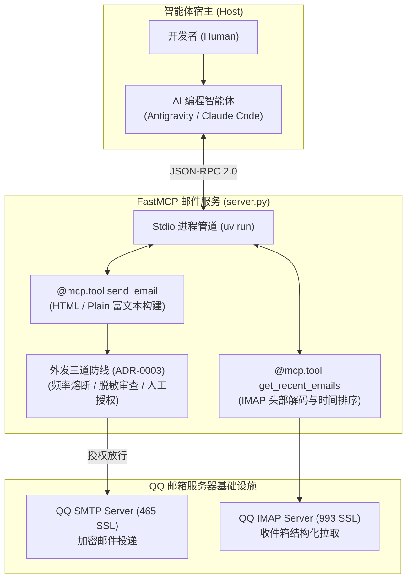

# QQ 邮箱 FastMCP 研发指南：轻量邮件推送与外发三道防线

| 属性 | 详情 |
| :--- | :--- |
| **文档类型** | 办公协同外设 / 轻量消息集成指南 |
| **当前状态** | 已归档 (Accepted) |
| **作者** | Ateng |
| **创建日期** | 2026-09-28 |
| **关联系统/模块** | Ateng-Agent / MCP Collaboration / QQ Email |

---

## 1. 为什么智能体需要轻量邮件外设

在协同办公领域，企业级 IM（如飞书、企业微信、钉钉）适合团队内部即时交互，但存在**企业租户隔离、自建应用审核门槛高、跨企业外部用户无法触达**的限制。

相比之下，**电子邮件 (Email)** 具备跨平台、跨组织、异步持久化的天然优势。当为智能体装配 QQ 邮箱外设时，能够解锁多项极轻量的工程能力：

- **长任务离线通知与巡检日报**：智能体执行耗时的大规模代码重构、全量静态编译或夜间压测后，将格式精美的 HTML 总结简报投递至开发者邮箱；
- **构建告警与故障通报**：CI/CD 编译失败或健康检查超时，智能体自动提取关键堆栈并发送邮件预警；
- **验证码拉取与自动化登录打通**：通过 IMAP 协议自动读取最新系统验证码，实现外部服务免人工打扰的自动化联调。



---

## 2. QQ 邮箱开通与专用授权码获取

QQ 邮箱出于账户安全考虑，严禁直接使用 QQ 登录密码进行 SMTP/IMAP 鉴权，必须生成专属的 **16 位授权码**。

### 2.1 开启服务与生成授权码

1. 打开浏览器登录 [QQ 邮箱网页版](https://mail.qq.com/)；
2. 点击顶部 **“设置”** -> 进入 **“账户”** 选项卡；
3. 向下滚动至 **“POP3/IMAP/SMTP/Exchange/CardDAV/CalDAV 服务”** 区域；
4. 开启 **“POP3/SMTP 服务”** 与 **“IMAP/SMTP 服务”**；
5. 根据页面安全指引（发送短信验证），系统将生成一段 16 位的独立字母授权码（如 `abcdefghijklmnop`）。

> [!TIP] 授权码安全特性
> 授权码仅用于特定脚本通信，具有独立吊销权。若在任何情况下怀疑凭据泄漏，只需在 QQ 邮箱后台点击“停用服务”或“重新生成”，旧授权码将立即全量失效，无需修改 QQ 主密码。

---

## 3. PEP 723 规范单文件服务架构解构

通过现代 Python 工具链 `uv` 支持的 **PEP 723 (Inline Script Metadata)** 规范，我们可以编写出完全自包含的单文件 MCP 服务端。任何机器无需提前配置虚拟环境，一条命令即可启动：

### 3.1 完整源码范式 (`server.py`)

```python
# -*- coding: utf-8 -*-
# /// script
# requires-python = ">=3.10"
# dependencies = [
#     "mcp<2",
# ]
# ///
"""
QQ 邮箱 FastMCP 服务端
提供邮件发送、未读拉取与关键词搜索功能

@author Ateng
@since 2026-09-28
"""

import os
import smtplib
import imaplib
import email
from email.mime.text import MIMEText
from email.header import Header, decode_header
from email.utils import formataddr
from mcp.server.fastmcp import FastMCP

# 1. 初始化 FastMCP 服务中枢
mcp = FastMCP("qq-email-service")

# 2. 邮箱协议网关常量
SMTP_SERVER = "smtp.qq.com"
SMTP_PORT = 465
IMAP_SERVER = "imap.qq.com"
IMAP_PORT = 993

# 3. 环境变量注入 (严格贯彻 ADR-0003 凭据卫生)
USER_EMAIL = os.getenv("QQ_EMAIL_USER", "your_account@qq.com")
AUTH_CODE = os.getenv("QQ_EMAIL_AUTH_CODE", "your_auth_code_here")


def _decode_header_str(header_val: str) -> str:
    """对邮件标题与发件人进行跨字符集解码防御"""
    if not header_val:
        return ""
    decoded_parts = decode_header(header_val)
    result = []
    for content, charset in decoded_parts:
        if isinstance(content, bytes):
            result.append(content.decode(charset or "utf-8", errors="ignore"))
        else:
            result.append(str(content))
    return "".join(result)


@mcp.tool()
def send_email(to: str, subject: str, content: str, is_html: bool = True) -> str:
    """
    通过 QQ 邮箱发送一封邮件给指定收件人
    
    :param to: 收件人邮箱地址（例如 test@example.com）
    :param subject: 邮件主题
    :param content: 邮件正文内容（支持纯文本或 HTML 富文本）
    :param is_html: 是否为 HTML 格式内容（默认为 True）
    :return: 发送状态描述信息
    """
    try:
        msg_type = "html" if is_html else "plain"
        message = MIMEText(content, msg_type, "utf-8")
        message["From"] = formataddr((Header("Antigravity 研发助理", "utf-8").encode(), USER_EMAIL))
        message["To"] = formataddr((Header("收件人", "utf-8").encode(), to))
        message["Subject"] = Header(subject, "utf-8")

        # 建立 SSL 加密隧道并投递
        server = smtplib.SMTP_SSL(SMTP_SERVER, SMTP_PORT)
        server.login(USER_EMAIL, AUTH_CODE)
        server.sendmail(USER_EMAIL, [to], message.as_string())
        server.quit()
        return f"邮件已成功投递至 {to}，主题为：{subject}"
    except Exception as e:
        return f"发送邮件失败，原因: {str(e)}"


@mcp.tool()
def get_recent_emails(count: int = 5) -> str:
    """
    获取收件箱中最近的未读/已读邮件列表及摘要
    
    :param count: 获取邮件的数量（默认为 5 封，最大 20 封）
    :return: 格式化后的最近邮件列表
    """
    try:
        # 上下文卫生保护：限制拉取条数
        count = min(max(count, 1), 20)

        mail = imaplib.IMAP4_SSL(IMAP_SERVER, IMAP_PORT)
        mail.login(USER_EMAIL, AUTH_CODE)
        mail.select("INBOX")

        status, data = mail.search(None, "ALL")
        if status != "OK" or not data or not data[0]:
            mail.logout()
            return "收件箱中暂未找到邮件。"

        email_ids = data[0].split()
        recent_ids = email_ids[-count:]
        recent_ids.reverse()

        result = []
        for eid in recent_ids:
            res, msg_data = mail.fetch(eid, "(RFC822.HEADER)")
            for response_part in msg_data:
                if isinstance(response_part, tuple):
                    msg = email.message_from_bytes(response_part[1])
                    subject = _decode_header_str(msg.get("Subject", "无主题"))
                    sender = _decode_header_str(msg.get("From", "未知发件人"))
                    date = msg.get("Date", "未知时间")
                    result.append(f"- 📨 **主题**: {subject}\n  👤 **发件人**: {sender}\n  🕒 **时间**: {date}")

        mail.logout()
        return f"成功获取收件箱最近 {len(result)} 封邮件：\n\n" + "\n\n".join(result)
    except Exception as e:
        return f"拉取收件箱失败，原因: {str(e)}"


if __name__ == "__main__":
    mcp.run()
```

---

## 4. 客户端配置与挂载实战

在 `mcp_config.json` 中，通过 `uv.exe` 调用上述脚本：

```json
{
  "mcpServers": {
    "qq-email": {
      "command": "C:\\Users\\admin\\.local\\bin\\uv.exe",
      "args": [
        "run",
        "--with",
        "mcp<2",
        "C:\\Users\\admin\\.gemini\\servers\\qq-email\\server.py"
      ],
      "env": {
        "QQ_EMAIL_USER": "your_account@qq.com",
        "QQ_EMAIL_AUTH_CODE": "${QQ_EMAIL_AUTH_CODE}"
      }
    }
  }
}
```

> [!NOTE] uv run 自动依赖解析
> 启动时，`uv` 会自动读取脚本顶部的 `# /// script` 元数据块，自动安装并缓存 `mcp<2` 运行时，彻底摆脱了传统 Python 复杂的 `virtualenv` 或 `requirements.txt` 流程。

---

## 5. 协同外发三重安全防线 (贯彻 ADR-0003)

发信动作会直接产生对外影响，甚至可能将机密代码或未经授权的结论扩散至外网。使用中必须坚决贯彻以下三道安全防线：

```
                    ┌──────────────────────────────────────────────┐
                    │          邮件外发三重安全围栏模型            │
                    └──────────────────────────────────────────────┘
                                           │
         ┌─────────────────────────────────┼─────────────────────────────────┐
         ▼                                 ▼                                 ▼
 ┌────────────────────────┐       ┌────────────────────────┐       ┌────────────────────────┐
 │   第 1 道：频率熔断门   │       │   第 2 道：脱敏审查门   │       │   第 3 道：人工确认门   │
 ├────────────────────────┤       ├────────────────────────┤       ├────────────────────────┤
 │ • 单会话限发 <= 3 封   │       │ • 敏感词正则扫描拦截   │       │ • 强制弹出外发预览卡片 │
 │ • 杜绝循环推理狂发邮件 │       │ • 拦截 sk- Key 与密码  │       │ • 人类明确同意后才发信 │
 └────────────────────────┘       └────────────────────────┘       └────────────────────────┘
```

1. **第 1 道：频率熔断门**：
   - 智能体在单个任务执行周期内，发信次数不得超过 3 次，从源头上遏制因为模型陷入循环推理（Loop）而引发的邮件轰炸；
2. **第 2 道：脱敏审查门**：
   - 严禁在正文中携带明文连接串、云厂商 AccessKey、未脱敏手机号或用户密码；
3. **第 3 道：人工确认门 (Human-in-the-Loop)**：
   - 在触发 `send_email` 工具前，智能体必须在会话中完整呈现以下核验卡片并等待开发者授权：
     ```markdown
     > [!IMPORTANT] 拟外发邮件确认
     > - **收件人**：`developer@example.com`
     > - **邮件主题**：`【构建通知】订单模块单元测试覆盖率报告 (89.4%)`
     > - **内容摘要**：42 个测试用例全部通过，耗时 3.2s
     > 
     > 请确认是否允许投递此邮件？(y/n)
     ```

---

## 6. 常见故障排障清单 (FAQ)

| 报错现象 | 根因分析 | 解决建议 |
| :--- | :--- | :--- |
| **`535 Error: authentication failed`** | 1. 误用了 QQ 主密码而非 16 位授权码<br>2. 授权码复制时混入了首尾多余空格 | 检查并重新在 QQ 邮箱后台生成 16 位纯英文字符串授权码 |
| **`ssl.SSLError: certificate verify failed`** | 本地网络开启了抓包代理工具导致根证书不信任 | 暂时关闭抓包代理，或在操作系统中更新 Python 的 `certifi` CA 证书库 |
| **外部邮箱收件箱未见邮件** | 被收件方邮件服务商误判为垃圾邮件 | 检查收件人的“垃圾箱/订阅邮件”分类，邮件主题避免使用单一生硬的测试敏感字眼 |
| **中文主题乱码显示为 `???`** | 编码未采用标准 RFC2047 MIME 规范 | 确保发信端统一使用 `Header(subject, "utf-8")` 进行显式编码 |

---

## 7. 结语与相关阅读

- 🔙 返回模块导航：[🤝 协同办公与生产力扩展](./index.md)
- ⬅️ 上一篇：[01. 飞书云文档与多维表格 MCP 自动化实战](./01-feishu-docx-and-bitable-automation.md)
- 🛡️ 安全基线遵从：[`docs/adr/0003-mcp-tool-sandboxing-and-write-guard.md`](../../adr/0003-mcp-tool-sandboxing-and-write-guard.md)
