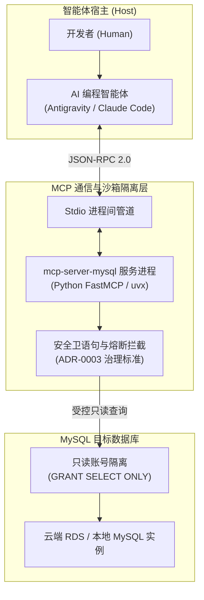

# MySQL MCP 深度实战：只读接入、表结构逆向与慢查询熔断防护

| 属性 | 详情 |
| :--- | :--- |
| **文档类型** | 存储层外设接入 / 关系型数据库实战 |
| **当前状态** | 已归档 (Accepted) |
| **作者** | Ateng |
| **创建日期** | 2026-09-28 |
| **关联系统/模块** | Ateng-Agent / MCP Database / MySQL |

---

## 1. 为什么智能体需要深度集成 MySQL

在传统由人工驱动的软件研发模式中，开发者经常需要在 IDE 与各类数据库客户端（如 Navicat、DataGrip、DBeaver）之间频繁切换窗口：查字段类型、拷 DDL 语句、写测试数据桩、核验业务流数据。

在智能体（Coding Agent）深度参与结对编程后，通过 Model Context Protocol (MCP) 赋予其**受控的数据库直连与语义探查能力**，可以带来多项质的飞跃：

1. **精准的代码生成与逆向建模**：智能体直接调用 `describe_table` 探查数据库真实物理表结构（包含精准的字段类型、字符长度、主键自增与非空约束），彻底杜绝因“凭空臆造”实体类属性引发的 ORM 映射缺陷；
2. **高效的业务链路排障推演**：当线上或联调环境反馈报错时，智能体可自主执行只读 SQL 查询，根据追踪 ID（`trace_id`）或业务单号验证数据表当前状态与预期假说；
3. **确定性 SQL 性能与索引诊断**：让智能体为慢 SQL 执行 `EXPLAIN`，自动根据真实执行计划（扫描行数、命中索引、是否产生临时表或文件排序）给出建索引建议。



---

## 2. 生产级环境准备与配置

官方与开源社区成熟的 `mcp-server-mysql` 是目前最广泛采用的 MySQL MCP 实现。推荐通过现代 Python 工具链 `uvx` 运行，以确保运行时的自包含与版本锁定。

### 2.1 依赖就绪自检

在配置前，请确保操作系统终端中已安装并就绪以下基础工具：
- **Python**：版本要求 `>= 3.10`；
- **uv / uvx**：极速 Python 包与工具管理器（可通过官方安装器一键获取）。

### 2.2 配置文件示例 (带环境变量注入)

遵循项目 [`docs/adr/0003-mcp-tool-sandboxing-and-write-guard.md`](../../adr/0003-mcp-tool-sandboxing-and-write-guard.md) 中的凭据卫生纪律，**严禁将真实密码直接硬编码写入配置文件**。推荐在操作系统的用户环境变量或宿主客户端私有环境中注入敏感参数：

```json
{
  "mcpServers": {
    "mysql-dev": {
      "command": "uvx",
      "args": [
        "--with",
        "mcp<2",
        "mcp-server-mysql"
      ],
      "env": {
        "MYSQL_HOST": "rm-bp1xxxxxxxxxxxxxx.mysql.rds.aliyuncs.com",
        "MYSQL_PORT": "3306",
        "MYSQL_DATABASE": "app_biz_dev",
        "MYSQL_USER": "agent_readonly",
        "MYSQL_PASSWORD": "${MYSQL_AGENT_PWD}"
      }
    }
  }
}
```

> [!TIP] Windows 环境绝对路径建议
> 在 Windows 系统中，如果智能体后台进程无法正确定位 `uvx`，可将 `command` 显式替换为绝对路径（如 `C:\\Users\\admin\\.local\\bin\\uvx.exe`），反斜杠必须使用双斜杠 `\\` 转义。

---

## 3. DBA 安全准入基线：默认只读与权限隔离

直接向 AI 智能体开放生产或研发数据库是一项高风险动作。智能体可能由于大模型幻觉、误解指令或上下文漂移，生成无 `WHERE` 条件的 `DELETE` 语句，甚至执行破坏性 DDL（如 `DROP TABLE`）。

为了杜绝灾难性事故，DBA 必须在数据库引擎层为智能体设立“物理级”只读防护网：

### 3.1 创建受控只读账户 (MySQL DDL)

连接到目标 MySQL 实例（使用超级管理员账户），执行以下 SQL 创建专用智能体账户：

```sql
-- 1. 创建独立智能体账户 (限制允许访问的内网网段)
CREATE USER 'agent_readonly'@'192.168.%.%' IDENTIFIED BY 'StrongP@ssw0rd!2026';

-- 2. 仅授予只读查询权限与视图查看权限
GRANT SELECT, SHOW VIEW ON `app_biz_dev`.* TO 'agent_readonly'@'192.168.%.%';

-- 3. 严格禁止赋予以下破坏性权限：
-- 严禁 INSERT, UPDATE, DELETE (数据篡改)
-- 严禁 CREATE, DROP, ALTER, TRUNCATE, REFERENCES (表结构篡改)
-- 严禁 SUPER, PROCESS, RELOAD, GRANT OPTION (管理越权)

-- 4. 刷新权限表生效
FLUSH PRIVILEGES;
```

### 3.2 资源上限配额约束

为防止智能体发起并发长事务拖垮数据库 CPU 或连接池，建议为该账户配置资源配额参数：

```sql
ALTER USER 'agent_readonly'@'192.168.%.%' WITH 
    MAX_QUERIES_PER_HOUR 1000 
    MAX_CONNECTIONS_PER_HOUR 100 
    MAX_USER_CONNECTIONS 5;
```

---

## 4. 核心工具实战与使用技巧

挂载成功后，`mcp-server-mysql` 会向智能体上下文暴露 5 个标准工具。在日常研发中，最核心的是以下三项：

### 4.1 数据表全景枚举：`list_tables`

智能体在接到需求（如“为物流模块设计收货地址相关接口”）时，首先调用 `list_tables` 获取库内已有表：

```json
// 调用入参
{}

// 返回示例
[
  "t_order_header",
  "t_order_item",
  "t_user_address",
  "t_shipping_carrier"
]
```

### 4.2 物理结构逆向探查：`describe_table`

当需要为 `t_user_address` 编写 Java JPA / MyBatis 实体类或 TypeScript Interface 时，调用 `describe_table`：

```json
// 调用入参
{
  "table_name": "t_user_address"
}

// 返回字段元数据示例 (自动包含主键与默认值)
[
  { "Field": "id", "Type": "bigint(20)", "Null": "NO", "Key": "PRI", "Default": null, "Extra": "auto_increment" },
  { "Field": "user_id", "Type": "bigint(20)", "Null": "NO", "Key": "MUL", "Default": null, "Extra": "" },
  { "Field": "receiver_name", "Type": "varchar(64)", "Null": "NO", "Key": "", "Default": "''", "Extra": "" },
  { "Field": "mobile_phone", "Type": "varchar(20)", "Null": "NO", "Key": "", "Default": "''", "Extra": "" },
  { "Field": "detail_address", "Type": "varchar(255)", "Null": "NO", "Key": "", "Default": "''", "Extra": "" },
  { "Field": "is_default", "Type": "tinyint(1)", "Null": "NO", "Key": "", "Default": "0", "Extra": "" },
  { "Field": "created_at", "Type": "datetime", "Null": "NO", "Key": "", "Default": "CURRENT_TIMESTAMP", "Extra": "" }
]
```

基于上述准确的物理表字段，智能体生成的代码将 100% 保持列名、空安全契约（`Null: NO`）与字段类型一致。

### 4.3 业务数据只读探查：`execute_query`

在排查联调缺陷时，智能体可执行单条安全查询语句：

```sql
SELECT id, user_id, receiver_name, is_default 
FROM t_user_address 
WHERE user_id = 10086 
ORDER BY id DESC 
LIMIT 5;
```

---

## 5. 上下文卫生度防御：超大结果集熔断 (Context Flood Guard)

### 5.1 上下文灌爆的致命风险

关系型数据库中单张表动辄数十万甚至数千万行。若智能体生成了如下查询：

```sql
-- 危险！未加任何分页与限制的查询
SELECT * FROM t_order_item;
```

如果工具端原样将全量数据格式化为 JSON 返回给 Host，**成百上千兆的文本将瞬间把模型的上下文窗口塞满（Context Bloat）**，引发上下文溢出崩溃，或者导致后续轮次因 Token 耗尽而彻底丧失推理能力。

### 5.2 三重防灌爆卫语句设计

```
                    ┌──────────────────────────────────────────────┐
                    │          MySQL 查询上下文防灌爆三道防线      │
                    └──────────────────────────────────────────────┘
                                           │
         ┌─────────────────────────────────┼─────────────────────────────────┐
         ▼                                 ▼                                 ▼
 ┌────────────────────────┐       ┌────────────────────────┐       ┌────────────────────────┐
 │   第 1 道：强制分页截断 │       │   第 2 道：投影字段精简 │       │   第 3 道：敏感列脱敏   │
 ├────────────────────────┤       ├────────────────────────┤       ├────────────────────────┤
 │ • 强制 LIMIT <= 50     │       │ • 禁用 SELECT *        │       │ • 手机号中间 4 位掩码   │
 │ • 无 LIMIT 自动追加截断│       │ • 剔除超大 TEXT/BLOB 列│       │ • 密码哈希列显式置空   │
 └────────────────────────┘       └────────────────────────┘       └────────────────────────┘
```

1. **强制条数熔断 (LIMIT 50 Guard)**：
   - 智能体系统提示词中必须声明铁律：所有的业务探查查询必须携带 `LIMIT <= 50`；
   - 服务端若检测到未包含 `LIMIT` 子句，底层自动在 SQL 尾部追加 `LIMIT 50`；
2. **投影字段瘦身**：
   - 严禁在正式联调中执行 `SELECT *`；
   - 仅拉取当前推演所必需的业务主键与状态列，主动排除长富文本（`MEDIUMTEXT`、`LONGTEXT`）或二进制大对象（`BLOB`）；
3. **敏感个人信息动态脱敏**：
   - 在查询包含用户隐私的数据表时，优先通过 SQL 函数在数据库端完成脱敏：
     ```sql
     SELECT 
         id, 
         CONCAT(LEFT(mobile_phone, 3), '****', RIGHT(mobile_phone, 4)) AS masked_mobile, 
         receiver_name 
     FROM t_user_address 
     LIMIT 10;
     ```

---

## 6. 常见踩坑与故障排障清单 (FAQ)

| 故障现象 | 根因定位 | 处置方案 |
| :--- | :--- | :--- |
| **`Access denied for user 'agent'@'...' (using password: YES)`** | 1. 密码错误<br>2. 数据库白名单未包含客户端真实出口 IP | 1. 核验 `${MYSQL_AGENT_PWD}` 环境变量<br>2. 执行 `SELECT USER, HOST FROM mysql.user;` 确认用户 Host 匹配掩码 |
| **`Can't connect to MySQL server on '...' (timed out)`** | 1. 云端 RDS 安全组未开放 3306 端口<br>2. 宿主机未连接企业内网 VPN | 1. 检查阿里云/腾讯云 RDS 白名单分组配置<br>2. 确保本地网络路由可达 |
| **`spawn uvx ENOENT` 或工具无法启动** | 操作系统环境 `PATH` 丢失 `uvx` 路径 | 在 `mcp_config.json` 中配置 `command` 为 `uvx.exe` 的绝对路径 |
| **查询中文字段返回乱码问号 `???`** | 数据库客户端编码握手未协商为 UTF-8 | 在 MySQL 连接参数中显式指定字符集参数：`charset=utf8mb4` |
| **`Command aborted: mutating query not permitted`** | 智能体尝试执行 `UPDATE`/`DELETE`/`DROP` | 契约正常生效。若确需在开发环境写入测试桩数据，需依据 ADR-0003 引导开发者人工二次授权确认 |

---

## 7. 结语与相关阅读

- 🔙 返回模块导航：[🗄️ 数据库与缓存生态实战](./index.md)
- ➡️ 下一篇：[02. 高性能缓存外设实战：Redis 全数据结构探查与 Stream 巡检](./02-redis-cache-and-stream-operations.md)
- 🛡️ 安全基线遵从：[`docs/adr/0003-mcp-tool-sandboxing-and-write-guard.md`](../../adr/0003-mcp-tool-sandboxing-and-write-guard.md)
