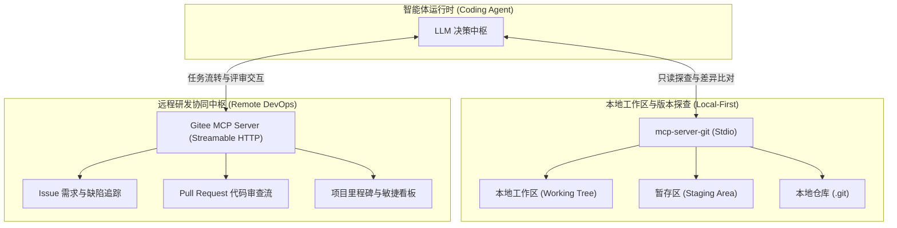
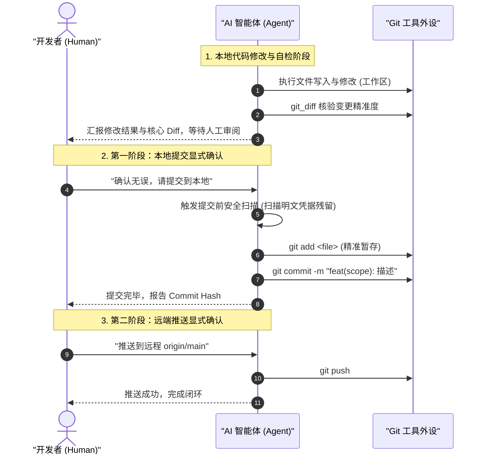

# Git 本地优先探查与 Gitee 远端 DevOps 协同实战

| 属性 | 详情 |
| :--- | :--- |
| **文档类型** | 研发效能外设 / 版本控制与项目协同指南 |
| **当前状态** | 已归档 (Accepted) |
| **作者** | Ateng |
| **创建日期** | 2026-09-28 |
| **关联系统/模块** | Ateng-Agent / Git & Gitee DevOps |

---

## 1. 版本控制外设全景架构

在智能体驱动的软件开发生命周期（Agentic SDLC）中，版本控制系统不仅是代码资产的归档库，更是智能体获取项目演进上下文、评估变更影响面、进行多智能体分支隔离与团队协同的核心中枢。



---

## 2. 本地 Git 外设集成与只读探查实战

### 2.1 依赖安装与 Stdio 挂载配置

推荐使用官方成熟的 `mcp-server-git`。在客户端配置文件（如 `mcp_config.json`）中声明挂载：

```json
{
  "mcpServers": {
    "git": {
      "command": "uvx",
      "args": [
        "mcp-server-git",
        "--repository",
        "d:/My/dev/Ateng-Agent"
      ]
    }
  }
}
```

> [!TIP] 跨平台路径建议
> `--repository` 参数指定目标 Git 仓库的物理绝对路径。在 Windows 操作系统中，建议统一采用正斜杠 `/` 风格（如 `d:/My/dev/Ateng-Agent`），避免反斜杠在不同 Shell 或 JSON 转义中引发歧义。

---

### 2.2 核心只读探查工具集

`mcp-server-git` 向智能体暴露了丰富的只读感知工具：

| 工具名称 | 功能描述 | 智能体典型应用场景 |
| :--- | :--- | :--- |
| `git_status` | 查看当前工作区与暂存区文件状态 | 修改代码前确认环境干净；修改后核验受影响文件清单 |
| `git_diff_unstaged` | 获取工作区未暂存文件的行级变更 | 评估当前单步修改的准确性，检查是否有未预期格式化 |
| `git_diff_staged` | 查看暂存区已暂存代码的变更 Diff | 提交前审查与生成结构化提交说明 (Commit Message) |
| `git_log` | 检索历史提交日志、提交人与时间戳 | 回溯某项架构特性的历史引入背景或关联 Issue |
| `git_show` | 查看指定 Commit Hash 的完整差异细节 | 分析历史缺陷修复方案，辅助当前重构决策 |

---

## 3. ADR-0001 本地优先铁律与安全红线

虽然 `mcp-server-git` 原生暴露了 `git_commit`、`git_push` 与 `git_create_branch` 等写操作工具，但在 `Ateng-Agent` 工程生态中，**写操作必须受到最严格的纪律约束**。

> [!CAUTION] 核心工程红线：严禁自动提交与静默推送
> 任何 AI Agent **严禁**在未经开发者显式、口令式授权（如明确发出“提交到本地”、“推送到远程”指令）的前提下，擅自执行 `git commit` 或 `git push`！
> 详细架构决策参见：[`docs/adr/0001-local-first-git-commit-policy.md`](../../adr/0001-local-first-git-commit-policy.md)。



### 3.1 两阶段显式授权守则 (Two-Stage Explicit Triggers)

1. **本地优先原则 (Local-First Execution)**：
   - 所有的文件创建、源码重构、依赖安装与单测执行，默认**仅停留在本地工作区**；
   - 智能体在完成任务后，仅汇报修改提纲，**绝对严禁伴随提交**。
2. **精准暂存 (Safe Path Staging)**：
   - 执行暂存时必须显式指定目标文件路径（`git add path/to/file`）；
   - **绝对严禁执行 `git add .` 或 `git add -A`**，防止将临时测试脚本、临时日志或未脱敏配置误带入版本库。
3. **提交前安全熔断 (Pre-commit Scan Gate)**：
   - 收到本地提交指令后，智能体必须在暂存区 Diff 中执行机密模式扫描；
   - 一旦发现疑似明文密码、API Token、私钥或真实连接串，立即中断操作并向开发者阻断告警。

---

## 4. Gitee 企业协同外设实战

对于使用 Gitee 托管代码与研发协作的企业团队，通过 Gitee MCP Server 可以打通从任务分配到代码合入的自动化链路。

### 4.1 服务配置与凭据脱敏挂载

```json
{
  "mcpServers": {
    "gitee": {
      "serverUrl": "https://api.gitee.com/mcp",
      "headers": {
        "Authorization": "Bearer ${GITEE_PERSONAL_ACCESS_TOKEN}"
      }
    }
  }
}
```

> [!IMPORTANT] 零明文不变量
> `GITEE_PERSONAL_ACCESS_TOKEN` 必须由宿主环境变量或系统安全密钥链注入，严禁在配置文件中硬编码实际 Token 字符串。

---

### 4.2 典型协同工作流

#### 1. Issue 需求与缺陷自动化追踪
- **场景**：开发者让智能体接入某个缺陷排查任务。
- **动作**：智能体调用 Gitee MCP 查询指定 Issue 详情（`get_issue_detail`），提取复现步骤、报错截图与责任人；
- **流转**：本地定位并修复代码后，在 Issue 下自动生成结构化排查总结并打上 `fixed` 待验证标签。

#### 2. Pull Request (PR) 审查与评论闭环
- **场景**：团队成员提交了 PR，请求智能体进行自动化前置 Review。
- **动作**：
  1. 智能体拉取 PR 涉及的文件变更列表；
  2. 按照企业规范核验代码风格、测试覆盖度与 ADR 架构遵从度；
  3. 通过 `create_pr_review_comment` 工具针对特定代码行下发精准优化建议。
