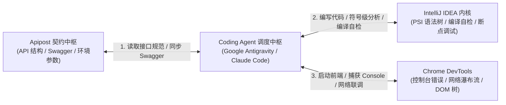
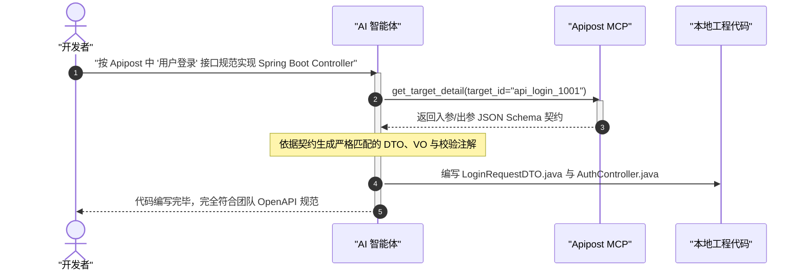

# Apipost 接口契约中枢与 IntelliJ IDEA 调试联动

| 属性 | 详情 |
| :--- | :--- |
| **文档类型** | 研发效能外设 / API 契约与 IDE 调试联动指南 |
| **当前状态** | 已归档 (Accepted) |
| **作者** | Ateng |
| **创建日期** | 2026-09-28 |
| **关联系统/模块** | Ateng-Agent / Apipost & IDE DevTools |

---

## 1. 研发效能全链路闭环架构

现代企业级软件研发通常涵盖三个关键物理环境：**API 契约协作中枢 (Apipost)**、**本地语言编译与调试中枢 (IntelliJ IDEA)** 以及 **客户端运行时与控制台 (Chrome DevTools)**。

通过 Model Context Protocol (MCP)，智能体可以将这三项原本相互割裂的开发工具串联为自动化协同回路：



---

## 2. Apipost 接口契约管理与自动化逆向 (`apipost-mcp`)

Apipost 官方推出的 MCP 服务采用标准流式网络架构（Streamable HTTP/SSE），使智能体可以直接与云端项目空间交互。

### 2.1 客户端配置与凭据脱敏挂载

在客户端配置文件中声明 Apipost 远端服务：

```json
{
  "mcpServers": {
    "apipost-mcp": {
      "url": "https://open.apipost.net/mcp",
      "headers": {
        "api-token": "${APIPOST_ACCESS_TOKEN}"
      }
    }
  }
}
```

> [!IMPORTANT] 凭据安全注入
> `api-token` 为 Apipost 个人或团队访问令牌，严禁明文入库，必须使用 `${APIPOST_ACCESS_TOKEN}` 环境变量占位注入。

---

### 2.2 核心契约工具应用场景

| 工具名称 | 输入参数 | 核心职责与业务价值 |
| :--- | :--- | :--- |
| `get_project_tree` | `project_id` | 递归获取指定项目微服务的目录结构树与全部接口清单。 |
| `get_target_detail` | `target_id` | 获取指定接口的完整 Request Body、Header、Query 及 Response JSON Schema。 |
| `import_swagger` | `project_id`, `data` | 将后端生成的最新 Swagger / OpenAPI JSON 逆向导入并更新 Apipost 契约文档。 |
| `get_env_details` | `env_id` | 读取开发/测试/预发布环境的前缀 URL、网关域名及公共鉴权参数。 |
| `search_model` | `keyword` | 在团队数据字典中模糊检索通用的数据实体模型定义（如 `PageResultVO`、`UserDTO`）。 |

#### 契约驱动研发 (Contract-First) 实战流程



---

## 3. IntelliJ IDEA 官方插件内核级打通 (`idea`)

对于大型 Java / Kotlin / Spring 工程，单纯依赖文本检索无法准确理解庞大的继承层级与跨包引用。JetBrains 官方推出了基于本地 Stdio 管道的 MCP Server 插件。

### 3.1 本地配置规范

```json
{
  "mcpServers": {
    "idea": {
      "command": "C:/software/IntelliJ_IDEA/jbr/bin/java.exe",
      "args": [
        "-classpath",
        "${IDEA_PLUGINS_HOME}/mcpserver/lib/*",
        "com.intellij.mcpserver.stdio.McpStdioRunnerKt"
      ],
      "env": {
        "IJ_MCP_SERVER_PORT": "64342"
      }
    }
  }
}
```

### 3.2 符号级分析与 IDE 协同能力

1. **PSI 语法树与符号定位**：
   - 智能体直接调用 IDEA 索引引擎，毫秒级定位接口实现类（`Find Implementations`）或查找所有调用方（`Find Usages`），杜绝简单的全文 Grep 引发误判。
2. **即时语法与 Lint 诊断**：
   - 无需开发者手动执行漫长的 `mvn clean compile` 构建，智能体即可直接读取 IDEA 内存中已解析的 Inspections 与语法错误告警，快速就地修复。
3. **活动上下文感知**：
   - 自动获取开发者当前正在查看的文件焦点与代码选区，智能推理开发者的下一步意图。

---

## 4. Chrome DevTools 运行时调试外设 (`chrome-devtools`)

在 Web 全栈与前端组件联调场景中，通过 Chrome 远程调试协议 (CDP) 封装的 MCP 外设，智能体能够对正在运行的浏览器页面实施“探针式”诊断。

### 4.1 核心外设功能矩阵

```text
Chrome DevTools MCP
├── Console 监控：实时捕获 TypeError、Vue/React 运行时未捕获警告
├── Network 抓包：嗅探 HTTP 4xx/5xx 状态码与前后端接口响应载荷
├── DOM & 样式探测：评估 CSS 盒模型渲染、响应式布局溢出与无障碍属性
└── 快照截图：捕获全屏页面图像，驱动多模态大模型进行 UI 还原度走查
```

### 4.2 前后端全链路联合排障示例

当开发者反馈“页面点击提交按钮无反应”时，智能体自主协同三大外设：
1. **Chrome DevTools**：捕获到前端控制台输出 `POST http://localhost:8080/api/v1/user 400 Bad Request`，并在 Network 捕获服务端返回的错误信息 `"Validation failed: phone format invalid"`；
2. **Apipost**：调用 `get_target_detail` 核对手机号字段正则约束；
3. **IntelliJ IDEA**：使用 IDEA 符号跳转定位到后端的 `UserCreateDTO.java` 与 `@Pattern` 注解，同步修正前端表单校验逻辑与后端提示，一键完成闭环。
