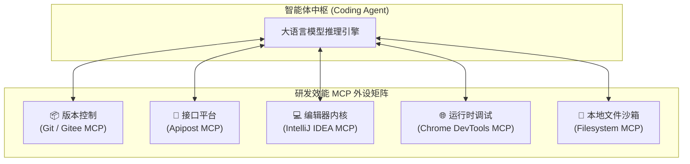

# 研发效能与工程工具 MCP 生态实战

| 属性 | 详情 |
| :--- | :--- |
| **文档类型** | 研发基础设施接入 / 效能工具指南 |
| **当前状态** | 已归档 (Accepted) |
| **作者** | Ateng |
| **创建日期** | 2026-09-28 |
| **关联系统/模块** | Ateng-Agent / MCP Developer Tools |

---

## 1. 研发外设矩阵：打通智能体工程闭环

在现代软件工程中，智能体不仅需要阅读和修改本地磁盘上的源代码，还需要与代码版本库、API 契约中心、IDE 编辑器内核以及浏览器运行时进行全方位联动：



---

## 2. 版本控制与协作平台：Git & Gitee

### 2.1 本地 Git (`mcp-server-git`)

通过标准管道提供对当前 Git 仓库的深度探查：
- `git_status` / `git_diff`：精准分析未提交变更与 Staging 区域状态；
- `git_log`：检索提交历史、变更作者与演进上下文；
- `git_checkout`：在特定调试分支间受控切换。

> [!CAUTION] 严守 ADR-0001 本地优先铁律
> 尽管 `mcp-server-git` 提供了 `git_commit` 与 `git_push` 工具，但在本知识库中，**严禁智能体自主调用提交或推送工具**。所有修改必须停留在工作区供人工审阅，仅在开发者发出明确授权口令时方可操作。

### 2.2 企业代码托管平台：Gitee MCP

基于标准流式 HTTP API 规范连接 Gitee 开放接口：

```json
{
  "mcpServers": {
    "gitee": {
      "serverUrl": "https://api.gitee.com/mcp",
      "headers": {
        "Authorization": "Bearer ${GITEE_PERSONAL_ACCESS_TOKEN}"
      }
    }
  }
}
```

赋予智能体自动化检索远程 Issue、分析 Pull Request 代码评审建议并关联业务里程碑的能力。

---

## 3. API 契约与管理平台：Apipost (`apipost-mcp`)

Apipost 官方推出的 MCP 服务采用远程 SSE 架构，无需本地编译即可快速联动 API 文档与测试环境。

### 3.1 配置示例

```json
{
  "mcpServers": {
    "apipost-mcp": {
      "url": "https://open.apipost.net/mcp",
      "headers": {
        "api-token": "${APIPOST_ACCESS_TOKEN}"
      }
    }
  }
}
```

### 3.2 核心应用场景

- `get_project_tree`：拉取指定微服务的 API 目录树，快速掌握全局接口拓扑；
- `get_target_detail`：获取某接口的完整 Request Body、Header 与 Response JSON Schema，保障前后端联调契约严丝合缝；
- `import_swagger`：代码重构后自动将最新 Spring Boot / OpenAPI 注解逆向同步至 Apipost 项目库。

---

## 4. IntelliJ IDEA 原生插件集成 (`idea`)

JetBrains 针对 2024.3+ 及后续版本推出了官方 MCP Server 插件，通过 Java 原生管道直接将 IDE 的强大语义分析能力（PSI 语法树、全局引用搜索、重构索引）暴露给外部智能体：

```json
{
  "mcpServers": {
    "idea": {
      "command": "C:/software/IntelliJ_IDEA/jbr/bin/java.exe",
      "args": [
        "-classpath",
        "${IDEA_PLUGINS_HOME}/mcpserver/lib/*",
        "com.intellij.mcpserver.stdio.McpStdioRunnerKt"
      ],
      "env": {
        "IJ_MCP_SERVER_PORT": "64342"
      }
    }
  }
}
```

通过与 IDEA 深度打通，智能体能够感知当前激活的打开文件、精确定位未解决的编译 Lint 告警，甚至在当前窗口精准高亮代码片段。

---

## 5. 前端与运行时调试：Chrome DevTools (`chrome-devtools-mcp`)

通过 Chrome 远程调试协议 (CDP)，智能体能够接管浏览器页面：
- 抓取前端渲染后的 DOM 树与 CSS 盒模型；
- 监听控制台 Console 报错与 Network 网络请求瀑布流；
- 截取渲染快照并结合多模态大模型进行 UI 还原度核验。

---

## 6. 本模块核心专题导航

本模块包含以下两篇研发效能外设深度实战指南：

1. 📦 [Git 本地优先探查与 Gitee 远端 DevOps 协同实战](./01-git-and-gitee-devops.md)：深入阐述 `mcp-server-git` 只读差异比对、严格遵循 ADR-0001 两阶段显式授权提交铁律，以及 Gitee Issue/PR 自动化协同。
2. 🔌 [Apipost 接口契约中枢与 IntelliJ IDEA 调试联动](./02-apipost-and-idea.md)：详解 Apipost 契约驱动开发（Swagger 逆向与 Schema 探测）、IntelliJ IDEA 符号级 PSI 语法树跳转与 Chrome DevTools 运行时联合排障。
