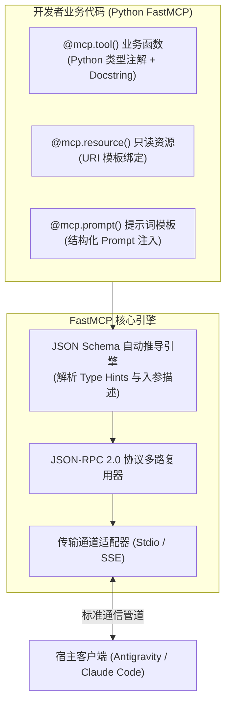
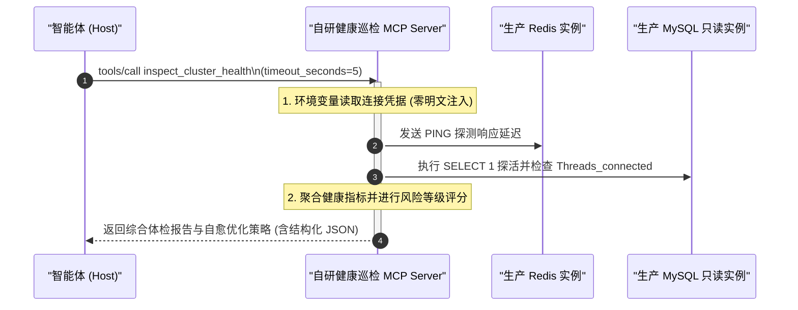

# Python FastMCP 进阶开发双案例实战

| 属性 | 详情 |
| :--- | :--- |
| **文档类型** | 服务端扩展开发 / 核心代码实战指南 |
| **当前状态** | 已归档 (Accepted) |
| **作者** | Ateng |
| **创建日期** | 2026-09-28 |
| **关联系统/模块** | Ateng-Agent / FastMCP Development |

---

## 1. FastMCP 架构全景与装饰器设计哲学

在 Model Context Protocol 生态中，Python 官方推出的 **FastMCP** 框架大幅简化了服务端研发流程。传统基于原生 JSON-RPC 编写协议处理服务需要手动定义 Schema 序列化、监听 IO 管道并管理消息分发。FastMCP 则借鉴了 FastAPI 与 Click 的声明式设计理念，让开发者能够专注于编写纯粹的业务函数。



### 1.1 核心装饰器与元数据推导机制

1. **`@mcp.tool()` 工具装饰器**：
   - 自动解析入参的 Type Hints（`int`, `str`, `bool`, `list`, `dict` 或 Pydantic 模型）生成标准的 JSON Schema；
   - 解析函数文档字符串（Docstring），自动提取工具说明与每个参数的 `description`；
   - 自动捕获未处理的运行时异常，将其封装为合法的包含 `isError: true` 的 CallToolResult。
2. **`@mcp.resource(uri)` 资源装饰器**：
   - 将函数绑定至符合 RFC 3986 的统一资源标识符（如 `system://metrics/cpu`）；
   - 支持动态路径参数模板（如 `db://table/{tableName}/schema`）。
3. **`@mcp.prompt()` 提示词装饰器**：
   - 声明预置任务工作流模板，向客户端下发角色与引导词序列。

---

## 2. 案例一：PEP 723 单文件自包含轻量工具范式

现代 Python 软件工程中，为一个小脚本创建完整的 `venv` 虚拟环境与 `pyproject.toml` 显得过于沉重。借助现代包管理工具 `uv` 支持的 **PEP 723 (Inline Script Metadata)** 规范，我们可以编写完全自包含、开箱即用的单文件 MCP 服务。

### 2.1 案例背景：服务器系统指标与进程诊断工具

本案例构建一个轻量级系统巡检外设，提供 CPU/内存指标感知与高负载进程探查能力。

```python
# -*- coding: utf-8 -*-
# /// script
# requires-python = ">=3.10"
# dependencies = [
#     "mcp<2",
#     "psutil>=5.9.0",
# ]
# ///
"""
系统指标与进程探查 MCP 扩展服务 (PEP 723 单文件自包含模式)
@author Ateng
@since 2026-09-28
"""

import sys
import psutil
from mcp.server.fastmcp import FastMCP

# 1. 实例化 FastMCP 服务中枢
mcp = FastMCP("system-diagnostics-mcp")

# 2. 声明系统基础资源 (只读静态指标)
@mcp.resource("system://metrics/overview")
def get_system_overview() -> str:
    """提供当前主机的核心硬件与操作系统概要信息"""
    cpu_percent = psutil.cpu_percent(interval=1)
    memory = psutil.virtual_memory()
    disk = psutil.disk_usage("/")
    
    return (
        f"CPU 使用率: {cpu_percent}%\n"
        f"内存总量: {memory.total / (1024**3):.2f} GB, 已用: {memory.percent}%\n"
        f"根磁盘总量: {disk.total / (1024**3):.2f} GB, 已用: {disk.percent}%"
    )

# 3. 声明高资源占用进程检索工具 (带有默认参数与类型推导)
@mcp.tool()
def get_top_processes(limit: int = 5, sort_by: str = "cpu") -> str:
    """
    检索当前操作系统中资源占用最高的热点进程清单
    
    :param limit: 返回的进程数量上限 (默认 5，最大 20)
    :param sort_by: 排序维度，可选 'cpu' (CPU利用率) 或 'memory' (内存占用)
    :return: 格式化后的进程排行报告
    """
    if limit > 20 or limit < 1:
        limit = 5
        
    processes = []
    for proc in psutil.process_iter(["pid", "name", "cpu_percent", "memory_percent"]):
        try:
            info = proc.info
            processes.append(info)
        except (psutil.NoSuchProcess, psutil.AccessDenied):
            continue

    if sort_by == "memory":
        processes.sort(key=lambda p: p["memory_percent"] or 0.0, reverse=True)
    else:
        processes.sort(key=lambda p: p["cpu_percent"] or 0.0, reverse=True)

    top_procs = processes[:limit]
    lines = [f"{'PID':<8}{'CPU(%)':<10}{'MEM(%)':<10}{'Process Name'}"]
    lines.append("-" * 45)
    for p in top_procs:
        lines.append(
            f"{p['pid']:<8}{p['cpu_percent'] or 0.0:<10.1f}{p['memory_percent'] or 0.0:<10.1f}{p['name']}"
        )
    return "\n".join(lines)

# 4. 标准入口点启动
if __name__ == "__main__":
    # 日志必须重定向至 stderr，绝对严禁使用 print() 输出到 stdout
    print("System Diagnostics MCP Service running...", file=sys.stderr)
    mcp.run()
```

### 2.2 极速启动与客户端挂载

无需预先创建虚拟环境，`uv` 会自动解析脚本顶部的 `/// script` 依赖块并在隔离沙箱中即时运行：

```bash
uv run system_diagnostics.py
```

在 Antigravity 或 Claude Code 中直接配置该命令即可无缝挂载。

---

## 3. 案例二：企业级健康巡检与自愈建议微服务

在生产环境中，自研 MCP Server 往往需要对接复杂的基础设施，并具备高严密性的**输入校验、异常熔断与凭据脱敏防护**。

### 3.1 架构设计与防护要点



### 3.2 生产级参考实现代码

```python
# -*- coding: utf-8 -*-
# /// script
# requires-python = ">=3.10"
# dependencies = [
#     "mcp<2",
#     "redis>=5.0.0",
#     "pymysql>=1.1.0",
#     "pydantic>=2.0.0",
# ]
# ///
"""
企业级集群健康巡检与自愈建议 MCP 服务
@author Ateng
@since 2026-09-28
"""

import os
import sys
import time
from typing import Dict, Any, Optional
import pymysql
import redis
from pydantic import BaseModel, Field
from mcp.server.fastmcp import FastMCP

mcp = FastMCP("enterprise-health-monitor")

# 1. 使用 Pydantic 规范结构化巡检入参
class ClusterInspectRequest(BaseModel):
    check_redis: bool = Field(default=True, description="是否包含 Redis 节点探查")
    check_mysql: bool = Field(default=True, description="是否包含 MySQL 只读从库探查")
    timeout_seconds: int = Field(default=5, ge=1, le=30, description="底层网络探测超时时间(秒)")

# 2. 巡检核心业务工具
@mcp.tool()
def inspect_cluster_health(params: ClusterInspectRequest) -> Dict[str, Any]:
    """
    对企业核心中间件（Redis、MySQL）执行健康探活巡检，生成多维度体检指标与自愈建议
    """
    report: Dict[str, Any] = {
        "timestamp": int(time.time()),
        "overall_status": "HEALTHY",
        "details": {},
        "recommendations": []
    }

    # 1. 探查 Redis 实例
    if params.check_redis:
        redis_host = os.environ.get("REDIS_HOST", "127.0.0.1")
        redis_port = int(os.environ.get("REDIS_PORT", "6379"))
        redis_pwd = os.environ.get("REDIS_PASSWORD")  # 动态环境变量注入

        try:
            r = redis.Redis(
                host=redis_host,
                port=redis_port,
                password=redis_pwd,
                socket_timeout=params.timeout_seconds
            )
            start_t = time.time()
            r.ping()
            latency_ms = round((time.time() - start_t) * 1000, 2)
            
            info = r.info("memory")
            report["details"]["redis"] = {
                "status": "UP",
                "latency_ms": latency_ms,
                "used_memory_human": info.get("used_memory_human", "N/A"),
                "connected_clients": r.info("clients").get("connected_clients", 0)
            }
        except Exception as e:
            print(f"[ERROR] Redis check failed: {e}", file=sys.stderr)
            report["overall_status"] = "DEGRADED"
            report["details"]["redis"] = {"status": "DOWN", "error": str(e)}
            report["recommendations"].append("Redis 探活失败，请核查网络连通性或实例端口安全组。")

    # 2. 探查 MySQL 只读从库
    if params.check_mysql:
        mysql_host = os.environ.get("MYSQL_HOST", "127.0.0.1")
        mysql_port = int(os.environ.get("MYSQL_PORT", "3306"))
        mysql_user = os.environ.get("MYSQL_USER", "readonly_monitor")
        mysql_pwd = os.environ.get("MYSQL_PASSWORD")

        try:
            conn = pymysql.connect(
                host=mysql_host,
                port=mysql_port,
                user=mysql_user,
                password=mysql_pwd,
                database="information_schema",
                connect_timeout=params.timeout_seconds
            )
            with conn.cursor() as cursor:
                cursor.execute("SHOW STATUS LIKE 'Threads_connected';")
                threads_row = cursor.fetchone()
                threads_connected = int(threads_row[1]) if threads_row else 0
                
            conn.close()
            report["details"]["mysql"] = {
                "status": "UP",
                "threads_connected": threads_connected
            }
            if threads_connected > 300:
                report["recommendations"].append(f"MySQL 活跃连接数偏高 ({threads_connected})，建议排查连接池泄露。")
        except Exception as e:
            print(f"[ERROR] MySQL check failed: {e}", file=sys.stderr)
            report["overall_status"] = "DEGRADED"
            report["details"]["mysql"] = {"status": "DOWN", "error": str(e)}
            report["recommendations"].append("MySQL 只读节点响应超时，请检查 RDS 实例 CPU 与连接池水位。")

    return report

if __name__ == "__main__":
    mcp.run()
```

> [!CAUTION] 零明文不变量与凭据注入纪律
> 观察上述代码实现：**没有任何数据库 IP、账户名或密码被硬编码**。
> 所有敏感连接凭据统一通过 `os.environ.get(...)` 从宿主运行时注入。在本地挂载测试时，开发者应通过客户端配置文件的 `env` 键或者前置 `.env` 加载，严格遵循 ADR-0003 安全红线。

---

## 4. 运行验证与常见报错排查

1. **依赖解析冲突**：
   - 若遇到 FastMCP 核心协议版本不兼容，确保依赖声明锁定为 `mcp<2`；
2. **标准输出日志泄露导致 `-32700 Parse Error`**：
   - 检查代码中是否有任何残留的调试 `print()` 语句。所有调试日志必须显式重定向至 `file=sys.stderr`；
3. **Pydantic 校验异常阻断**：
   - FastMCP 会自动将 Pydantic 校验失败转换为标准的 JSON-RPC `-32602 Invalid Params` 错误，前端智能体会根据提示自动重构入参重新发起请求。
