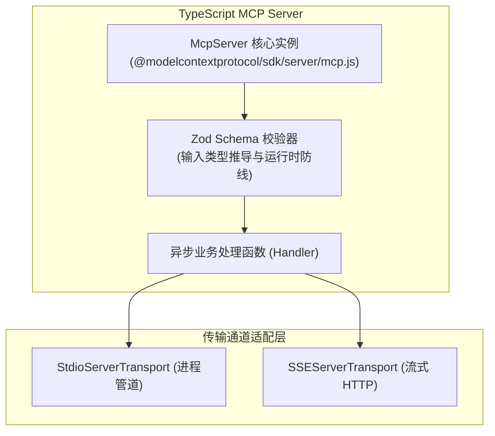
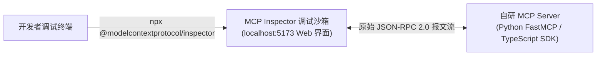

# TypeScript 官方 SDK 规范开发与 MCP Inspector 抓包联调

| 属性 | 详情 |
| :--- | :--- |
| **文档类型** | 服务端扩展开发 / TS SDK 与调试工具指南 |
| **当前状态** | 已归档 (Accepted) |
| **作者** | Ateng |
| **创建日期** | 2026-09-28 |
| **关联系统/模块** | Ateng-Agent / TypeScript MCP SDK & Inspector |

---

## 1. TypeScript 官方 SDK (`@modelcontextprotocol/sdk`) 架构解析

对于前端、Node.js 全栈开发者或企业 TypeScript 中台团队，Anthropic 官方维护的 **`@modelcontextprotocol/sdk`** 提供了最权威的类型定义与最贴合底层规范的编程模型。



### 1.1 工程初始化与依赖安装

在 Node.js (推荐 v20+) 或 Bun 环境中快速初始化：

```bash
pnpm init
pnpm add @modelcontextprotocol/sdk zod
pnpm add -D typescript @types/node tsup
```

配置 `tsconfig.json`，确保启用现代模块解析（NodeNext / ESNext）：

```json
{
  "compilerOptions": {
    "target": "ES2022",
    "module": "NodeNext",
    "moduleResolution": "NodeNext",
    "strict": true,
    "esModuleInterop": true,
    "skipLibCheck": true,
    "outDir": "./dist"
  },
  "include": ["src/**/*"]
}
```

---

### 1.2 生产级 TypeScript Server 代码范式

以下代码演示了完整的服务初始化、基于 Zod 的入参约束以及 Stdio 传输通道绑定：

```typescript
/**
 * 企业级用户与权限探查 MCP 扩展服务 (TypeScript 范式)
 * @author Ateng
 * @since 2026-09-28
 */

import { McpServer } from "@modelcontextprotocol/sdk/server/mcp.js";
import { StdioServerTransport } from "@modelcontextprotocol/sdk/server/stdio.js";
import { z } from "zod";

// 1. 初始化 MCP 服务中枢实例
const server = new McpServer({
  name: "enterprise-user-service",
  version: "1.0.0"
});

// 2. 注册只读静态资源 (Resource)
server.resource(
  "system-status",
  "system://profile",
  async (uri) => ({
    contents: [
      {
        uri: uri.href,
        mimeType: "application/json",
        text: JSON.stringify({ status: "ONLINE", region: "ap-east-1" })
      }
    ]
  })
);

// 3. 基于 Zod 注册强类型工具 (Tool)
server.tool(
  "query_user_permissions",
  {
    userId: z.number().int().positive().describe("目标用户全局唯一数字 ID"),
    departmentCode: z.string().min(2).max(32).describe("所属组织机构编码，如 DEPT_TECH"),
    includeAuditLog: z.boolean().default(false).describe("是否返回最近一次审计鉴权记录")
  },
  async ({ userId, departmentCode, includeAuditLog }) => {
    try {
      // 业务逻辑查询... (此处模拟结构化返回)
      const permissions = ["REPO_READ", "ISSUE_WRITE", "PIPELINE_TRIGGER"];
      
      const payload = {
        userId,
        departmentCode,
        permissions,
        auditSummary: includeAuditLog ? "Last authorized: 2026-09-28 10:00:00" : null
      };

      return {
        content: [
          {
            type: "text",
            text: JSON.stringify(payload, null, 2)
          }
        ],
        isError: false
      };
    } catch (err: any) {
      // 日志输出必须重定向至 stderr，绝对严禁使用 console.log()
      console.error(`[ERROR] Query permissions failed: ${err.message}`);
      return {
        content: [
          {
            type: "text",
            text: `Failed to query permissions: ${err.message}`
          }
        ],
        isError: true
      };
    }
  }
);

// 4. 挂载标准输入输出管道并启动服务
async function main() {
  const transport = new StdioServerTransport();
  await server.connect(transport);
  console.error("Enterprise User MCP Server started on Stdio.");
}

main().catch((err) => {
  console.error("Fatal startup error:", err);
  process.exit(1);
});
```

---

## 2. Python FastMCP 与 TypeScript SDK 双轨开发体验全景对比

| 核心特性维度 | Python FastMCP 范式 | TypeScript SDK 范式 |
| :--- | :--- | :--- |
| **开发心智模型** | 函数式 / 装饰器驱动（接近 FastAPI） | 对象模型 / 链式注册（接近 Express / tRPC） |
| **入参模式推导** | 原生 Type Hints + Docstring 解析 | `zod` 声明式链式 Schema 严格校验 |
| **单文件自包含运行** | ✅ 极佳（基于 `uv` 与 PEP 723 规范） | ⚠️ 需打包（通常需要 `tsup` 或 `tsc` 预编译） |
| **日志与错误防线** | 自动捕获未受控异常，自动格式化 | 需手动在 handler 中捕获并构建 `CallToolResult` |
| **生态互通性** | 与 AI/数据分析、运维脚本生态天然契合 | 与前端微前端、Node 全栈及企业 OpenAPI 体系无缝互通 |
| **性能吞吐** | 启动极快，进程内存占用轻量 | 高并发异步 IO 处理能力极强 |

---

## 3. 调试利器：MCP Inspector 交互式抓包审查实战

在将自研 Server 挂载到复杂的 AI 智能体（如 Google Antigravity、Claude Code）之前，**强烈推荐先使用 MCP Inspector 进行完全确定性的黑盒契约调试**。

### 3.1 什么是 MCP Inspector

**MCP Inspector** 是官方提供的一个专有 Web 调试沙箱工具。它能够在不依赖任何大语言模型推理的情况下，模拟客户端直接与自研服务端建立连接，并将底层所有的 JSON-RPC 2.0 报文全透明可视化展示。



### 3.2 启动与调试命令

#### 1. 调试本地 Python FastMCP 脚本
```bash
npx @modelcontextprotocol/inspector uv run server.py
```

#### 2. 调试本地 TypeScript 编译产物
```bash
npx @modelcontextprotocol/inspector node dist/index.js
```

#### 3. 调试远程流式 SSE 服务
```bash
# 直接启动 Inspector 界面，在 Web 顶栏输入 SSE URL (如 http://localhost:8000/sse)
npx @modelcontextprotocol/inspector
```

---

### 3.3 四大核心调试面板应用技巧

1. **Capabilities (能力协商审查)**：
   - 检查握手阶段服务端是否正确声明了 `tools`、`resources`、`prompts` 开关；
   - 验证 `serverInfo` 的服务名称与版本号是否符合预期。
2. **Tools (动态表单与 Schema 校验)**：
   - Inspector 会根据服务端的 inputSchema 自动渲染出交互式表单；
   - 开发者可以手动输入边界测试参数（如负数 ID、超长字符），验证服务端的校验阻断行为是否精准；
   - 观察执行结果 `content` 与 `isError` 状态码。
3. **Resources (资源树探测)**：
   - 实时浏览服务端暴露的静态或动态 URI 清单；
   - 一键点击读取内容，检查文本与二进制 Blob 数据的呈现格式。
4. **Network & JSON-RPC Logs (原始报文嗅探)**：
   - 在底部调试日志栏目中，完整查看每一次调用的原始 `request` 与 `response` 报文体，定位是否有缺少 `jsonrpc: "2.0"` 或参数字段遗漏等底层协议违规行为。

---

## 4. 本地工程化打包与私有分发规范

为了让团队内部成员能够方便地通过 `npx` 或系统命令使用自研的 MCP 服务，应做好工程化分发配置：

### 4.1 CLI 可执行入口配置 (`package.json`)

在 `package.json` 中配置 `bin` 字段：

```json
{
  "name": "@my-org/enterprise-mcp-server",
  "version": "1.0.0",
  "type": "module",
  "bin": {
    "my-mcp-server": "./dist/index.js"
  },
  "scripts": {
    "build": "tsup src/index.ts --format esm --clean --minify"
  }
}
```

在源码入口文件 `src/index.ts` 首行必须添加 Shebang 声明：
```typescript
#!/usr/bin/env node
```

### 4.2 本地全局链接与内网分发

```bash
# 1. 编译构建
pnpm build

# 2. 本地全局软链接调试
npm link

# 3. 在任意客户端配置文件中直接作为系统命令调用
# "command": "my-mcp-server"
```
