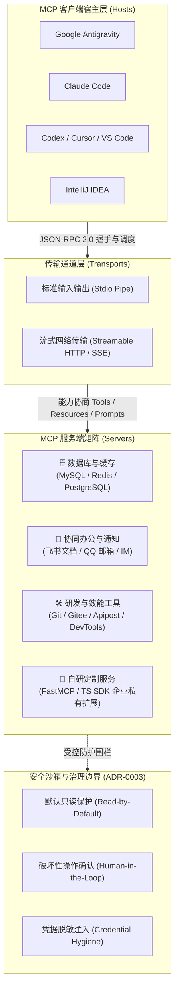

# MCP 协议生态全景与架构大厅

| 属性 | 详情 |
| :--- | :--- |
| **文档类型** | 体系全景总览 / 架构门户 |
| **当前状态** | 已归档 (Accepted) |
| **作者** | Ateng |
| **创建日期** | 2026-09-28 |
| **关联系统/模块** | Ateng-Agent / Model Context Protocol (MCP) |

---

## 1. 什么是 Model Context Protocol (MCP)

**Model Context Protocol (MCP)** 是由 Anthropic 发起并开源的下一代开放标准化通信协议，旨在统一大语言模型（LLM / Agent）与外部数据源、企业级工具、本地操作系统及研发基础设施之间的交互接口。

传统的智能体扩展通常采用专有插件、私有函数调用（Function Calling）或生硬的 Prompt 拼接方案，面临适配标准割裂、环境移植成本高昂、跨客户端无法复用等痛点。MCP 借鉴了编程语言生态中 **语言服务器协议（LSP, Language Server Protocol）** 的革命性思想：**将大语言模型与外部工具解耦，让任意具备 MCP 规范的客户端（Host）能够即插即用任意标准的工具服务器（Server）**。

---

## 2. MCP 专题知识库架构导航

为了保持专业性与高内聚隔离，MCP 知识库划分为以下独立的专业子目录，每个子模块均自包含专属设计背景、实战配置与演进指南：

| 模块目录 | 模块名称 | 核心职责与涵盖内容 | 状态 |
| :--- | :--- | :--- | :--- |
| [📐 `protocol/`](./protocol/) | **协议规范与核心架构** | JSON-RPC 2.0 通信底座、三大核心原语（Tools / Resources / Prompts）、Roots 与 Sampling 机制、能力协商握手与生命周期 | 已归档 (Accepted) |
| [💻 `clients/`](./clients/) | **客户端集成与配置** | Google Antigravity、Claude Code、Cursor、VS Code、Codex 等主流客户端的 MCP 配置、动态装配与环境变量注入 | 已归档 (Accepted) |
| [🗄️ `database/`](./database/) | **数据库与缓存生态** | MySQL (`mcp-server-mysql`)、Redis (`redis-mcp-server`) 本地/云端实例实战、只读账号配置与慢查询防护 | 已归档 (Accepted) |
| [🤝 `collaboration/`](./collaboration/) | **协同办公与生产力** | 飞书文档与多维表格集成 (`@larksuiteoapi/lark-mcp`)、QQ 邮箱与 SMTP 自动化通知推送实战 | 已归档 (Accepted) |
| [🛠️ `dev-tools/`](./dev-tools/) | **研发效能与工程工具** | Git/Gitee 版本控制、Apipost 接口联调、IntelliJ IDEA 原生调试、Chrome DevTools 与文件系统沙箱 | 已归档 (Accepted) |
| [🚀 `development/`](./development/) | **自研 MCP Server 实战** | 基于 Python FastMCP 的极简微服务研发与 TypeScript SDK 双轨开发体系、MCP Inspector 交互式联调套件 | 已归档 (Accepted) |
| [🛡️ `security/`](./security/) | **安全沙箱与治理规约** | 破坏性操作受控机制、两阶段人工确认、凭据脱敏、访问边界审计及 ADR 架构决策遵从 | 已归档 (Accepted) |

---

## 3. 核心设计原则与工程红线

在整个 MCP 体系的运用与扩展中，本知识库严格贯彻以下工程纪律：

1. **协议解耦与通用复用**：所有接入的 MCP Server 必须严格遵从 Model Context Protocol 官方规范，杜绝与单一客户端强绑定，确保在 Antigravity、Claude Code 与 IDE 间零代码迁移；
2. **本地优先与沙箱受控**：严格遵从 [`docs/adr/0003-mcp-tool-sandboxing-and-write-guard.md`](../adr/0003-mcp-tool-sandboxing-and-write-guard.md)，涉及写库、发信、提交代码等状态突变动作，一律实施人工二次授权确认（Human-in-the-Loop）；
3. **敏感凭据 100% 隔离**：文档正文严禁出现真实密码、App Secret 或私有 Token，所有配置示例均采用标准环境变量或占位符表达。

> [!TIP] 快速上手建议
> 如果你是初次接触 MCP，建议先阅读 [📐 协议规范与核心架构](./protocol/) 理解心智模型；若需快速为 Antigravity 配置数据库或飞书工具，可直接跳至 [💻 客户端集成与配置](./clients/) 与对应服务专栏。
