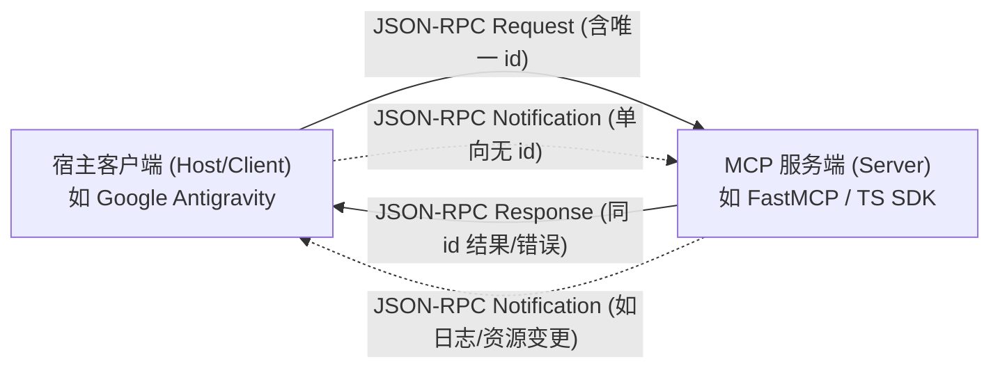
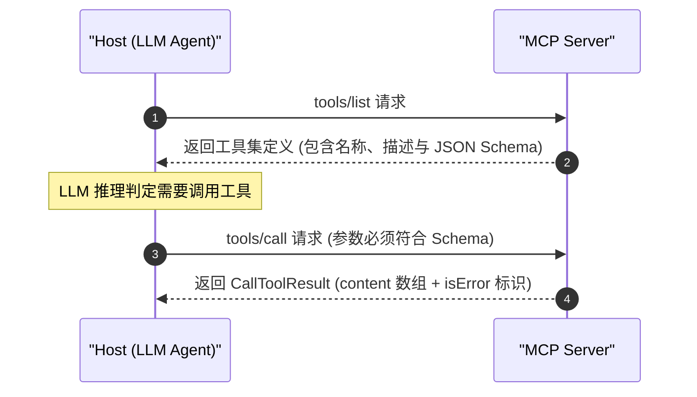
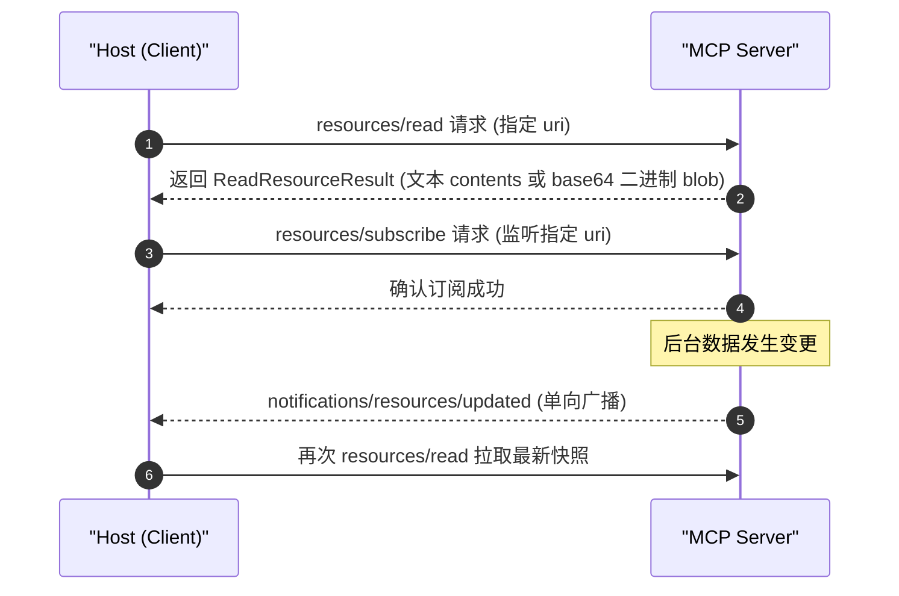
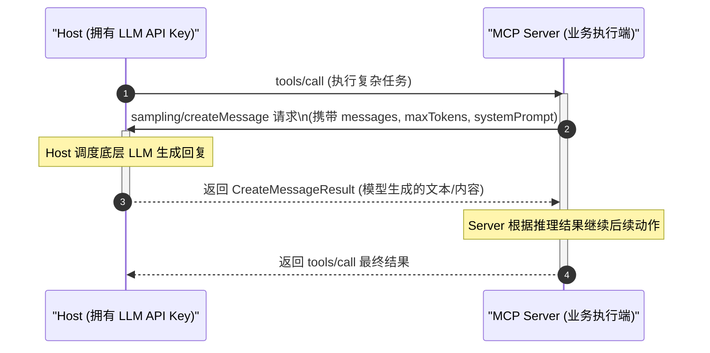

# MCP 协议底层消息规范与五大核心原语

| 属性 | 详情 |
| :--- | :--- |
| **文档类型** | 架构原理解析 / 协议契约规范 |
| **当前状态** | 已归档 (Accepted) |
| **作者** | Ateng |
| **创建日期** | 2026-09-28 |
| **关联系统/模块** | Ateng-Agent / MCP Protocol Core |

---

## 1. 协议基石：基于 JSON-RPC 2.0 的结构化报文体系

Model Context Protocol (MCP) 摒弃了复杂的私有序列化协议与沉重的 RPC 框架，全面基于工业成熟的 **JSON-RPC 2.0** 规范构建。无论是本地进程间管道（Stdio）还是远程长连接网络传输（Streamable HTTP/SSE），所有控制指令、元数据协商、业务工具调用与事件流推送均严格遵循 JSON-RPC 2.0 报文格式。



### 1.1 三大核心消息实体 (Message Entities)

#### 1. 请求报文 (Request)
由客户端或服务端发起、要求对端给予明确结果的有状态调用，必须包含全局唯一的 `id`：

```json
{
  "jsonrpc": "2.0",
  "id": "req-1001",
  "method": "tools/call",
  "params": {
    "name": "query_database",
    "arguments": {
      "sql": "SELECT id, username FROM users WHERE status = 1 LIMIT 10;"
    }
  }
}
```

- `jsonrpc`：必须固定为字符串 `"2.0"`；
- `id`：请求唯一标识符，可为整数或字符串（推荐 UUID 或带业务前缀的递增字符串），对端响应时必须原样回传；
- `method`：调用的目标协议方法，采用 `<primitive>/<action>` 的命名空间规范（如 `tools/call`、`resources/read`）；
- `params`：可选的参数对象或数组。

#### 2. 响应报文 (Response)
对端处理请求后的回包，包含与请求完全匹配的 `id`。成功与失败互斥，分别由 `result` 或 `error` 承载：

**成功响应 (Success Response)**：
```json
{
  "jsonrpc": "2.0",
  "id": "req-1001",
  "result": {
    "content": [
      {
        "type": "text",
        "text": "[{\"id\": 1, \"username\": \"admin\"}, {\"id\": 2, \"username\": \"auditor\"}]"
      }
    ],
    "isError": false
  }
}
```

**失败响应 (Error Response)**：
```json
{
  "jsonrpc": "2.0",
  "id": "req-1001",
  "error": {
    "code": -32602,
    "message": "Invalid params: Missing required field 'sql'",
    "data": {
      "field": "sql",
      "expected": "string"
    }
  }
}
```

#### 3. 通知报文 (Notification)
单向单播或广播的消息，**绝对不包含 `id` 字段**。接收方处理后无需也不得向对端发送任何确认或错误回包：

```json
{
  "jsonrpc": "2.0",
  "method": "notifications/resources/updated",
  "params": {
    "uri": "mysql://table/orders"
  }
}
```

- 适用场景：长任务进度反馈（`notifications/progress`）、日志推送（`notifications/message`）、资源订阅更新等。

---

### 1.2 标准错误码与 MCP 扩展矩阵

MCP 严格兼容 JSON-RPC 2.0 标准保留错误码，并在私有区间定义了协议专有错误：

| 错误码 (`code`) | 错误名称 | 业务含义与触发场景 |
| :--- | :--- | :--- |
| **`-32700`** | Parse Error | 报文解析失败，接收端收到非法的 JSON 文本字符串。 |
| **`-32600`** | Invalid Request | 报文结构不合规，如缺少 `jsonrpc` 字段或缺少 `method`。 |
| **`-32601`** | Method Not Found | 请求的方法不存在或对端当前未声明该能力。 |
| **`-32602`** | Invalid Params | 参数校验失败，未通过 JSON Schema 规则（如缺失必填字段、类型错误）。 |
| **`-32603`** | Internal Error | 服务端内部抛出未捕获的未受控异常。 |
| **`-32000`** | Connection Closed | 传输通道已断开或会话已超时销毁。 |
| **`-32001`** | Request Timeout | 请求在设定的超时期（如 30s）内未收到响应回包。 |
| **`-32002`** | Capability Disabled | 尝试调用双方握手协商阶段未声明支持的原语功能。 |

> [!WARNING] 工具执行失败 vs JSON-RPC Error
> 在 MCP 规范中，**工具业务层面的执行失败（如 SQL 语法错误、业务校验未通过）不应返回 JSON-RPC `error` 报文**！
> 应当返回合法的 JSON-RPC 响应，并在 `result` 内部将 `isError` 标记置为 `true`，同时在 `content` 中返回人类/模型友好的错误排查提示，允许大语言模型基于错误提示自行修正重试。

---

## 2. 核心原语一：Tools (计算动作与副作用执行)

`Tools` 是大语言模型改造外部物理世界的直接抓手。MCP Server 向 Host 暴露一组具备强类型契约的可执行函数，Host 在完成参数组装后下发调用请求。



### 2.1 工具列表枚举契约 (`tools/list`)

客户端拉取工具目录时发送请求：

```json
{
  "jsonrpc": "2.0",
  "id": "list-tools-1",
  "method": "tools/list",
  "params": {}
}
```

服务端返回清单与对应的 **JSON Schema Draft 7/2020-12** 契约定义：

```json
{
  "jsonrpc": "2.0",
  "id": "list-tools-1",
  "result": {
    "tools": [
      {
        "name": "send_email",
        "description": "通过 SMTP 协议向指定收件人外发结构化邮件，支持抄送与 HTML 正文",
        "inputSchema": {
          "type": "object",
          "properties": {
            "to": {
              "type": "string",
              "format": "email",
              "description": "收件人邮箱地址"
            },
            "subject": {
              "type": "string",
              "description": "邮件标题主题"
            },
            "body": {
              "type": "string",
              "description": "邮件内容正文"
            }
          },
          "required": ["to", "subject", "body"]
        }
      }
    ]
  }
}
```

### 2.2 工具调用执行契约 (`tools/call`)

当模型决定执行 `send_email` 时，客户端发起调用：

```json
{
  "jsonrpc": "2.0",
  "id": "call-tool-99",
  "method": "tools/call",
  "params": {
    "name": "send_email",
    "arguments": {
      "to": "dev-ops@example.com",
      "subject": "生产环境监控告警",
      "body": "Redis 内存占用已突破 85% 告警阈值，请及时排查。"
    }
  }
}
```

> [!CAUTION] 副作用隔离与只读防御
> 任何具有状态突变（写文件、发邮件、更新数据库、重启服务）的 Tool，必须在 ADR-0003 安全准则下受控管理。对于核心敏感系统，客户端应当默认开启沙箱拦截或人工确认（Human-in-the-Loop）防线。

---

## 3. 核心原语二：Resources (上下文只读挂载与订阅)

`Resources` 代表类似只读文件、数据库视图、API 字典等**静态或准静态数据资产**。它与 Tool 的根本区别在于：**Resource 仅用于提供背景上下文（Context Fetching），保证零副作用**。

### 3.1 URI 寻址定位体系

MCP 规定每个 Resource 必须具备符合 RFC 3986 标准的统一资源标识符（URI）：

- 数据库表结构：`mysql://schema/crm_customer`
- 配置文件：`file:///workspace/config/application.yml`
- 动态模板资源：`postgres://tables/{tableName}/ddl`

### 3.2 资源读取与动态订阅



读取资源的实际报文示例：

```json
{
  "jsonrpc": "2.0",
  "id": "res-read-1",
  "method": "resources/read",
  "params": {
    "uri": "mysql://schema/users"
  }
}
```

回包既支持 UTF-8 文本内容（`text`），也支持多媒体文件（图片、PDF、音频等）通过 `blob` + `mimeType` 传输：

```json
{
  "jsonrpc": "2.0",
  "id": "res-read-1",
  "result": {
    "contents": [
      {
        "uri": "mysql://schema/users",
        "mimeType": "text/x-sql",
        "text": "CREATE TABLE `users` (\n  `id` bigint NOT NULL AUTO_INCREMENT,\n  `name` varchar(64) NOT NULL,\n  PRIMARY KEY (`id`)\n) ENGINE=InnoDB DEFAULT CHARSET=utf8mb4;"
      }
    ]
  }
}
```

---

## 4. 核心原语三：Prompts (提示词模板化外设)

`Prompts` 允许 MCP Server 封装可重用的提示词工程模式或专业角色模板。用户或智能体无需记忆复杂的预置 Prompt，直接通过服务端暴露的模板名称与参数快速唤醒。

```json
// prompts/list 回包示例
{
  "jsonrpc": "2.0",
  "id": "prompts-list-1",
  "result": {
    "prompts": [
      {
        "name": "code_review_expert",
        "description": "按企业 Clean Code 规范对指定分支的代码变更进行双轴评审",
        "arguments": [
          {
            "name": "baseBranch",
            "description": "对比的基线分支名称，如 main 或 develop",
            "required": true
          }
        ]
      }
    ]
  }
}
```

调用 `prompts/get` 获取渲染后的完整消息流：

```json
{
  "jsonrpc": "2.0",
  "id": "prompts-get-1",
  "result": {
    "description": "Code Review 专家系统提示词",
    "messages": [
      {
        "role": "system",
        "content": {
          "type": "text",
          "text": "你是一名资深架构师，请对传入的代码差异进行规范与逻辑安全性双向核查。"
        }
      }
    ]
  }
}
```

---

## 5. 核心原语四与五：Sampling (反向采样) 与 Roots (工作区围栏)

### 5.1 Sampling：服务端反向推理机制

在传统设计中，通信流向始终是“Host 驱动 Server”。但在复杂业务场景下，Server 自身可能需要多步推理才能完成工具交付（例如：Server 拿到一段未整理的自然语言日志，希望让模型提炼出核心 JSON 结构再入库）。

`Sampling` 原语打破了单向调用限制，**允许 Server 反向向 Host 发起 `sampling/createMessage` 请求**，借用客户端挂载的大语言模型进行子任务推理：



> [!NOTE] 权限控制与计费透明
> Host 对 `sampling/createMessage` 拥有最终裁量权。Host 可以拒绝未授权的采样请求，也可以对 Server 限制采样的模型型号（如强制限定为轻量快速模型）和 Token 消耗限额，防止滥用。

---

### 5.2 Roots：宿主工作区边界围栏

智能体在操作本地文件系统时，最大的安全隐患在于路径遍历攻击（Path Traversal，如 `../../../../etc/passwd`）。

`Roots` 原语正是 Host 用来向 Server 明确声明**安全受控根目录**的标准契约：

```json
// roots/list 回包示例
{
  "jsonrpc": "2.0",
  "id": "roots-1",
  "result": {
    "roots": [
      {
        "uri": "file:///d:/My/dev/Ateng-Agent",
        "name": "Ateng-Agent Workspace Root"
      }
    ]
  }
}
```

当 Host 的工作区发生变动（例如切换了工作空间或新增了挂载目录）时，Host 会主动向 Server 发送 `notifications/roots/list_changed` 通知，Server 重新拉取 `roots/list` 并更新内部文件访问白名单。

---

## 6. 五大原语职责边界速查矩阵

| 原语名称 | 发起方 | 幂等性 | 主要应用场景 | 安全与审计考量 |
| :--- | :--- | :--- | :--- | :--- |
| **Tools** | Host $\to$ Server | 视具体业务而定 (多数非幂等) | 执行计算、写入数据、发送网络请求、操作系统 | 核心审计对象，需开启只读拦截与白名单防护。 |
| **Resources** | Host $\to$ Server | 必须幂等 (只读) | 挂载配置、表结构探查、日志文件读取 | 数据脱敏，防止通过 URI 注入越权读取受限文件。 |
| **Prompts** | Host $\to$ Server | 幂等 | 获取预制模板、规范化提示词流 | 提示词模板注入防护，参数转义处理。 |
| **Sampling** | Server $\to$ Host | 视 Prompt 而定 | 服务端长链路逻辑中的中间文本结构化与决策 | Token 预算限额、模型访问权限鉴权。 |
| **Roots** | Host $\to$ Server | 幂等 | 声明工作区目录范围，限制本地文件操作物理边界 | 路径穿越防御，硬性阻止跨工作区破坏性读写。 |
