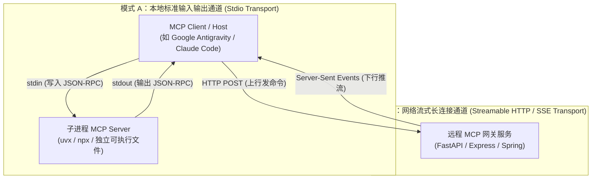
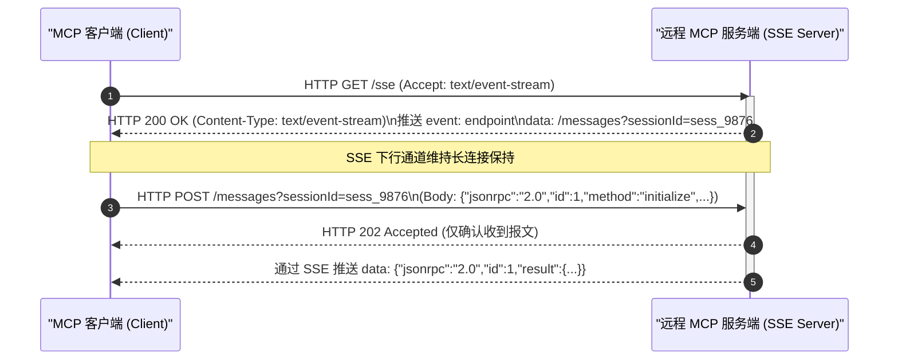
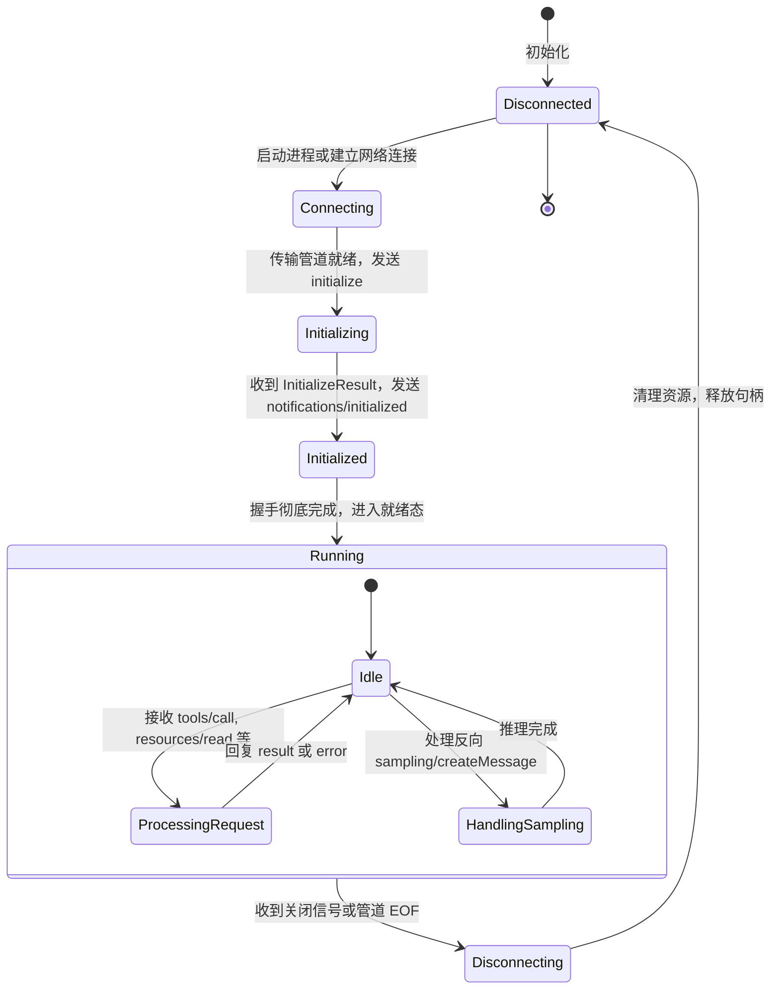

# MCP 传输通道实现机制与双向握手生命周期

| 属性 | 详情 |
| :--- | :--- |
| **文档类型** | 架构原理解析 / 传输机制与生命周期 |
| **当前状态** | 已归档 (Accepted) |
| **作者** | Ateng |
| **创建日期** | 2026-09-28 |
| **关联系统/模块** | Ateng-Agent / MCP Transport & Lifecycle |

---

## 1. 传输通道选型：Stdio vs Streamable HTTP / SSE

Model Context Protocol (MCP) 在设计上将**应用层协议报文（JSON-RPC 2.0）**与**底层传输通道（Transport Layer）**彻底解耦。这种分层架构允许开发者根据不同的网络拓扑、进程拓扑和安全隔离等级，灵活选择最适配的传输载体。



---

### 1.1 本地标准输入输出通道 (Stdio Transport)

Stdio 是 MCP 生态中使用最为广泛的“本地原生通道”。客户端将 MCP Server 作为其子进程（Child Process）拉起，并通过操作系统的标准流管道完成双向通信。

#### 1. 核心工作机制
- **上行管道 (`stdin`)**：客户端将序列化后的 JSON-RPC 请求按行（以换行符 `\n` 分隔）写入子进程的标准输入。
- **下行管道 (`stdout`)**：子进程将 JSON-RPC 响应或通知以单行 JSON 写入标准输出，客户端按行反序列化解析。
- **诊断通道 (`stderr`)**：子进程所有的业务日志、运行堆栈和调试信息必须统一输出至 `stderr`，严禁混入 `stdout`，否则会导致客户端报文解析器抛出 `-32700 Parse Error`。

#### 2. 技术优势与局限
- **零网络端口暴露**：不监听任何 TCP/UDP 端口，天然防御局域网未授权探测。
- **极速响应与超低延迟**：通过内存管道直连，单次调用往返通常在亚毫秒级别。
- **生命周期严密跟随**：客户端退出时，操作系统自动向子进程管道发送 EOF，子进程自动级联销毁，杜绝孤儿/僵尸进程。
- **平台差异防坑**：在 Windows 平台上需注意控制台代码页（推荐 UTF-8）与换行符 `\r\n` 的处理，TS/Python SDK 已对底层的缓冲区按行切分做了抹平。

---

### 1.2 网络流式长连接通道 (Streamable HTTP / SSE Transport)

当 MCP Server 运行在远程服务器、Kubernetes 集群、Docker 容器内，或者需要作为企业中台供多位开发者并发共享时，Stdio 无法满足跨主机通信需求，此时必须采用 **Streamable HTTP / SSE**。

#### 1. 核心工作机制
- **下行推流通道 (SSE Endpoint)**：
  - 客户端首先向服务端发起一个 HTTP GET 请求（如 `http://mcp.example.com/sse`），请求头携带 `Accept: text/event-stream`。
  - 服务端建立 SSE 长连接，并向客户端推送包含上行消息接收端点的 `endpoint` 事件（携带唯一的 `sessionId`，如 `/messages?sessionId=uuid-1234`）。
  - 后续所有服务端推送的消息、通知和异步结果均通过该 SSE 连接持续向下广播。
- **上行控制通道 (HTTP POST Endpoint)**：
  - 客户端向第一步协商出的专属端点发送标准的 HTTP POST 请求，Body 为单个完整的 JSON-RPC 报文。
  - 服务端接收后立即返回 HTTP 202 Accepted 状态码，表示请求已受理进入队列，实际处理结果通过 SSE 下行通道回推给客户端。



---

### 1.3 传输协议全景对比矩阵

| 评估维度 | Stdio (标准输入输出) | Streamable HTTP / SSE |
| :--- | :--- | :--- |
| **物理拓扑** | 单机本地进程树 | 跨主机、跨容器、公网/局域网 |
| **端口依赖** | 零端口，依赖进程管道 | 需要监听 HTTP 端口（如 8000、443） |
| **部署形态** | 本地 CLI、脚本（`uvx`、`npx`、可执行文件） | 独立后台 Daemon、Docker 容器、K8s Pod |
| **认证与多租户** | 基于宿主机用户权限与环境变量 | 标准 HTTP Header（Bearer Token、OAuth2、mTLS） |
| **调试与排障** | 极简，依靠 CLI 控制台与 stderr | 依赖网络抓包工具（Wireshark、Charles）或 SSE 调试器 |
| **断线重连** | 不支持（进程崩溃直接重建） | 支持（通过 SSE `Last-Event-ID` 机制实现重连与事件补发） |
| **推荐适用场景** | 开发者个人桌面 IDE、本地只读数据库探查、本地 Git 工具 | 企业团队公共 MCP 知识库、三方 SaaS 云端开放平台 |

---

## 2. 全生命周期状态机：从能力协商到优雅下线

一个标准的 MCP 会话生命周期必须历经 **建立连接 $\to$ 握手与能力协商 $\to$ 运行时业务交互 $\to$ 优雅停机** 四个阶段。



---

### 2.1 阶段一：握手初始化与双向能力协商 (Initialize)

在正式发送业务指令前，通信双方必须交换彼此的版本号、客户端/服务端信息以及所开启的特性能力集合（Capabilities）。

#### 1. 客户端发起 `initialize` 请求
客户端发送请求，声明自身协议版本（目前通用为 `2024-11-05`）与支持的原语开关：

```json
{
  "jsonrpc": "2.0",
  "id": "init-001",
  "method": "initialize",
  "params": {
    "protocolVersion": "2024-11-05",
    "capabilities": {
      "roots": {
        "listChanged": true
      },
      "sampling": {}
    },
    "clientInfo": {
      "name": "Antigravity",
      "version": "2.0.0"
    }
  }
}
```

#### 2. 服务端返回 `InitializeResult`
服务端确认协议版本兼容，并声明自身能为客户端提供的服务：

```json
{
  "jsonrpc": "2.0",
  "id": "init-001",
  "result": {
    "protocolVersion": "2024-11-05",
    "capabilities": {
      "logging": {},
      "tools": {
        "listChanged": false
      },
      "resources": {
        "subscribe": true,
        "listChanged": true
      }
    },
    "serverInfo": {
      "name": "fastmcp-database-service",
      "version": "1.2.0"
    },
    "instructions": "本服务提供 MySQL/Redis 只读探查能力，写操作已被沙箱拦截。"
  }
}
```

#### 3. 客户端发送握手终结通知 `notifications/initialized`
客户端在核验服务端的能力集后，发送终结通知，标志着握手阶段正式闭环：

```json
{
  "jsonrpc": "2.0",
  "method": "notifications/initialized"
}
```

> [!IMPORTANT] 握手守则：未完成协商严禁调用业务原语
> 在对端收到 `notifications/initialized` 之前，任何一方均**严禁发起 `tools/call`、`resources/read` 等业务请求**！违规调用将被直接抛弃或返回 `-32002 Capability Disabled` 错误。

---

### 2.2 阶段二：运行时调用、异步流控与信令机制 (Runtime)

进入 `Running` 阶段后，双方开始高频的报文流转。为了保证复杂网络或耗时任务下的系统稳定性，MCP 内置了多项信令流控机制。

#### 1. 请求取消机制 (`notifications/cancelled`)
当某个工具调用（如大规模数据全表扫描）执行时间过长，用户在前端点击了“停止生成”或智能体超时熔断时，客户端会发送取消通知，要求服务端立刻中断执行并释放底层资源：

```json
{
  "jsonrpc": "2.0",
  "method": "notifications/cancelled",
  "params": {
    "requestId": "req-1001",
    "reason": "User abort or timeout"
  }
}
```

服务端内部收到该通知后，必须捕获取消信号（如 Python 的 `asyncio.CancelledError` 或 Go 的 `ctx.Done()`），终止耗时 SQL 或网络请求，并回复超时响应。

#### 2. 心跳存活探测 (`ping`)
任意一方可随时发起轻量级的 `ping` 请求探测链路连通性，接收方必须立刻回复空结果：

```json
// 请求
{ "jsonrpc": "2.0", "id": "p-1", "method": "ping" }
// 响应
{ "jsonrpc": "2.0", "id": "p-1", "result": {} }
```

---

### 2.3 阶段三：优雅停机与资源释放 (Teardown)

会话终结时的资源释放策略如下：

1. **Stdio 模式**：
   - 客户端主动关闭其持有的 `stdin` 写入句柄（发送 EOF）；
   - 服务端监听标准输入的读取流结束，触发内部 `on_shutdown` 钩子函数（关闭数据库连接池、清理临时缓存文件）；
   - 服务端进程平稳退出（Exit Code 0）；
   - 若超过优雅等待时间（如 5 秒），客户端将向子进程发送强制终止信号（`SIGKILL`）。
2. **SSE 模式**：
   - 客户端主动断开 SSE 下行 HTTP 连接；
   - 服务端心跳管理器发现对端连接断开，进入宽限等待期；
   - 若在宽限期内未收到该 `sessionId` 的重新接入请求，服务端自动销毁会话上下文并回收内存句柄。

---

## 3. 高可用健壮性保障与故障排查

### 3.1 管道阻塞与缓冲区死锁防御

在 Stdio 模式下，操作系统管道通常拥有固定大小的内核缓冲区（Linux 默认为 64KB，Windows 约为 4KB~64KB）。如果服务端或客户端在没有及时消费对方输出的前提下持续向管道灌入海量数据，将导致管道被填满，发生**缓冲区死锁（Deadlock）**。

**工程防御准则**：
1. **异步非阻塞 IO**：服务端与客户端必须基于事件驱动（如 Node.js Event Loop、Python `asyncio`）进行管道读写，杜绝在单线程同步阻塞写入。
2. **分片与分页约束**：工具返回大量文本（如 10MB 数据）时，应当先写入本地临时文件并返回文件 Resource URI，而不是直接在单个 `tools/call` 响应中塞入巨幅 JSON 字符串。

### 3.2 联调利器：MCP Inspector

官方推荐使用 **`@modelcontextprotocol/inspector`** 对任何本地或远程 MCP Server 进行黑盒协议探测与报文抓包：

```bash
# 本地快速拉起 Inspector 调试界面
npx @modelcontextprotocol/inspector uv run python server.py
```

Inspector 将自动启动一个本地 Web 调试页面（通常在 `localhost:5173`），直观呈现：
- 初始化握手 Capabilities 报文交换详情；
- 可用 Tools 清单与在线表单输入调试；
- 资源与模板的实时渲染；
- 所有出入流量的 JSON-RPC 2.0 原始报文抓取与耗时分析。
