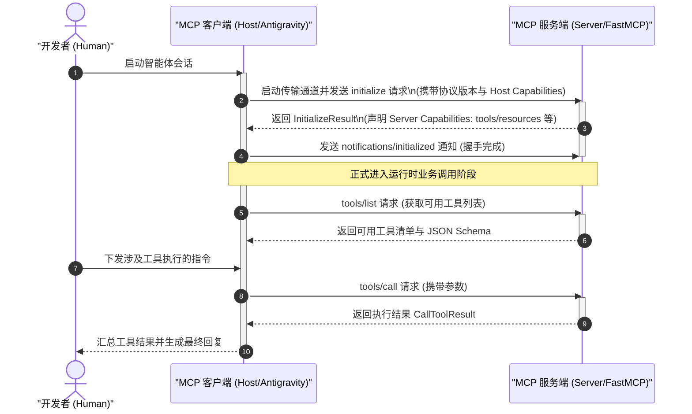

# MCP 协议规范与架构原理

| 属性 | 详情 |
| :--- | :--- |
| **文档类型** | 架构原理解析 / 协议规范指南 |
| **当前状态** | 已归档 (Accepted) |
| **作者** | Ateng |
| **创建日期** | 2026-09-28 |
| **关联系统/模块** | Ateng-Agent / MCP Protocol Core |

---

## 1. 协议内核：基于 JSON-RPC 2.0 的标准化通信

Model Context Protocol (MCP) 底层基于工业成熟的 **JSON-RPC 2.0** 规范构建，采用客户端-服务端（Client-Server / Host-Server）架构。所有控制信令、数据挂载与工具执行请求均被严格序列化为 JSON-RPC 格式。

协议交互分为三类基本消息实体：
1. **请求（Request）**：带有唯一 `id` 的调用请求，服务端处理后必须返回包含相同 `id` 的结果或错误对象；
2. **响应（Response）**：承载请求执行结果（`result`）或异常信息（`error`）；
3. **通知（Notification）**：单向广播消息，不含 `id` 字段，接收方无需也不得返回响应（如日志推送、资源状态变更通知）。

---

## 2. 核心原语体系 (MCP Primitives)

MCP 形式化抽象了五大核心通信原语，构成了智能体感知与改造外部世界的基石：

```
                    ┌──────────────────────────────────────────────┐
                    │            MCP 核心通信原语体系              │
                    └──────────────────────────────────────────────┘
                                           │
         ┌───────────────┬─────────────────┼────────────────┬───────────────┐
         ▼               ▼                 ▼                ▼               ▼
 ┌──────────────┐ ┌──────────────┐ ┌──────────────┐ ┌──────────────┐ ┌──────────────┐
 │    Tools     │ │  Resources   │ │   Prompts    │ │   Sampling   │ │    Roots     │
 ├──────────────┤ ├──────────────┤ ├──────────────┤ ├──────────────┤ ├──────────────┤
 │ • 模型主动执行│ │ • 静态数据挂载│ │ • 预置模板分发│ │ • 服务端反向  │ │ • 客户端工作区│
 │ • 含副作用操作│ │ • URI 唯一定位│ │ • 用户快速唤醒│ │   请求模型推理 │   边界明确声明 │
 │ • JSON Schema│ │ • 文本/二进制 │ │ • 结构化参数  │ │ • 智能递归生成│ │ • 目录安全围栏 │
 └──────────────┘ └──────────────┘ └──────────────┘ └──────────────┘ └──────────────┘
```

- **Tools (工具)**：向大模型暴露的计算动作。服务端使用 JSON Schema 严格声明输入参数与返回格式。工具调用通常具有状态副作用（如写数据库、发邮件、执行命令）；
- **Resources (资源)**：类似文件或数据库记录的只读上下文，统一采用标准 URI（如 `mysql://table/orders`、`file:///path`）唯一定位，便于模型拉取只读背景知识；
- **Prompts (提示词模板)**：服务端预定义的任务提示词模版，用户或客户端可直接调用以启动特定专业任务流；
- **Sampling (反向采样)**：高级进阶机制，允许 MCP Server 在处理复杂长链逻辑时，反向请求 Host 的大语言模型进行中间步骤的辅助推理；
- **Roots (根路径感知)**：Host 向 Server 显式声明当前工作区根目录，规范文件系统工具的操作边界，防止路径穿越风险。

---

## 3. 传输协议通道对比 (Transports)

MCP 官方标准定义了两种主流传输通道（Transport Layer），满足不同物理网络与隔离级别的部署需求：

| 传输通道 | 通信媒介 | 核心特征与适用场景 | 调试难度 |
| :--- | :--- | :--- | :--- |
| **标准输入输出 (Stdio)** | 进程间管道 (`stdin` / `stdout`) | 适用于本地轻量运行的 CLI、脚本（如 `uvx`、`npx`）。延迟极低，跟随 Host 生命周期自动启停，进程安全受控隔离。 | 低 (推荐日常使用) |
| **流式网络传输 (Streamable HTTP / SSE)** | Server-Sent Events (下行) + HTTP POST (上行) | 适用于内网共享服务、多租户云端 SaaS（如 Apipost、Gitee、Penpot）。天然支持分布式跨机器部署，但需考虑身份认证与断线重连。 | 中 |

---

## 4. 会话握手与能力协商生命周期 (Lifecycle)

Host 与 Server 建立连接时，必须经过严谨的**双向能力协商（Capability Negotiation）**过程，确保通信双方精准理解彼此支持的特性集：



---

## 5. 本模块核心专题导航

本模块包含以下两篇协议内核与传输机制深度指南：

1. 📜 [MCP 协议底层消息规范与五大核心原语](./01-json-rpc-and-primitives.md)：系统化剖析 JSON-RPC 2.0 报文、标准与扩展错误码，以及 Tools / Resources / Prompts / Sampling / Roots 五大原语的契约分工与 JSON Schema。
2. 🔄 [MCP 传输通道实现机制与双向握手生命周期](./02-transports-and-lifecycle.md)：对比 Stdio 与 Streamable HTTP/SSE 管道流控原理，解析 initialize 到 initialized 的全状态机生命周期与优雅停机策略。

