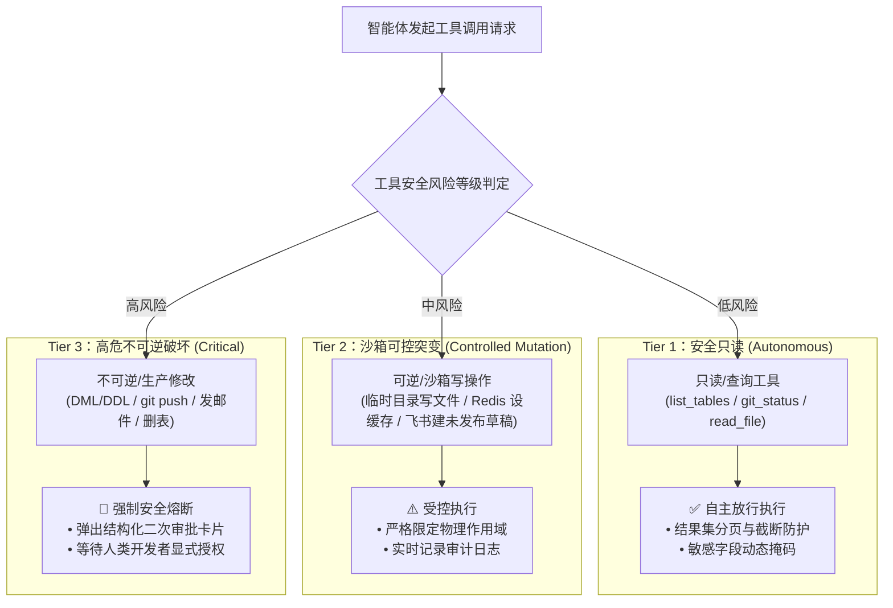
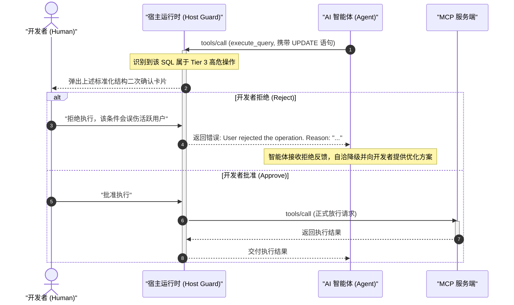

# MCP 工具三级风险分级治理与 ADR-0003 权限控制模型

| 属性 | 详情 |
| :--- | :--- |
| **文档类型** | 架构安全规约 / 权限控制与治理标准 |
| **当前状态** | 已归档 (Accepted) |
| **作者** | Ateng |
| **创建日期** | 2026-09-28 |
| **关联系统/模块** | Ateng-Agent / MCP Security & Governance |

---

## 1. 安全治理基石与 ADR-0003 决策遵从

在传统的面向人类开发者的研发系统中，权限控制（RBAC/ABAC）依赖于账号密码或 SSO 登录态。然而，当大语言模型（LLM）成为系统的直接操作者时，传统安全模型面临根本性挑战：
1. **决策不确定性**：模型推理可能产生幻觉，误将生产数据当作测试数据执行破坏性操作；
2. **多步工具组合穿透**：攻击者可能通过连续诱导“读取敏感配置 $\to$ 拼接外发请求 $\to$ 触发邮件推送”形成组合拳越权；
3. **缺乏责任主体**：自主智能体的操作如无即时拦截和审计追溯，极易造成不可逆的数据灾难。

为此，本项目全面贯彻 [`docs/adr/0003-mcp-tool-sandboxing-and-write-guard.md`](../../adr/0003-mcp-tool-sandboxing-and-write-guard.md) 架构决策，确立三大治理核心原则：
- **默认只读原则 (Read-by-Default)**：外设挂载默认仅赋予查询探查权限；
- **人在回路原则 (Human-in-the-Loop)**：任何高危不可逆变更必须由人类开发者显式二次确认；
- **零明文不变量 (Zero-Secret Invariant)**：所有交互物与代码库严禁明文凭据入库。

---

## 2. 工具三级风险分级治理矩阵 (Three-Tier Risk Matrix)

为了在研发效率与系统安全之间取得最佳平衡，我们将智能体接触的所有 MCP 工具形式化划分为三个风险等级：



### 2.1 典型外设工具分级映射全景表

| 风险等级 | 核心特征定义 | 代表性 MCP 外设与工具 | 准入与执行策略 |
| :--- | :--- | :--- | :--- |
| **Tier 1 (安全只读)** | 仅获取只读上下文与静态资产，绝对无状态副作用，多次调用严格幂等。 | • **MySQL**：`list_tables`, `describe_table`<br>• **Redis**：`get`, `hgetall`, `zrange`, `scan_keys`<br>• **Git**：`git_status`, `git_diff`, `git_log`<br>• **飞书**：`docx_v1_document_get`, `bitable_v1_appTable_list`<br>• **Apipost**：`get_project_tree`, `get_target_detail`<br>• **Filesystem**：`read_file`, `list_directory` | ✅ **自主直接执行**：<br>智能体可自主调度，但宿主必须对单次返回的文本大小进行安全截断（如最大 500 行），防止 Context Bloat。 |
| **Tier 2 (沙箱可控)** | 发生状态写入或修改，但影响面被物理沙箱或临时作用域严格限制，或者提供一键回滚能力。 | • **本地文件**：向 Agent 专属 Scratch 隔离目录写入临时排障脚本<br>• **Redis**：`set` 且显式带有 `EXPIRE` 存活时间（TTL $\le$ 300s）<br>• **飞书**：在个人私有测试空间创建临时调试多维表格<br>• **Apipost**：`create_target`（仅限测试环境调试接口） | ⚠️ **受控静默/轻量执行**：<br>智能体必须在输出中陈述变更理由，记录调用上下文与前置快照，无需打断开发者注意力。 |
| **Tier 3 (高危不可逆)** | 涉及数据库持久化修改、生产数据突变、外部群发通知、代码仓库分支重写或不可逆删除。 | • **MySQL**：`execute_query` (包含 `INSERT`, `UPDATE`, `DELETE`, `DROP`, `ALTER`, `TRUNCATE`)<br>• **Redis**：`flushdb`, `flushall`, `del` (无 TTL)<br>• **Git**：`git_commit`, `git_push`, `git_reset --hard`<br>• **QQ 邮箱**：`send_email`<br>• **本地文件**：`delete_file`，覆写已有业务代码文件 | 🛑 **强制安全中断**：<br>立即触发 **Human-in-the-Loop** 二次授权确认，人类未明确点击批准前，底层操作严禁执行。 |

---

## 3. 二次授权确认协议模版 (Human-in-the-Loop Protocol)

当智能体尝试调度 Tier 3 高危工具时，宿主运行时必须拦截请求并向开发者呈现**标准二次确认交互卡片**。

### 3.1 确认卡片呈现标准结构

```markdown
> [!CAUTION] 🚨 MCP 高危操作二次确认提醒 (Tier 3 Critical Operation)
> 智能体尝试执行具备状态突变或不可逆破坏的操作，请仔细核对以下拟执行载荷：
>
> | 审核要素 | 详情内容 |
> | :--- | :--- |
> | **目标外设 / 工具** | `mysql-dev` / `execute_query` |
> | **操作危险等级** | 🛑 **Tier 3 (高危不可逆)** |
> | **操作意图** | 为 `users` 表中的测试账号批量更新状态 |
> | **拟执行实际载荷** | `UPDATE users SET status = 0 WHERE created_at < '2026-01-01' LIMIT 50;` |
> | **预计影响范围** | 最多影响 50 行数据，命中测试环境数据库 |
> | **回滚/补偿方案** | 执行前已通过 `SELECT` 导出对应 50 行的备份数据至本地 Scratch 目录 |
>
> **请回复口令确认是否授权执行**：
> - 输入 `[批准执行 / Approve]`：临时授予单次执行权限；
> - 输入 `[拒绝取消 / Reject]`：阻断本次执行并指示智能体调整方案。
```

---

### 3.2 决策闭环与防重放机制



1. **单次一次性授权 (Single-Use Token)**：
   - 每次人工授权仅针对当前会话中唯一的请求 `id` 与参数快照生效；
   - 严禁赋予智能体“全局永久免审批”权限，防止后续多步执行时发生越权逃逸。
2. **自洽降级拒绝处理**：
   - 当开发者拒绝执行时，智能体**绝对严禁死循环重复弹出确认申请**；
   - 必须记录拒绝原因，评估替代只读方案或退出当前危险分支。
