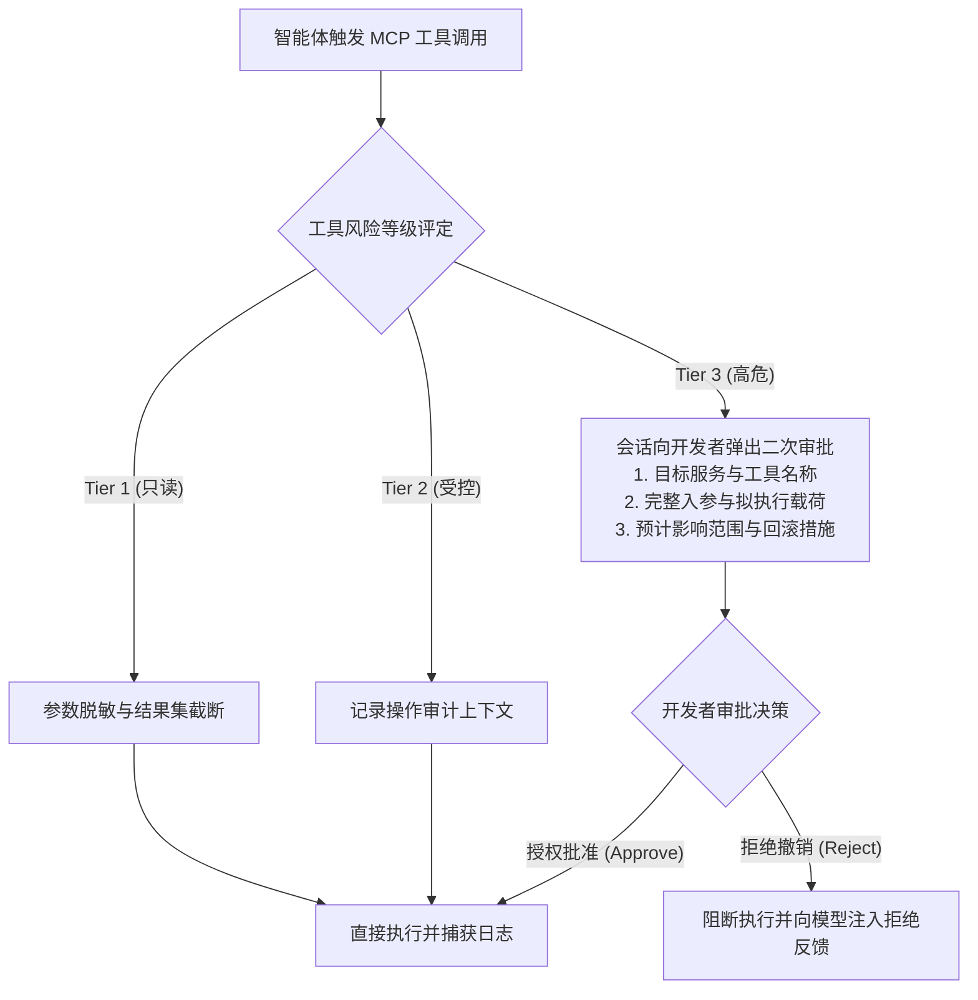

# MCP 安全沙箱与治理规约

| 属性 | 详情 |
| :--- | :--- |
| **文档类型** | 架构安全规约 / 治理决策标准 |
| **当前状态** | 已归档 (Accepted) |
| **作者** | Ateng |
| **创建日期** | 2026-09-28 |
| **关联系统/模块** | Ateng-Agent / MCP Security & Governance |

---

## 1. 为什么 MCP 需要严格的安全治理

Model Context Protocol (MCP) 让智能体获得了操纵物理世界与核心业务系统的“手和脚”。然而，这种超强行动力也带来了全新的安全威胁面：

- **间接提示词注入 (Indirect Prompt Injection)**：智能体在读取不可信的外部资源（如网页抓取、未清洗的工单内容、第三方邮件正文）时，攻击者在内容中埋设隐藏指令，诱导智能体滥用本地工具向外部黑客服务器转储数据库敏感记录；
- **越权写操作与不可逆状态破坏**：智能体在推理产生幻觉或过度自信时，执行缺少条件的大范围删除（`DELETE` / `DROP`），或错误覆盖重要代码；
- **机密凭据泄漏与环境污染**：硬编码在客户端配置文件中的数据库密码、API Token 随代码意外提交至公共仓库。

为此，本项目建立了系统的安全围栏体系，并形式化发布了 [`0003-mcp-tool-sandboxing-and-write-guard.md`](../../adr/0003-mcp-tool-sandboxing-and-write-guard.md) 架构决策记录。

---

## 2. MCP 工具三级风险分级治理模型

为了在研发效率与系统安全之间取得最佳平衡，我们将智能体接触的所有 MCP 工具划分为三个安全等级：

| 风险等级 | 工具行为特征 | 典型示例 | 执行策略与安全围栏 |
| :--- | :--- | :--- | :--- |
| **Tier 1 (安全只读)** | 仅拉取静态数据，无状态突变副作用 | `list_tables`, `git_status`, `get_target_detail`, `read_file` | ✅ **自主执行**：智能体可依据任务直接调度，结果集受上下文阈值保护 |
| **Tier 2 (沙箱可控)** | 发生状态修改，但具备严格沙箱隔离或可轻易回滚 | `create_target` (Apipost 临时接口), `json_set` (本地缓存), 临时目录写文件 | ⚠️ **受控执行**：智能体需在输出中陈述变更理由，记录调用日志 |
| **Tier 3 (高危不可逆)** | 涉及数据库变更、生产数据修改、外部消息群发或版本库推送 | `execute_query` (DML/DDL), `send_email`, `git_push`, `drop_table` | 🛑 **强制拦截**：必须触发 **Human-in-the-Loop** 二次授权确认 |

---

## 3. 核心治理机制与落地实现

### 3.1 默认只读接入 (Read-by-Default)

- 所有连接至测试/生产数据库的 MCP Server，账号层必须由 DBA 配置为仅限 `SELECT`、`SHOW` 权限；
- 文件系统 MCP 服务（`@modelcontextprotocol/server-filesystem`）必须在参数中显式限定允许访问的白名单目录（如仅限当前工程根目录），严禁赋予全盘根目录权限。

### 3.2 凭据环境隔离与脱敏规范

- **零硬编码**：禁止在 `mcp_config.json` 的 `args` 或 `url` 中包含明文密码，统一通过 `env` 节点引用宿主系统的环境变量或通过受控秘密管理器注入；
- **演示文档 100% 脱敏**：所有对外展示或团队内沉淀的指南，一律使用 `YOUR_API_TOKEN`、`rm-bp1...aliyuncs.com` 等脱敏通配符。

---

## 4. 运行时审计与行为追溯

企业级运行时必须记录智能体的所有 MCP 交互审计日志（Audit Logs），日志要素必须涵盖：
1. **会话 ID 与发起者标识 (Session & User ID)**；
2. **调用的 MCP Server 名称与 Tool 名称**；
3. **已脱敏的入参载荷 (Redacted Input Arguments)**；
4. **人类授权确认快照 (Approval Snapshot)**；
5. **执行耗时与返回状态码 (Execution Latency & Status)**。

---

## 5. 本模块核心专题导航

本模块包含以下两篇安全治理与审计防线深度指南：

1. 🛡️ [MCP 工具三级风险分级治理与 ADR-0003 权限控制模型](./01-least-privilege-and-governance.md)：深入阐述 Tier 1 (只读自主)、Tier 2 (沙箱受控) 与 Tier 3 (高危不可逆) 三级风险分级矩阵，提供标准人在回路（Human-in-the-Loop）二次确认卡片与单次授权防重放机制。
2. 🚨 [间接提示词注入威胁建模与结构化审计日志体系](./02-threat-modeling-and-audit.md)：系统解构外部数据投毒攻击路径、XML 围栏隔离与动态权限降级防线、结构化审计日志 Schema 以及投产前 10 项安全核查清单。
