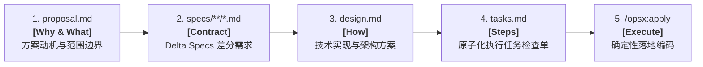
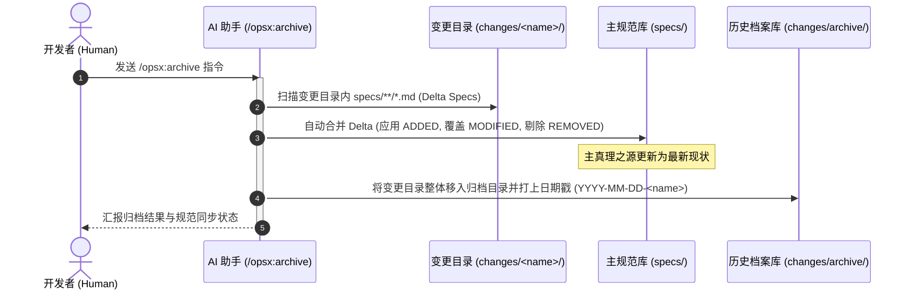
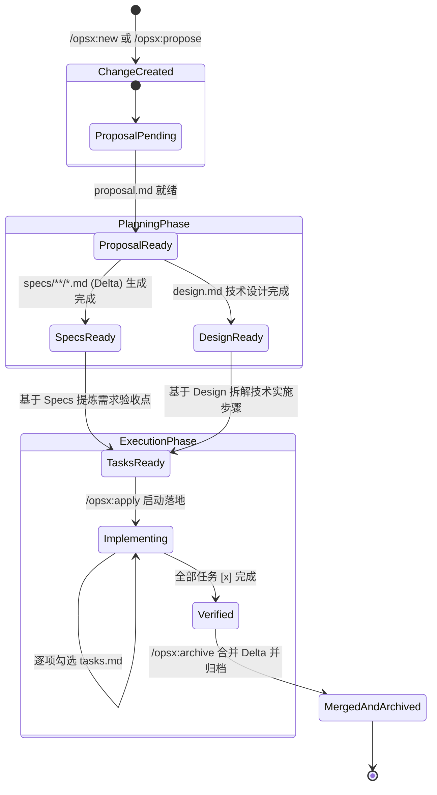

# OpenSpec 核心理念与架构契约规范 (Core Concepts & Architecture)

| 属性 | 详情 |
| :--- | :--- |
| **文档类型** | 技术专题指南 / 架构契约 |
| **当前状态** | 已归档 (Accepted) |
| **作者** | Ateng |
| **创建日期** | 2026-09-28 |
| **关联系统/模块** | Ateng-Agent / OpenSpec 规范中心 |
| **适用基准** | Node.js >= 20.19.0 / @fission-ai/openspec |

---

## 1. 规范驱动开发 (SDD) 五大核心支柱 (Core Pillars)

规范驱动开发（Spec-Driven Development, 简称 SDD）是 OpenSpec 确立的面向 AI 编程时代的核心方法论。它彻底打破了“即兴提示词生成代码”的不可靠模式，通过以下五大核心支柱构建起坚固的人机协作工程基线。

```text
       ┌────────────────────────────────────────────────────────┐
       │             OpenSpec SDD 五大支柱架构模型              │
       └────────────────────────────────────────────────────────┘
       1. Specs (真理之源)  ───► 描述系统当前真实行为
       2. Change (工作单元) ───► 单特性隔离目录与上下文封装
       3. Delta Specs (差分)───► ADDED / MODIFIED / REMOVED 增量演进
       4. Pipeline (递进链) ───► proposal ─► specs ─► design ─► tasks
       5. Archive (真理闭环)───► Delta 自动合并回主规范，形成历史追溯
```

### 1.1 支柱一：Specs 是唯一的系统真理 (Source of Truth)

在 OpenSpec 体系中，规范（Specs）代表了对软件系统**当前如何运行**的权威答案，而非过期陈旧的需求草稿。

- **组织形式**：全部规格文件存放在项目根目录下的 `openspec/specs/` 中，按业务领域或功能模块自然分层（例如 `auth/`、`payment/`、`ui/`、`inventory/`）。
- **语言格式**：采用标准 Markdown 编写，无需记忆复杂的专有 DSL 语法。
- **核心构成**：
  1. **需求条目 (Requirements)**：使用 RFC 2119 风格的关键词（如 `SHALL` 必须、`SHOULD` 应当、`MAY` 可以）进行无歧义约束。
  2. **具体场景 (Scenarios)**：为每个需求提供具体的上下文输入与预期结果，支持清晰的 `WHEN ... THEN ...` 或 `GIVEN / WHEN / THEN` 格式。

```markdown
<!-- 示例: openspec/specs/auth/spec.md -->
# 身份认证规范 (Authentication Specification)

## 核心会话管理

### Requirement: 会话自动过期控制
系统 SHALL 在用户无任何操作持续达到 30 分钟后自动终止其认证会话，并强制失效关联的 Token。

#### Scenario: 闲置超时会话失效
- **GIVEN** 用户已成功登录且处于闲置状态
- **WHEN** 距离最后一次请求时间超过 30 分钟且用户发起新的 API 请求
- **THEN** 系统响应 HTTP 401 状态码，并重定向至登录界面
```

### 1.2 支柱二：Change 作为独立工作单元 (Unit of Work)

在敏捷开发与多任务并行场景下，代码与文档的散落混杂是导致冲突的根源。OpenSpec 提出了**单一变更单元 (Unit of Work)** 模型：

- **单特性单目录**：任何特性的增加、重构或缺陷修复，均在 `openspec/changes/<change-name>/` 下创建专属目录。
- **全生命周期上下文自包含**：变更目录内完整包含该特性的背景提案（`proposal.md`）、架构设计（`design.md`）、差分规范（`specs/`）与执行任务卡（`tasks.md`）。
- **零全局污染**：多个开发者或多个 AI Agent 可在不同的变更目录中独立推进各自任务，互不干扰，直至合并。

### 1.3 支柱三：Delta Specs 差分规范协议 (Diff not Destination)

传统的文档体系之所以在实际项目中难以维持，是因为每次修改都要求开发者通读并重写全量文档。针对既有项目（Brownfield），OpenSpec 提出了划时代的 **Delta Specs（差分规范）** 协议。

> [!IMPORTANT]
> **差分理念核心**：在变更（Change）阶段，**严禁重写整个业务规范**，仅需记录本次特性引起的增量差分（Diff）。这种增量契约不仅大幅降低了 AI 的上下文消耗，也使得代码审查者（Reviewer）能够一目了然地识别行为变更。

Delta Specs 规定了三类规范头：

| 差分标识符 | 语义定义 | 适用场景 |
| :--- | :--- | :--- |
| `## ADDED Requirements` | **新增需求** | 引入全新功能模块、新增校验规则或提供全新对外 API 接口 |
| `## MODIFIED Requirements` | **变更需求** | 对既有功能的输入输出逻辑、超时时间或业务约束进行就地修正 |
| `## REMOVED Requirements` | **废弃/移除需求** | 下线过时接口、废除已不再适用的旧业务规则 |

#### Delta Specs 生产级范式代码

```markdown
<!-- 示例: openspec/changes/add-oauth2-login/specs/auth/spec.md -->
## ADDED Requirements

### Requirement: 第三方 OAuth2 授权登录
系统 SHALL 支持用户通过 GitHub 与 Google OAuth2 凭据完成无密码注册与登录流程。

#### Scenario: 用户授权登录成功
- **WHEN** 用户点击“GitHub 登录”并在授权页完成许可
- **THEN** 系统校验 State 状态码，匹配并创建本地用户绑定记录，下发 Session Token

## MODIFIED Requirements

### Requirement: 登录重试限流防御
系统 SHALL 针对单一 IP 地址限制密码及 OAuth 登录重试频次，由原有的每分钟 10 次调整为每分钟 5 次，并在超限后锁定访问 15 分钟。

#### Scenario: 登录尝试频次超限
- **WHEN** 来自同一客户端 IP 的登录尝试在 60 秒内达到第 6 次
- **THEN** 系统拦截请求并返回 HTTP 429 Too Many Requests
```

### 1.4 支柱四：工件递进链与流体状态 (Fluid Artifact Pipeline)

OpenSpec 将一个特性的研发过程抽象为 4 个互相支撑的核心工件，彼此顺畅流转：



#### 流体状态机机制 (Fluid not Rigid)
在实际开发中，研发并非死板的单向流动。OpenSpec 创新性地将工件依赖作为**使能器 (Enablers)** 而非**阻碍关卡**：
- **前向生成**：`proposal.md` 确定后，AI 便有依据推导 `specs/`；`specs/` 与 `design.md` 共同催生原子化的 `tasks.md`。
- **反向重塑**：当在编码实现或设计阶段发现最初设想不合理时，开发者可以随时修改 `design.md`，并通过 `/opsx:update` 命令通知 AI 将影响自适应反向同步至 `specs/` 或 `proposal.md`，始终维持工件群的一致性。

### 1.5 支柱五：归档与真理闭环 (Archiving & Truth Convergence)

当一个特性的所有任务在 `tasks.md` 中均被验证通过并勾选完毕后，执行 `/opsx:archive` 触发归档闭环：



通过这一闭环：
1. **文档永远不会陈旧**：每次代码合并，主规范库自动吸收变更，与生产代码保持绝对同步。
2. **审计追溯完备**：历史归档目录中永久保留当时决策的 Proposal、Design 及每项 Task 的勾选记录，为后续追溯提供清晰的上下文背景。

---

## 2. 项目目录结构拓扑与契约布局 (Directory Hierarchy)

OpenSpec 在工程根目录下统一建立 `openspec/` 契约体系。以下为标准的目录结构布局树：

```text
<project-root>/
├── openspec/
│   ├── config.yaml                   # 项目级全局配置文件 (架构规则、上下文注入)
│   │
│   ├── specs/                        # 【系统真理之源】主业务规范库
│   │   ├── auth/
│   │   │   └── spec.md               # 认证域主规范
│   │   ├── payment/
│   │   │   └── spec.md               # 支付域主规范
│   │   └── common/
│   │       └── spec.md               # 公共基线与错误码规范
│   │
│   └── changes/                      # 【活动单元库】当前正在进行中的变更特性
│       ├── .gitkeep
│       │
│       ├── add-oauth2-login/         # 示例变更 1：新增 OAuth2 登录
│       │   ├── .openspec.yaml        # 变更专用元数据配置 (schema、创建时间)
│       │   ├── proposal.md           # 变更动机、影响范围与权衡
│       │   ├── design.md             # 架构技术设计方案 (数据模型、时序链路)
│       │   ├── tasks.md              # 实施任务检查单 (支持勾选 [x])
│       │   └── specs/                # 本变更包含的差分规范 (Delta Specs)
│       │       └── auth/
│       │           └── spec.md       # ADDED / MODIFIED / REMOVED 规则
│       │
│       └── archive/                  # 【历史档案库】已归档合并的历史变更
│           ├── 2026-09-20-init-auth/
│           │   ├── proposal.md
│           │   ├── design.md
│           │   └── tasks.md
│           └── 2026-09-25-add-cache/
│               ├── proposal.md
│               ├── design.md
│               └── tasks.md
```

### 2.1 变更元数据 `.openspec.yaml` 规范

每个变更目录的根层级均包含一个轻量的 `.openspec.yaml` 元数据文件，负责声明该变更所绑定的工作流方案（Schema）：

```yaml
# 文件: openspec/changes/<change-name>/.openspec.yaml
schema: spec-driven
createdAt: 2026-09-28T16:24:00.000Z
```

- `schema`：指定解析该变更工件依赖关系的模板定义（默认 `spec-driven`，支持自定义扩展）。

### 2.2 核心工件职能对照表

在单一变更单元内，各标准 Markdown 工件的具体职能分工如下：

| 工件文件 | 回答的核心问题 | 关键承载内容 | 开发者核心审查点 |
| :--- | :--- | :--- | :--- |
| **`proposal.md`** | **Why & What** (为什么做？做什么？) | 业务背景、问题陈述、提案范围、弃用替代方案与潜在技术风险 | 动机是否合理、改动边界是否清晰克制 |
| **`specs/**/*.md`** | **Contract** (具体的行为约定是什么？) | `ADDED`、`MODIFIED`、`REMOVED` 差分规范及带有测试场景的标准示例 | 需求语义是否无歧义、边界分支是否覆盖全 |
| **`design.md`** | **How** (在工程架构上如何实现？) | 选型权衡、架构分层、实体关系（ERD）、数据表 DDL、服务调用时序 | 技术选型是否稳妥、是否违反系统既有规范 |
| **`tasks.md`** | **Steps** (落地的具体先后步骤？) | 按模块或分层编排的任务项（`[ ] 1.1 ...`），每个任务保持原子性 | 步骤粒度是否合适（单步可测试）、依赖顺序 |

---

## 3. 架构依赖流转与状态推进机制

工件之间的依赖关系不仅决定了生成顺序，也决定了验证和实施的时机。



通过这一套严谨的架构契约，OpenSpec 将大模型从“容易产生幻觉的代码生成器”重塑为“遵循契约与规范的严谨工程搭档”。
