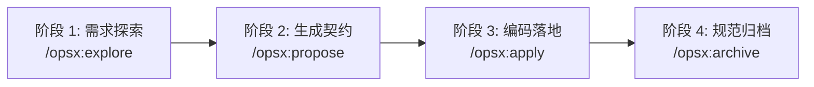

# OpenSpec 安装部署与快速上手指南 (Installation & Quickstart)

| 属性 | 详情 |
| :--- | :--- |
| **文档类型** | 实施指南 / 上手实战 |
| **当前状态** | 已归档 (Accepted) |
| **作者** | Ateng |
| **创建日期** | 2026-09-28 |
| **关联系统/模块** | Ateng-Agent / OpenSpec 规范中心 |
| **适用基准** | Node.js >= 20.19.0 / @fission-ai/openspec |

---

## 1. 环境基线与全局安装 (Installation & Prerequisites)

### 1.1 运行时基线检查

在部署 OpenSpec 之前，需确保宿主机已安装满足最低要求的 Node.js 运行时：

- **运行时版本**：Node.js `>= 20.19.0`（推荐使用 Node.js 22 LTS）。
- **版本自检命令**：
  ```bash
  node --version
  ```
  若当前版本低于 `v20.19.0`，请优先通过版本管理器（如 `nvm`、`fnm`、`asdf` 或 `volta`）升级至支持的长期支持版本。

### 1.2 全局安装 CLI 引擎

OpenSpec 命令行工具统一发布于官方 NPM 镜像源 [`@fission-ai/openspec`](https://www.npmjs.com/package/@fission-ai/openspec)。您可以根据当前系统偏好选用任意包管理器进行全局安装：

```bash
# 推荐方式：使用 npm 全局安装
npm install -g @fission-ai/openspec@latest

# 或使用 pnpm 全局安装
pnpm add -g @fission-ai/openspec@latest

# 或使用 bun 全局安装
bun add -g @fission-ai/openspec@latest

# 或使用 yarn 1.x 全局安装
yarn global add @fission-ai/openspec@latest
```

> [!TIP]
> 全局安装仅负责提供 `openspec` 命令行可执行环境，**不会修改当前项目的本地锁文件 (`pnpm-lock.yaml` / `package-lock.json`)**，也不会向项目注入冗余的运行时业务依赖。

### 1.3 连通性与 PATH 环境变量排查

安装完成后，在终端中执行版本查询，验证 CLI 是否已成功加载至系统环境：

```bash
openspec --version
```

#### 常见环境变量问题与解决
- **命令未找到 (`command not found` / 不是内部或外部命令)**：
  - 说明对应包管理器的全局 `bin` 路径未加入到系统的 `PATH` 环境变量中。
  - **npm 查找路径**：执行 `npm config get prefix`，将输出目录下的 `bin`（Windows 上为输出根目录）追加至系统环境变量。
  - **pnpm 查找路径**：执行 `pnpm setup` 自动修复环境变量。
- **Node 版本管理器多版本覆盖**：
  - 若使用 `nvm` 或 `fnm`，全局安装的 CLI 绑定在安装时激活的特定 Node.js 版本目录下。切换 Node 版本后若出现命令失效，只需在当前激活版本下重新执行一次全局安装。

---

## 2. 项目初始化与 AI 编码工具适配 (Initialization & Tool Setup)

OpenSpec 采用高度开放的生态适配策略，通过在项目中生成标准化技能脚本（Skills / Prompts），使 30+ 种主流 AI 辅助编程工具能够原生感知并调用 OpenSpec 的工作流。

### 2.1 执行项目初始化向导

进入需要实施规范驱动开发的代码仓库根目录，执行初始化命令：

```bash
# 交互式向导初始化（推荐）
openspec init
```

执行后，OpenSpec 会自动检测当前工作空间，并引导您选择日常使用的 AI 辅助工具；随后自动创建 `openspec/` 根目录骨架。

```text
┌────────────────────────────────────────────────────────┐
│               OpenSpec 初始化检测交互向导               │
└────────────────────────────────────────────────────────┘
? Which AI coding tools do you use? (Select all that apply)
  [x] Claude Code
  [x] Cursor
  [x] GitHub Copilot
  [ ] Codex
  [ ] Roo Code
  [ ] Devin Desktop
```

#### 批量非交互式初始化
若在 CI/CD 流水线或自动化脚本中运行，可通过 `--tools` 参数一次性指定工具 ID 列表（逗号分隔）：

```bash
openspec init --tools claude-code,cursor,github-copilot
```

### 2.2 主流 AI 编码工具适配机制对照

不同 AI 辅助编程工具对扩展指令的接入范式有所差异，OpenSpec 在初始化阶段会为各工具生成完全符合其原生规范的配置：

| AI 辅助工具 | 工具 ID (`--tools`) | 核心生成位置与机制 | Slash 指令触发语法 |
| :--- | :--- | :--- | :--- |
| **Claude Code** | `claude-code` | 注入 `.claude/skills/` 技能脚本，定义工作流交互契约 | `/opsx:propose`、`/opsx:explore` |
| **Cursor** | `cursor` | 生成 `.cursorrules` 与 `.cursor/rules/` 规则集 | `/opsx-propose`、`/opsx-apply` |
| **GitHub Copilot** | `github-copilot` | 生成 `.github/copilot-instructions.md` 提示词约束 | `/opsx:propose`（聊天界面） |
| **Codex** | `codex` | 生成 `~/.codex/prompts/` 专属指令模板 | `$openspec-propose` |
| **Devin Desktop** | `devin` | 注入专属 Agent 协议文件与执行规则 | `/opsx:propose` |
| **Roo Code** | `roocode` | 注册自定义工作流 Modes 与指令动作 | `/opsx:propose` |

---

## 3. 端到端快速上手实战：以添加暗黑模式 (Add Dark Mode) 为例

本节以一个标准的“添加暗黑主题支持 (`add-dark-mode`)”功能为例，完整演示从需求探索到最终合并归档的 4 步闭环。



### 3.1 阶段一：无侵入式需求探索 (`/opsx:explore`)

当面对一个模糊需求或需要研判技术路线时，无需立即创建文档，直接在 AI 对话框中唤醒思考伴侣：

```text
开发者: /opsx:explore

AI 助手: 请问你想探索什么技术主题或需求？

开发者: 我们的前端项目想加入暗黑模式，但要尽量轻量，如何设计比较合理？

AI 助手: 正在分析你的前端技术栈...
        当前项目采用标准 CSS 模块化方案。推荐采用原生 CSS 自定义属性（Variables）+ ThemeContext 方案：
        1. 定义 :root 与 [data-theme='dark'] 全局颜色变量；
        2. 通过 window.matchMedia('(prefers-color-scheme: dark)') 自动响应系统外观；
        3. 使用 localStorage 持久化用户的显式切换偏好。
        整套方案零外部依赖，改动轻量。是否立即固化为特性变更？
```

### 3.2 阶段二：生成结构化契约工件 (`/opsx:propose`)

当技术思路清晰后，执行 `/opsx:propose` 正式发起变更：

```text
开发者: /opsx:propose add-dark-mode
```

AI 将在项目根目录下自动创建独立变更工件目录 `openspec/changes/add-dark-mode/`，并一次性生成全套初始规划工件：

```text
AI 助手: 已成功创建变更单元 openspec/changes/add-dark-mode/
        ✓ proposal.md         — 阐明动机、影响范围与备选方案
        ✓ specs/ui/spec.md    — 编写 Delta Specs 差分规范 (ADDED 需求与测试场景)
        ✓ design.md           — 确定 CSS 变量与 Context 技术实现方案
        ✓ tasks.md            — 拆解 4 项原子化实施检查项
        工件均已就绪，请审阅设计与任务单。确认后运行 /opsx:apply 启动实现！
```

此时生成的关键工件片段如下：

#### 1. 差分契约规范 (`specs/ui/spec.md`)
```markdown
## ADDED Requirements

### Requirement: 用户主题偏好切换
系统 SHALL 提供亮色与暗色主题的即时切换功能，并默认遵循操作系统的系统外观偏好。

#### Scenario: 用户手动切换主题
- **WHEN** 用户点击主题切换按钮
- **THEN** 界面在 50ms 内完成无闪烁切换，并将选择值写入 localStorage 中的 `app_theme` 键中
```

#### 2. 实施任务检查单 (`tasks.md`)
```markdown
# 实施任务清单 (Tasks)

## 1. 基础样式与上下文注入
- [ ] 1.1 在 `styles/globals.css` 中声明 CSS 主题颜色变量及暗色映射
- [ ] 1.2 编写 `ThemeProvider` 组件，支持读取系统偏好与监听变更

## 2. 交互组件与持久化
- [ ] 2.1 封装 `ThemeToggle` 切换按钮组件
- [ ] 2.2 接入 localStorage 本地存储逻辑，补充单元测试用例
```

### 3.3 阶段三：人机确认与任务落地 (`/opsx:apply`)

在对生成的工件进行快速审阅并确认无误后，向 AI 发出实施指令：

```text
开发者: /opsx:apply
```

AI 助手将严格根据 `tasks.md` 中的步骤推进代码修改，并在完成具体步骤后自动将对应任务项打勾更新：

```text
AI 助手: 正在按照 tasks.md 实施代码落地...
        ✓ [x] 1.1 编写 styles/globals.css 变量声明
        ✓ [x] 1.2 编写 src/contexts/ThemeContext.tsx
        ✓ [x] 2.1 创建 src/components/ThemeToggle.tsx
        ✓ [x] 2.2 接入 localStorage 逻辑与单元测试

        🎉 全部任务实施完毕并通过本地测试！代码已就绪，请运行测试自检或执行 /opsx:archive 归档。
```

### 3.4 阶段四：验证与主规范归档闭环 (`/opsx:archive`)

在本地运行测试确认功能符合预期后，执行归档操作：

```text
开发者: /opsx:archive
```

AI 或终端底层调用 `openspec archive` 完成生命周期收敛：
1. **差分自动合并**：将 `openspec/changes/add-dark-mode/specs/ui/spec.md` 中的 `ADDED Requirements` 自动抽取并增量合并至全局主规范 `openspec/specs/ui/spec.md`。
2. **变更历史封存**：将活动目录 `add-dark-mode/` 整体移动至 `openspec/changes/archive/2026-09-28-add-dark-mode/`。
3. **工作区复位**：活动变更库恢复干净状态，随时迎接下一个全新特性！
