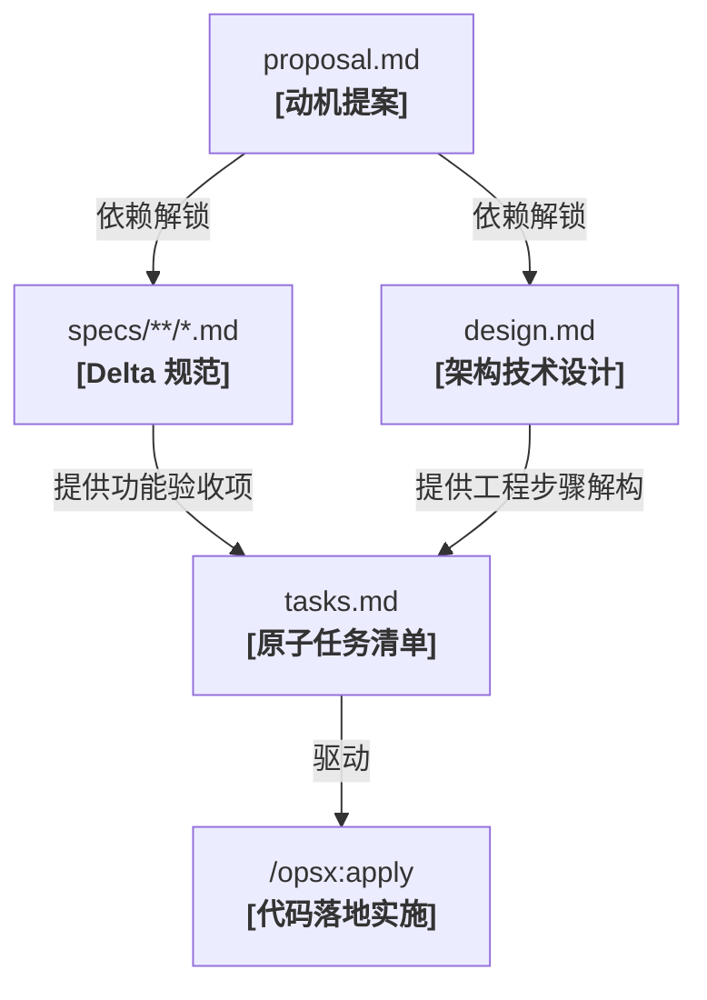

# OpenSpec CLI 命令行与交互式指令参考 (CLI & Slash Commands)

| 属性 | 详情 |
| :--- | :--- |
| **文档类型** | 命令手册 / API 契约 |
| **当前状态** | 已归档 (Accepted) |
| **作者** | Ateng |
| **创建日期** | 2026-09-28 |
| **关联系统/模块** | Ateng-Agent / OpenSpec 规范中心 |
| **适用基准** | Node.js >= 20.19.0 / @fission-ai/openspec |

---

## 1. OpenSpec 交互架构双轮驱动体系

OpenSpec 在工程交互上设计为**双轮驱动模型**：
1. **终端命令体系 (`openspec ...`)**：面向系统初始化、资产浏览、静态规范校验、全局配置管理与 CI/CD 流水线集成。
2. **交互式 Slash 指令体系 (`/opsx:...`)**：面向 IDE 及 AI 对话界面，在日常编码会话中通过提示词工程引导大语言模型执行探索、生成、实施与归档。

```text
┌────────────────────────────────────────────────────────┐
│             OpenSpec 双轮交互与契约驱动模型            │
└────────────────────────────────────────────────────────┘
  终端控制台 (Terminal / Shell)      AI 对话界面 (IDE Chat Interface)
  [开发者直接调用]                    [开发者发出 /opsx:* 指令]
         │                                       │
         ▼                                       ▼
  ┌──────────────┐                       ┌──────────────┐
  │ openspec CLI │                       │ Agent Skills │
  └──────────────┘                       └──────────────┘
         │                                       │
         ├─ init / doctor / config               ├─ /opsx:explore / propose
         ├─ list / show                          ├─ /opsx:apply / update
         └─ validate / archive / sync            └─ /opsx:verify / archive
                         │                       │
                         ▼                       ▼
          ═══════════════════════════════════════════════
                 统一底层：openspec/ 规范资产库
          ═══════════════════════════════════════════════
```

---

## 2. OpenSpec CLI 终端命令全集 (CLI Reference)

全局安装 `@fission-ai/openspec` 后，在终端中即可调用 `openspec` 及其子命令。

### 2.1 项目初始化与技能刷新

#### `openspec init`
在当前目录下初始化 OpenSpec 体系，生成 `openspec/` 目录树并配置 AI 工具。

```bash
# 交互式向导初始化
openspec init

# 指定特定工具集成（支持多工具逗号分隔）
openspec init --tools claude-code,cursor,github-copilot
```

- **参数说明**：
  - `--tools <ids>`：跳过交互式提问，直接声明需要适配的 AI 辅助工具 ID。

#### `openspec update`
当全局升级了 OpenSpec 版本或修改了工作流 Profile 后，执行该命令刷新工作区中的 AI 技能脚本与指令模板，保持其与最新引擎一致。

```bash
openspec update
```

---

### 2.2 资产与状态浏览命令

#### `openspec list`
枚举项目内的规范资产或活动变更单元。

```bash
# 列出当前所有进行中的变更单元 (Changes)
openspec list

# 列出系统主规范 (Specs)
openspec list specs

# 列出已归档的历史变更 (Archive)
openspec list archive
```

#### `openspec show`
查看指定变更或主规范的详细工件内容与元数据。

```bash
# 查看特定活动变更的状态与工件清单
openspec show add-dark-mode

# 查看特定主规范的定义内容
openspec show specs/auth/spec.md
```

---

### 2.3 静态校验与系统健康诊断

#### `openspec validate`
对当前工作区的变更工件与主规范执行严格的静态合规校验。

```bash
# 静态全量校验
openspec validate
```

- **检查项**：
  1. 变更目录命名是否符合规范（推荐 kebab-case）；
  2. 工件之间的前置依赖关系是否闭环（如 `tasks.md` 存在前是否已具备对应规范）；
  3. Delta Specs 格式语法（`ADDED` / `MODIFIED` / `REMOVED`）是否正确。

#### `openspec doctor`
诊断当前 OpenSpec 安装环境与解析根目录的健康度。

```bash
openspec doctor
```

- **输出内容**：Node.js 运行时版本校验、配置项有效性、已绑定的工具集成状态及已知冲突扫描。

---

### 2.4 规范同步与归档操作

#### `openspec archive`
将指定已完成的变更单元正式归档，将其 Delta Specs 增量合并至 `openspec/specs/` 并移入历史库。

```bash
# 归档指定变更
openspec archive add-dark-mode
```

#### `openspec sync`
在不归档整个变更的前提下，手动将指定变更内的 Delta Specs 提前试同步（Merge）至主规范库。

```bash
openspec sync add-dark-mode
```

---

### 2.5 配置与工作流方案管理

#### `openspec config`
查看或调整项目与全局配置项。

```bash
# 切换工作流 Profile（core 核心模式 vs expanded 扩展模式）
openspec config profile

# 查看当前生效的完整配置视图
openspec config --show
```

#### `openspec schemas`
列出系统当前支持的工作流方案（Schemas）及其工件依赖链定义。

```bash
# 列出可用 Schemas 概要
openspec schemas

# 输出机器可读的 JSON 依赖元数据
openspec schemas --json
```

---

## 3. 交互式 Slash 命令参考 (Slash Commands Reference)

Slash 命令是由开发者在 AI 编码助手的对话框中直接触发的标准化操作指令。

> [!NOTE]
> **工具命名映射**：
> - Claude Code / Copilot / Devin：统一使用 `/opsx:<command>`（如 `/opsx:propose`）；
> - Cursor：注册为中划线形式 `/opsx-<command>`（如 `/opsx-propose`）；
> - Codex：注册为美元符前缀 `$openspec-<command>`（如 `$openspec-propose`）。

### 3.1 核心 Profile (`core`) 指令全解

`core` 是 OpenSpec 默认激活的工作流模式，旨在以最精简的指令闭环完成全流程交付：

| 指令名称 | 语法格式 | 核心职能 |
| :--- | :--- | :--- |
| **`/opsx:explore`** | `/opsx:explore [topic]` | **无负担思考伴侣**：研读代码库、推演设计方案、对比架构选型，不产生任何副作用代码。 |
| **`/opsx:propose`** | `/opsx:propose [name-or-desc]` | **一键生成规划**：一步到位创建变更目录，自动生成 `proposal`、`specs`、`design` 和 `tasks`。 |
| **`/opsx:apply`** | `/opsx:apply [change-name]` | **确定性编码落地**：驱动 AI 严格按 `tasks.md` 逐项执行代码修改与测试，并动态勾选 `[x]`。 |
| **`/opsx:update`** | `/opsx:update <name> - <reason>` | **跨工件连贯性修偏**：当业务意图微调时，同步调整所有相关工件（绝对不擅自改写业务代码）。 |
| **`/opsx:sync`** | `/opsx:sync [change-name]` | **规范差分预同步**：将指定变更中的 Delta Specs 提前合并至主真理库中。 |
| **`/opsx:archive`** | `/opsx:archive [change-name]` | **特性收口归档**：合并 Delta Specs 至主规范，将变更工件移入 `archive/` 历史目录。 |

#### `/opsx:update` 跨工件双向纠偏范式
如果在设计或实施过程中，决定将最初规划的实现方案变更（例如：“原设计使用 localStorage 存储，现决定改为 HttpOnly Cookie 存储”），只需执行：

```text
/opsx:update add-dark-mode - 我们决定改用 HttpOnly Cookie 存储主题偏好
```

AI 助手将遵循以下流程完成外科手术式修偏：
1. 更新 `proposal.md` 中的技术选型背景；
2. 更新 `specs/ui/spec.md` 中的 Cookie 读取与响应头场景；
3. 更新 `design.md` 中的接口签名与客户端请求流程；
4. 重新排练并更新 `tasks.md` 中的实施检查项。

---

### 3.2 扩展 Profile (`expanded`) 指令深度剖析

对于超大型重构、强合规审核项目或追求每步严密掌控的高级用户，可通过 `openspec config profile` 开启扩展指令集：

| 指令名称 | 语法格式 | 核心职能与价值 |
| :--- | :--- | :--- |
| **`/opsx:new`** | `/opsx:new [name] [--schema <id>]` | **仅创建脚手架**：仅创建变更目录与 `.openspec.yaml`，不立即生成工件，方便手动干预。 |
| **`/opsx:continue`** | `/opsx:continue [name]` | **单步依赖推导**：基于工件依赖图，每次仅生成下一个处于就绪状态的工件，方便逐篇细致评审。 |
| **`/opsx:ff`** | `/opsx:ff [name]` | **快进补全 (Fast-Forward)**：当意图完全明确时，从当前进度一次性补全后续全部规划工件。 |
| **`/opsx:verify`** | `/opsx:verify [name]` | **实施合规校验**：在不修改代码的前提下，深度审查当前源码实现是否百分之百忠实于 Specs 与 Design。 |
| **`/opsx:bulk-archive`**| `/opsx:bulk-archive` | **批量归档**：扫描并一次性归档所有任务项已全部勾选完毕的活动变更。 |
| **`/opsx:onboard`** | `/opsx:onboard` | **新手端到端向导**：以交互式教程引导新开发者从零走完一次完整的规范驱动开发流程。 |

---

## 4. 工件依赖图谱与状态流转机制 (Artifact State Machine)

OpenSpec 的核心调度引擎建立在有向无环图（DAG）之上。工件的生成顺序与可执行状态由预先定义的依赖规则严格控制：



### 工件状态生命周期

在调用 `/opsx:continue` 时，引擎会动态计算每个工件的三种标准状态：

- `✓ Done (已完成)`：工件文件已生成且内容完整。
- `◆ Ready (就绪)`：该工件的所有前置依赖工件均已标记为 `Done`，随时可以调用指令生成。
- `○ Blocked (阻塞)`：该工件的前置依赖尚未满足（例如：在 `proposal.md` 存在前，`tasks.md` 处于绝对阻塞状态）。

---

## 5. 常见运维诊断与操作陷阱防御 (Troubleshooting & Traps)

### 5.1 典型异常与排查清单

```text
┌────────────────────────────────────────────────────────┐
│               OpenSpec 典型排错与防御矩阵              │
└────────────────────────────────────────────────────────┘
```

| 异常现象 / 警告信息 | 触发诱因 | 生产级标准解决方案 |
| :--- | :--- | :--- |
| **`Unknown artifact ID in rules: X`** | 在 `openspec/config.yaml` 的 `rules` 中配置了当前 Schema 不存在的工件标识符 | 运行 `openspec schemas --json` 查看当前绑定的 Schema 支持的准确工件 ID（如 `spec-driven` 仅支持 `proposal`、`specs`、`design`、`tasks`）。 |
| **`Context too large (> 50KB)`** | `openspec/config.yaml` 中的 `context` 文本过长，超出 50KB 阈值限制 | `context` 仅用于注入核心技术栈与编码规范摘要；大段文档应改为外部链接或收录入规范库。 |
| **`Config not being applied`** | 配置文件命名或路径不正确 | 确保文件命名为 `openspec/config.yaml`（必须使用 `.yaml` 后缀，不支持 `.yml`）。 |
| **Delta Specs 冲突告警** | 两个并行变更同时对同一个主规范条目声明了不兼容的 `MODIFIED` 规则 | 先将前序变更归档，在后序变更目录中运行 `/opsx:update` 重新对齐最新真理之源。 |
