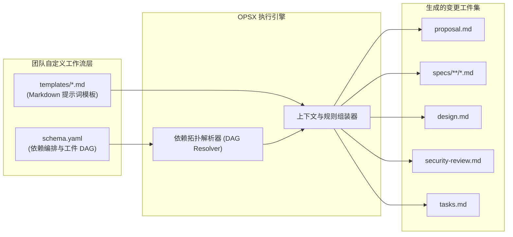
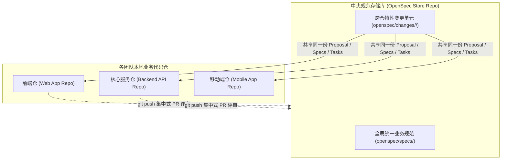

# OpenSpec 高级工作流定制与多仓架构实战 (Advanced Workflows & Stores)

| 属性 | 详情 |
| :--- | :--- |
| **文档类型** | 高级进阶指南 / 架构扩展规范 |
| **当前状态** | 已归档 (Accepted) |
| **作者** | Ateng |
| **创建日期** | 2026-09-28 |
| **关联系统/模块** | Ateng-Agent / OpenSpec 规范中心 |
| **适用基准** | Node.js >= 20.19.0 / @fission-ai/openspec |

---

## 1. 项目配置体系与规则深度注入 (Project Configuration & Rules)

为了避免每次向 AI 发出指令时重复灌输技术栈与编码规范，OpenSpec 支持通过项目级配置文件 `openspec/config.yaml` 实现全局上下文与细粒度工件规则的自动动态注入。

### 1.1 `openspec/config.yaml` 核心结构

配置文件位于项目规范根目录 `openspec/config.yaml`（必须使用 `.yaml` 后缀，不支持 `.yml`），其核心包含三大顶层配置块：

```yaml
# 文件: openspec/config.yaml
# 1. 默认绑定的工作流方案 (Schema)
schema: spec-driven

# 2. 全局上下文 (Context)：自动注入至每个工件的生成提示词最前端
context: |
  技术栈基线: TypeScript 5.5, React 19, Node.js 22 LTS, VitePress
  代码风格与规范: 遵循严格 ESLint 规则，禁止 any 类型，优先不可变数据结构
  接口契约: RESTful 风格，统一采用 JSON 格式响应，业务状态码封装于 code 字段中
  测试标准: 单元测试使用 Vitest，端到端测试使用 Playwright，新增功能测试覆盖率 >= 85%

# 3. 按工件 ID 细分注入规则 (Rules)：精准约束特定工件的格式与要素
rules:
  proposal:
    - 必须评估变更对现有系统性能与数据库吞吐量的潜在影响
    - 明确列出受影响的跨部门系统与协作团队
    - 必须包含线上灰度放量与回滚方案 (Rollback Plan)
  specs:
    - 必须严格遵循 Given/When/Then 或 WHEN ... THEN ... 格式编写测试场景
    - 每个 Requirement 必须标注 RFC 2119 约束动词 (SHALL / SHOULD / MAY)
    - 涉及金额与财务计算的场景，必须显式声明舍入精度与防并发重复扣款约定
  design:
    - 涉及两个以上系统或组件交互的流程，必须提供 Mermaid 时序图 (sequenceDiagram)
    - 涉及状态流转的实体，必须提供 Mermaid 状态机图 (stateDiagram-v2)
    - 数据库变更必须附带生产级 DDL 脚本与回滚 SQL
  tasks:
    - 任务拆解粒度应保持原子化，单项任务预期编码时长不超过 1 小时
    - 任务清单必须区分模块与执行顺序，且每项任务均需附带自动化单元测试验证项
```

### 1.2 注入机制与标签隔离

在调用 `/opsx:propose`、`/opsx:continue` 或 `/opsx:update` 时，OpenSpec 引擎会自动将配置解析并组装至底层 Prompt 中：

- **`<context>` 块注入**：`context` 文本被包裹在 `<context>...</context>` XML 标签内，放置在工件提示词最顶部，帮助 AI 快速建立宿主工程的背景上下文。
- **`<rules>` 块精准路由**：`rules` 仅在生成或更新对应 ID 的工件时按需加载，包裹在 `<rules>...</rules>` 标签内，杜绝无关规则对其他工件的上下文干扰。
- **容量上限与边界控制**：`context` 设有 50KB 的容量保护上限；超过阈值时 CLI 会抛出阻断性告警，促使团队将大篇幅文档收敛为模块化规范。

### 1.3 Schema 生效优先级矩阵

OpenSpec 在解析一个变更目录时，按照以下优先级严格判定其采用的 Schema 规则：

```text
┌────────────────────────────────────────────────────────┐
│            OpenSpec Schema 判定优先级 (高至低)         │
└────────────────────────────────────────────────────────┘
1. 命令行参数显式覆盖: /opsx:new --schema <custom-schema>
2. 变更目录局部元数据: openspec/changes/<name>/.openspec.yaml
3. 项目全局配置文件:   openspec/config.yaml (schema: <name>)
4. 引擎系统内置默认值: spec-driven
```

---

## 2. 自定义 Schema 工作流扩展 (Custom Workflow Schemas)

在早期版本中，AI 助手的指令逻辑硬编码在编译好的 TypeScript 代码包中，导致企业或团队无法对生成流程进行深度定制。OpenSpec 引入的 **OPSX 引擎**彻底解决了这一黑盒难题。

### 2.1 OPSX 引擎解耦架构

OPSX 将工作流的**流转逻辑（State/Dependency）**与**提示词内容（Prompt/Template）**完全外置：
- **`schema.yaml`**：以声明式语法定义工作流所包含的所有工件、文件存放路径及其前置拓扑依赖关系。
- **`templates/*.md`**：纯 Markdown 提示词模板，支持团队直接就地编辑优化，保存后立即生效，零编译开销。



### 2.2 自定义 `schema.yaml` 语法规范

团队可以在 `openspec/schemas/<schema-name>/` 下创建自定义工作流。以下为一个引入了“安全合规审计工件 (`security-review`)”的企业级自定义 Schema 实战范例：

```yaml
# 文件: openspec/schemas/enterprise-secure/schema.yaml
name: enterprise-secure
version: 1.0.0
description: 适用于企业级金融与交易类系统的强安全规范驱动工作流

artifacts:
  - id: proposal
    name: 业务与架构变更提案
    path: proposal.md
    template: templates/proposal.md
    requires: []

  - id: specs
    name: Delta Specs 差分需求规范
    path: specs/**/*.md
    template: templates/specs.md
    requires:
      - proposal

  - id: design
    name: 架构技术实现方案
    path: design.md
    template: templates/design.md
    requires:
      - proposal

  - id: security-review
    name: 数据安全与合规审计评估
    path: security-review.md
    template: templates/security-review.md
    requires:
      - specs
      - design

  - id: tasks
    name: 实施任务检查单
    path: tasks.md
    template: templates/tasks.md
    requires:
      - specs
      - design
      - security-review
```

- **`requires` 依赖声明**：在上例中，`tasks.md` 显式依赖 `security-review`。这意味着在安全审计工件完成之前，`/opsx:continue` 会将 `tasks` 标记为 `Blocked`，强力保障安全评估先于编码实施落地！

---

## 3. Multi-Repo Stores 跨仓协作架构 (Stores Beta)

在微服务架构或复杂中台体系中，一个业务特性往往横跨多个代码仓库（例如：Web 前端仓、iOS/Android 移动端仓、API 网关仓与核心业务微服务仓）。如果将规范仅保存在单仓内部，会导致需求脱节与规范碎片化。

OpenSpec 提出的 **Stores（独立存储库）** 架构彻底解决了跨仓规划难题。

### 3.1 Stores 协作模型



- **独立仓库管理**：创建一个纯规范的 Git 仓库（如 `org/product-specs`），保持标准的 `openspec/` 目录组织。
- **跨代码仓单一真理之源**：产品经理、系统架构师与不同业务组在 Store 仓库中共同发起变更提案与设计评审，通过 Git PR 完成跨团队协同。
- **多端共同消费**：多个代码仓库的 AI 编码助手均可直接读取 Store 仓库中的同一份规范与设计，确保多端实现高度一致。

### 3.2 Stores 管理指令与跨仓接入

通过 `openspec store` 子命令集在开发者本地注册与管理跨仓 Store：

```bash
# 1. 在本地注册中央规范存储库
openspec store register central-store /path/to/product-specs-repo

# 2. 列出当前已注册的 Stores
openspec store list

# 3. 查看特定 Store 的状态与活动变更
openspec store show central-store

# 4. 在特定项目代码仓中绑定并激活指定 Store
openspec store bind central-store
```

通过 Store 机制，OpenSpec 实现了从“单兵作战”到“企业级跨团队规模化协作”的无缝升维。

---

## 4. 权威参考资料与事实依据 (References & Grounding)

本节作为全技术文档套件（`index.md` 至 `04-advanced-workflows-and-stores.md`）的**统一事实依据收口归档中心**。本套件所有架构陈述、命令语法、配置键名与依赖版本均经过严格核验，杜绝任何技术虚构。

### 4.1 官方权威信源清单

- [[Tier 1 官方源码]] [Fission-AI/OpenSpec GitHub Repository](https://github.com/Fission-AI/OpenSpec) - OpenSpec 官方主干源码、Issue 讨论与 Release Notes (核验日期: 2026-09-28)
- [[Tier 1 官方规范]] [OpenSpec OPSX Workflow Specification (docs/opsx.md)](https://github.com/Fission-AI/OpenSpec/blob/main/docs/opsx.md) - 解耦架构、工件流转及 config.yaml 注入协议 (核验日期: 2026-09-28)
- [[Tier 1 官方指令]] [OpenSpec Slash Commands Reference (docs/commands.md)](https://github.com/Fission-AI/OpenSpec/blob/main/docs/commands.md) - /opsx 核心与扩展指令集语法规范 (核验日期: 2026-09-28)
- [[Tier 1 官方安装]] [OpenSpec Installation Guide (docs/installation.md)](https://github.com/Fission-AI/OpenSpec/blob/main/docs/installation.md) - Node.js 基线要求、包管理器与 AI 工具适配 (核验日期: 2026-09-28)
- [[Tier 1 官方多仓]] [OpenSpec Stores Beta User Guide (docs/stores-beta/user-guide.md)](https://github.com/Fission-AI/OpenSpec/blob/main/docs/stores-beta/user-guide.md) - Multi-Repo Stores 跨仓规划与协作架构 (核验日期: 2026-09-28)
- [[Tier 1 官方分发]] [NPM Registry: @fission-ai/openspec](https://www.npmjs.com/package/@fission-ai/openspec) - 官方 NPM 发布包版本与安装坐标 (核验日期: 2026-09-28)

---

### 4.2 核心组件、命令与配置核查矩阵

| 核查对象 (组件/指令/配置键) | 官方基准事实 (Ground Truth) | 对应官方依据 (Tier 1 出处) | 状态 |
| :--- | :--- | :--- | :--- |
| **Node.js 运行时基线** | 官方硬性要求 Node.js `>= 20.19.0` | [`docs/installation.md`](https://github.com/Fission-AI/OpenSpec/blob/main/docs/installation.md) | 已核实真实有效 |
| **NPM 官方包坐标** | 全局安装命令为 `@fission-ai/openspec` | [`package.json`](https://github.com/Fission-AI/OpenSpec/blob/main/package.json) | 已核实真实有效 |
| **Delta Specs 语法** | 采用 `ADDED`、`MODIFIED`、`REMOVED Requirements` 头信息 | [`README.md`](https://github.com/Fission-AI/OpenSpec/blob/main/README.md) | 已核实真实有效 |
| **`config.yaml` 根字段** | 支持 `schema`、`context` (50KB 限制) 与 `rules` 键名 | [`docs/opsx.md`](https://github.com/Fission-AI/OpenSpec/blob/main/docs/opsx.md) | 已核实真实有效 |
| **Core Profile 指令** | 默认包含 `/opsx:propose`、`explore`、`apply`、`update`、`sync`、`archive` | [`docs/commands.md`](https://github.com/Fission-AI/OpenSpec/blob/main/docs/commands.md) | 已核实真实有效 |
| **Expanded Profile 指令** | 扩展包含 `/opsx:new`、`continue`、`ff`、`verify`、`bulk-archive`、`onboard` | [`docs/commands.md`](https://github.com/Fission-AI/OpenSpec/blob/main/docs/commands.md) | 已核实真实有效 |
| **Cursor 指令适配映射** | Cursor 环境下语法自动转换为 `/opsx-propose` 等中划线形式 | [`docs/commands.md`](https://github.com/Fission-AI/OpenSpec/blob/main/docs/commands.md) | 已核实真实有效 |
| **Codex 指令适配映射** | OpenAI Codex 环境下语法自动转换为 `$openspec-propose` | [`docs/commands.md`](https://github.com/Fission-AI/OpenSpec/blob/main/docs/commands.md) | 已核实真实有效 |
| **Stores 多仓子命令** | 提供 `openspec store register / list / show / bind` | [`docs/stores-beta/user-guide.md`](https://github.com/Fission-AI/OpenSpec/blob/main/docs/stores-beta/user-guide.md) | 已核实真实有效 |
