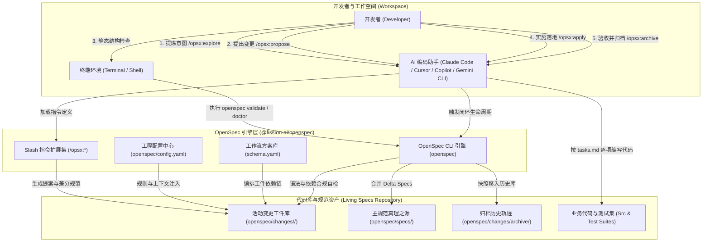
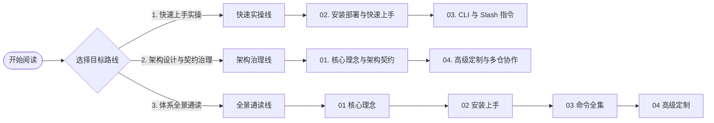

# OpenSpec 规范驱动开发 (SDD) 技术文档套件总览 (Suite Overview)

| 属性 | 详情 |
| :--- | :--- |
| **文档类型** | 全景技术套件总览与导航入口 |
| **当前状态** | 已归档 (Accepted) |
| **作者** | Ateng |
| **创建日期** | 2026-09-28 |
| **关联系统/模块** | Ateng-Agent / OpenSpec 规范中心 |
| **适用基准** | Node.js >= 20.19.0 / @fission-ai/openspec |

---

## 1. OpenSpec 规范驱动开发总览 (Overview)

### 1.1 从 Vibe Coding 到 Spec-Driven 确定性工程演进

在生成式 AI 与大语言模型（LLM）深度融入软件工程的背景下，基于自然语言对话的即兴编程（俗称“Vibe Coding”）暴露出了若干根本性的工程痛点：

1. **上下文遗忘与漂移 (Context Loss & Drift)**：长会话或多轮交互中，LLM 会逐渐淡忘系统最初的架构约束与非功能性要求，导致后续生成的代码与早期模块产生隐式冲突。
2. **幻觉与伪造参数 (Hallucination)**：AI 倾向于脑补并不存在的 API 签名、配置键名或技术依赖，给代码库引入难以排查的隐形缺陷。
3. **黑盒重构与失控 (Black-box Refactoring)**：缺少明确的人机契约，AI 往往在“理解不完整”的前提下直接对关键业务逻辑进行大范围改写，破坏既有功能。

**OpenSpec**（由 Fission-AI 发起并开源）应运而生。它不是一个笨重传统的瀑布式文档工具，而是为 AI 编码助手量身打造的**轻量级人机契约层 (Lightweight Agreement Layer)**。通过将架构意图、业务需求、变更差分（Delta Specs）以标准 Markdown 形式固化在版本控制系统（Git）中，OpenSpec 强制 AI 编码助手遵循 **“先对齐认知，后编写代码 (Agree First, Then Build Confidently)”** 的工程准则。

```text
传统 Vibe Coding 模式:
  自然语言想法 ──(即兴对话)──> 直接生成代码 ──(发现跑偏)──> 痛苦排障与黑盒返工

OpenSpec 规范驱动开发 (SDD) 模式:
  自然语言想法 ──> 结构化工件协商 (Proposal / Specs / Design / Tasks)
                     │
                     ▼ 双方对齐确认 (Human-in-the-loop)
                     │
                     └──> 确定性代码落地 (Apply) ──> 归档并收敛为系统真理 (Archive)
```

### 1.2 OpenSpec 核心设计哲学

OpenSpec 的架构理念围绕以下五条核心原则构建：

- **流体而非僵化 (Fluid not rigid)**：告别传统文档体系强绑定的线性瀑布阶段；工件之间以依赖为使能器（Enablers），支持随时在探索、设计、编码与重构之间灵活跳跃与就地调整。
- **迭代而非瀑布 (Iterative not waterfall)**：需求无需一次性做到尽善尽美，支持通过小步快跑的差分规范逐步丰富系统认知。
- **轻量易用 (Easy not complex)**：纯 Markdown + Git 原生存储，零私有二进制依赖，不强制依赖复杂云端平台或中心化数据库。
- **专为既有棕地系统设计 (Built for brownfield)**：独创 Delta Specs（差分规范）机制，新增特性仅需定义 `ADDED`、`MODIFIED`、`REMOVED` 局部变动，无需在老项目全量重写百万字遗留文档。
- **平滑扩展 (Scalable from personal projects to enterprises)**：单人本地开发体验极速轻巧；团队与大型企业协作时，可无缝接入 Multi-Repo Stores 机制实现跨代码库的集中式规划治理。

---

## 2. 架构全景拓扑与调用流 (Architecture Topology)

OpenSpec 架构深度融合了**终端命令行 (CLI)**、**AI 助手交互指令 (Slash Commands)**、**配置中心**与**双层资产库 (Changes vs Living Specs)**。其完整协同拓扑如下图所示：



---

## 3. 全套件交付模块导航矩阵 (Suite Navigation)

本技术文档套件经过严格的领域解耦与渐进式分层，各模块定位明确、互为依托。请通过下表直达对应专题：

| 序号 | 交付物模块 | 核心内容定位 | 相对直达链接 |
| :---: | :--- | :--- | :--- |
| **01** | **核心理念与架构契约** | SDD 规范驱动开发哲学、五大核心支柱、Delta Specs 差分规范协议、工件递进流图与项目目录拓扑契约 | [01-core-concepts-and-architecture.md](./01-core-concepts-and-architecture.md) |
| **02** | **安装部署与快速上手** | Node.js >= 20.19 基线要求、全局 CLI 安装与排错、多 AI 编码工具适配（Claude Code / Cursor / Copilot / Gemini CLI）、端到端完整特性实战演示 | [02-installation-and-quickstart.md](./02-installation-and-quickstart.md) |
| **03** | **CLI 命令行与交互式指令参考** | `openspec` 终端命令全集、`/opsx:*` 交互指令全景（Core 与 Expanded Profile 深度拆解）、工件依赖状态机与排障指南 | [03-cli-and-slash-commands.md](./03-cli-and-slash-commands.md) |
| **04** | **高级定制与多仓协作** | `config.yaml` 规则与上下文注入、自定义 `schema.yaml` 工作流扩展、Multi-Repo Stores 跨仓规划与治理共享、全套件权威参考资料与事实依据收口 | [04-advanced-workflows-and-stores.md](./04-advanced-workflows-and-stores.md) |

---

## 4. 推荐阅读路线 (Recommended Reading Routes)

根据您的研发角色与当前技术目标，推荐采用以下针对性阅读路径：



- **快速上手实操线 (Developer Quickstart)**：
  - 直接阅读 [02-installation-and-quickstart.md](./02-installation-and-quickstart.md)，完成环境准备并在 5 分钟内通过 `/opsx:propose` 跑通第一个特性变更；
  - 遇到指令不熟悉时查阅 [03-cli-and-slash-commands.md](./03-cli-and-slash-commands.md) 掌握常用参数与排障方式。
- **架构设计与契约治理线 (Architect & Tech Lead)**：
  - 重点研读 [01-core-concepts-and-architecture.md](./01-core-concepts-and-architecture.md)，掌握 Delta Specs 的规范语法设计与工件递进流转控制；
  - 深入学习 [04-advanced-workflows-and-stores.md](./04-advanced-workflows-and-stores.md)，为团队定制项目级上下文注入（Context & Rules）及跨多仓库集中式规范治理（Stores）。
- **体系全景通读线 (Full Spectrum)**：
  - 按照 `01 核心理念` $\rightarrow$ `02 安装部署` $\rightarrow$ `03 命令参考` $\rightarrow$ `04 高级定制` 的标准递进顺序通读，全面掌握 SDD 工程方法论与工具链落地实践。

---

## 5. 全局事实依据收口说明 (Grounding Statement)

本套件严格遵守技术文档反虚构（Anti-Hallucination）规范，前序各业务模块（`01` 至 `03`）在正文中均采用行内超链接形式标注外部引用，文末免除冗余清单。

本套件涉及的全部外部开源项目依据、NPM 包坐标发布记录、CLI 语法及 YAML 字段核验矩阵，统一集中收口归档于最终篇章：
👉 **详见 [04-advanced-workflows-and-stores.md#4-权威参考资料与事实依据](./04-advanced-workflows-and-stores.md#4-权威参考资料与事实依据)**。
