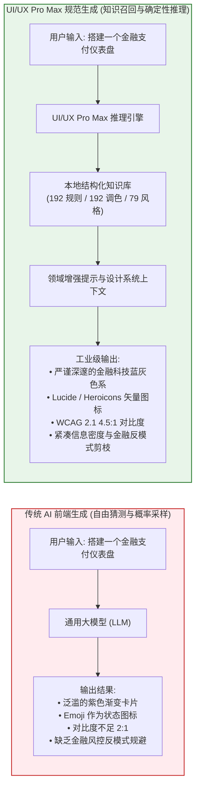
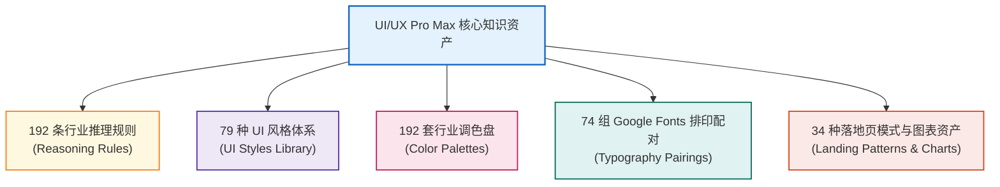
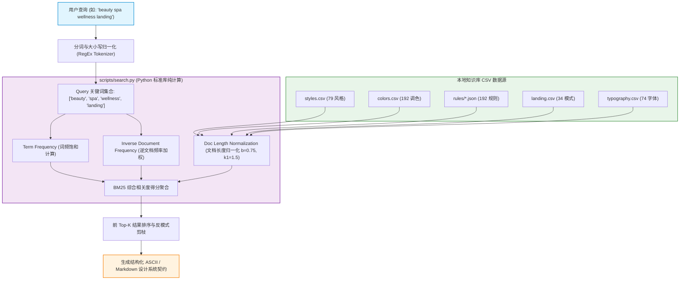

# UI/UX Pro Max 核心定位与设计推理架构 (Core Engine & Architecture)

| 属性 | 详情 |
| :--- | :--- |
| **文档类型** | 架构原理与知识库设计规范 |
| **当前状态** | 已归档 (Accepted) |
| **作者** | Ateng |
| **创建日期** | 2026-09-29 |
| **关联系统/模块** | Ateng-Agent / UI/UX Pro Max 技能中心 |
| **所属套件** | [UI/UX Pro Max 技能总览](./index.md) |
| **代码仓库** | [nextlevelbuilder/ui-ux-pro-max-skill](https://github.com/nextlevelbuilder/ui-ux-pro-max-skill) |

---

## 1. 概念定位与设计智能跃迁 (Conceptual Evolution)

### 1.1 传统 AI 前端生成的困境

通用大语言模型（如 Claude、GPT-4、Gemini 等）在理解语法语义、生成纯逻辑代码和常规算法方面展现了强大的能力。然而，一旦介入前端工程与 UI/UX 界面生成任务，常常暴露出显著的“**设计智能断层 (Design Intelligence Gap)**”：

1. **色彩与对比度失范 (Contrast & Accessibility Pitfalls)**：
   - 模型缺乏真实的视力渲染反馈回路，常常随机生成诸如暗灰底搭配淡紫文字、浅黄色按钮搭配白字的低反差样式；
   - 对 WCAG 2.1 AA 级（普通正文对比度至少 4.5:1，大标题至少 3:1）的标准缺乏硬性约束意识。
2. **千篇一律的刻板设计 (Homogeneous AI Aesthetics)**：
   - 绝大多数模型存在“AI 紫色/粉色线性渐变 (`bg-gradient-to-r from-purple-500 to-indigo-600`)”的审美依赖，无论用户要求设计的是严谨的企业级银行风控台，还是生动的宠物电商平台，均频繁输出这类同质化样式；
   - 滥用 Emoji 作为功能图标（如 🏠 充当 Home 导航、⚙️ 充当设置按钮），破坏了专业生产级应用的严谨气质。
3. **空间密度与动效失序 (Spatial & Motion Misalignment)**：
   - 忽略用户偏好设置，随意堆叠非线性的 CSS 过渡动画与复杂的旋转缩放，导致页面杂乱且消耗 GPU 资源；
   - 布局层级缺乏垂直行业的自适应弹性，往往在简单列表与复杂多维表格之间缺乏统一的间距缩放标尺。



### 1.2 UI/UX Pro Max 解决范式

UI/UX Pro Max Skill 打破了“完全由模型黑盒生成样式”的传统做法，引入了**设计系统外脑机制**：
- **从“随机脑补”到“知识召回”**：将上千项经过人类资深设计师验证的配色方案、排印层级、布局模式与动效参数沉淀为本地结构化数据集（CSV / JSON）；
- **确定性规则约束**：内置 192 条行业垂直推理规则，在模型动笔前先执行逻辑推理，输出包含设计模式（Pattern）、风格（Style）、配色（Colors）、排印（Typography）、动效（Key Effects）以及**避免的反模式（Anti-patterns to Avoid）**的标准化设计系统契约；
- **交付前质量闸门**：将无障碍合规、SVG 图标规范、响应式断点与指针状态固化为明确的检查清单（Checklist），使得生成的代码在进入开发环境前就已具备生产可用性。

---

## 2. 知识库资产全景解构 (Knowledge Base Assets)

UI/UX Pro Max 的核心底座是一组经过结构化组织的领域知识库，其在物理空间上被解构为以下 5 大核心资产集群：



### 2.1 192 条行业推理规则 (Reasoning Rules)

推理规则库将真实世界中的数字化产品细分为 **8 大核心大类、192 个具体垂直领域**，每一个领域均对应严密的设计准则与禁止事项：

| 行业大类 | 覆盖细分领域示例 | 核心设计诉求与调性 | 关键禁止事项 (Anti-patterns) |
| :--- | :--- | :--- | :--- |
| **科技与 SaaS (Tech & SaaS)** | 开发者工具 / IDE、微 SaaS、AI 平台、网络安全监控台 | 高效、模块化、高信息密度、清晰的代码展示 | 避免过大的留白导致信息折叠、严禁低效的慢动画 |
| **金融与资产 (Finance & Crypto)** | 商业银行、加密货币交易平台、个人财务追踪、发票对账 | 沉稳、极高安全感、精确数字排印、极低视觉噪点 | 严禁使用浮躁的霓虹高饱和粉/紫、严禁未确认的数据抖动 |
| **医疗与健康 (Healthcare)** | 在线门诊挂号、电子病历系统、心理健康咨询、用药提醒 | 舒缓、无压迫感、高清晰度、极度关注无障碍可读性 | 严禁使用血腥暗红色调、严禁使用极细灰度字体 |
| **电子商务 (E-Commerce)** | 奢侈品商城、3C 数码零售、二手 P2P 交易、生鲜外卖 | 视觉冲击力强、明确突出的 CTA（购买按钮）、社交证明 | 严禁将购买按钮隐藏在深级菜单、严禁非标准的图片比例 |
| **生活与习惯 (Lifestyle)** | 冥想放松、食谱烹饪、个人日记随笔、天气预警 | 温暖、温润的圆角、自然有机形状、细腻微交互 | 严禁冷酷生硬的直角边框、避免高反差机械色彩 |
| **创意与作品集 (Creative & Media)** | 摄影画廊、独立设计工作室、音频播客流媒体、视频剪辑 | 极具张力的留白、网格不对称、大标题版式设计 | 避免平庸千篇一律的九宫格排版、严禁使用默认系统字体 |
| **专业服务 (Services)** | 法律事务咨询、酒店民宿预订、高端美容水疗 (Spa) | 优雅、精致、信任感构建、流程简便的预约引导 | 避免过于密集的表格排布、严禁繁琐多步骤的折磨式表单 |
| **新兴技术 (Emerging Tech)** | Web3 去中心化应用、空间计算界面、量子控制台 | 科技未来感、细腻的发光投影、暗色主题自适应 | 避免无法识别的抽象图标、严禁无边际的性能高耗滤镜 |

### 2.2 79 种可搜索 UI 风格 (UI Styles)

UI/UX Pro Max 收集并量化了 79 种界面美学风格（包含 50 种高频活跃风格），每种风格均标注了其适用场景、性能消耗评级以及无障碍风险等级：

| 风格名称 | 核心视觉特征 | 典型适用业务场景 | 渲染开销 (Performance) | 无障碍风险 (Accessibility) |
| :--- | :--- | :--- | :---: | :---: |
| **Glassmorphism (毛玻璃)** | 半透明背景 (`backdrop-blur`)、微亮白边框、多层景深阴影 | 现代 Web3 钱包、音乐播放器、现代 SaaS 侧边栏 | 中 ~ 高 (GPU 合成开销) | 中 (需强化背景对比度) |
| **Neumorphism (新拟物)** | 柔和的双向凸起/内凹阴影 (`box-shadow`)、背景与元素同色系 | 智能家居控制面板、音频均衡器旋钮、极简计算器 | 低 | **极高** (边界对比度天然不足) |
| **Neo-Brutalism (新野兽派)** | 2~3px 纯黑粗边框、高饱和撞色填充、45 度硬黑阴影无羽化 | 独立开发者个人工具、潮流电商、设计类产品宣发 | 低 | 低 (对比度天然极强) |
| **Bento Grid (便当盒网格)** | 不同比例卡片紧凑拼图、圆角包边、独立模块微交互 | 产品特性展示区 (Hero)、仪表盘看板、个人主页 | 低 | 低 |
| **Soft UI Evolution (柔和拟物)** | 温润大圆角、微羽化浅阴影、有机形状、高雅淡雅底色 | 高端美妆护肤、冥想身心健康、生活消费品牌 | 低 | 中 (需复核文字对比度) |
| **Minimalist Clean (极简质感)** | 大面积留白、精致纤细的网格线、严格的字阶对齐、克制用色 | 瑞士国际主义杂志、企业级风控控制台、云服务配置 | 极低 | 低 |

### 2.3 调色与排印系统 (Colors & Typography)

#### 调色系统模型 (The 5-Token Palette)
知识库中 192 套调色方案遵循严格的语义分工模型，每个色盘由 5 个核心语义槽位构成：
```text
Primary (主品牌色)    -> 确立产品调性基调 (如沉稳蓝 #1E40AF、活力橙 #EA580C)
Secondary (辅色)      -> 辅助组件、标签与边框分割 (如柔和灰蓝 #94A3B8)
CTA (行动号召色)      -> 购买、注册、提交等关键转化点 (高饱和吸睛度，如明黄 #F59E0B、高亮祖母绿 #10B981)
Background (底色)     -> 画布主基调 (如浅暖白 #F8FAFC 或高级炭黑 #0F172A)
Text (文字主色)       -> 正文内容 (与背景满足 >= 4.5:1 的 WCAG 严格要求)
```

#### 排印系统配对 (Font Combinations)
知识库包含 74 组经过排版美学检验的 Google Fonts 字体组合。每组配对均包含专门的展示标题字体（Display / Heading Font）与高易读性正文字体（Body Font）：
- **现代高科技 / SaaS 组合**：`Inter` / `Space Grotesk`（冷峻、利落、代码友好）
- **奢华与高端生活方式组合**：`Cormorant Garamond` / `Montserrat`（优雅古典与现代无衬线的对撞）
- **创作者与独立出版物组合**：`Playfair Display` / `Source Sans 3`（典雅大方，阅读舒适）
- **极简工程与技术控制台组合**：`JetBrains Mono` / `Plus Jakarta Sans`（高工业精度，数字展示严密对齐）

### 2.4 落地页模式与数据可视化资产 (Landing Patterns & Charts)

- **34 种落地页结构模式 (Landing Patterns)**：
  - *Hero-Centric + Social Proof*：大标题聚焦痛点 + 客户评价背书（转化率最高，适合 SaaS 与独立工具）；
  - *Interactive Calculator / Live Demo*：首屏即可上手交互试玩（极大降低用户决策门槛）；
  - *Split Screen (左右分栏)*：左侧精炼文案 + 右侧动态交互卡片或视频演示。
- **数据可视化体系 (Charts & Data-Viz)**：
  - 针对不同数据分布与业务诉求，明确推荐对应的图表类型：时序趋势推荐平滑面积图（Area Chart）、多维对比推荐雷达图（Radar Chart）、转化流失推荐漏斗图（Funnel Chart），并提供统一配色与 Tooltip 无障碍渲染约束。

---

## 3. 本地引擎与 BM25 检索架构 (Search Architecture)

UI/UX Pro Max 之所以能够秒级响应且对 AI Agent 零负担，核心在于其独特的轻量化检索引擎设计。



### 3.1 零外部依赖设计哲学 (Zero-Dependency Philosophy)

与许多动辄依赖数十个外部 npm 包或大型 Python 机器学习库（如 PyTorch、Transformers、Scikit-learn）的 AI 工具不同，UI/UX Pro Max 的核心运行脚本 `scripts/search.py` 坚持了**绝对的零外部依赖设计**：
- **纯标准库驱动**：仅使用 Python 3.8+ 内置的 `argparse`（命令行解析）、`csv`（表格解析）、`json`（规则载入）、`math`（对数计算）、`re`（正则分词与标点清洗）、`pathlib` 与 `sys`；
- **免安装环境开箱即用**：开发机器无需执行 `pip install`，无论在 CI/CD 容器、Windows PowerShell、macOS 终端还是轻量 Linux Alpine 镜像中，只要系统带有 Python 解释器，均可在 50 毫秒内完成秒级冷启动；
- **AI 智能体无缝唤醒**：Claude Code、Cursor、Windsurf 等智能体在沙箱中执行 Bash/PowerShell 指令时，不会因缺少三方包而发生报错中断，保障了端到端流程的高健壮性。

### 3.2 BM25 排名算法与相关度匹配

`scripts/search.py` 内置了工业界成熟的 **BM25 (Best Matching 25)** 算法，用于计算用户输入关键词与知识库各实体字段之间的语义相关度得分：

$$Score(D, Q) = \sum_{i=1}^{N} IDF(q_i) \cdot \frac{f(q_i, D) \cdot (k_1 + 1)}{f(q_i, D) + k_1 \cdot \left(1 - b + b \cdot \frac{|D|}{avgdl}\right)}$$

- **IDF (逆文档频率加权)**：对于在整个知识库中频繁出现的通用词给予较低权重，而对垂直专业词（如 `Fintech`、`Neumorphism`、`Spa`、`Dashboard`）赋予极高权重；
- **词频饱和度 ($k_1 = 1.5$)**：防止某个词在描述中无节制堆叠导致分数无限放大；
- **文档长度归一化 ($b = 0.75$)**：消除知识库条目中简短描述与长段落说明之间的长度偏差，确保匹配结果客观中立。

在执行 `--design-system` 复合生成时，引擎将同步在 `products`、`styles`、`colors`、`typography` 与 `landing` 5 个数据域发起并发计算，并将得分最高的实体绑定至统一的推荐契约输出中。

### 3.3 目录物理布局契约 (Physical Layout Contract)

当技能被部署或同步到工程环境中时，其目录结构严格遵循以下规范：

```text
skills/ui-ux-pro-max/ (或 .claude/skills/ui-ux-pro-max/)
├── SKILL.md                          # 智能体指令入口 (定义技能行为元数据与工作流)
├── data/                             # 结构化设计知识资产库
│   ├── rules/                        # 192 条行业推理与反模式规则 (JSON)
│   ├── styles.csv                    # 79 种 UI 风格库 (关键词、适用场景、性能与无障碍)
│   ├── colors.csv                    # 192 套行业调色盘 (Primary/Secondary/CTA/Background/Text)
│   ├── typography.csv                # 74 组 Google Fonts 排印搭配与授权
│   ├── landing.csv                   # 34 种落地页结构模式与 CTA 策略
│   ├── charts.csv                    # 图表与数据可视化最佳实践规范
│   └── stacks/                       # 前端技术栈专属规则映射
│       ├── react.csv                 # React 状态与组件设计规范
│       ├── nextjs.csv                # Next.js 服务端组件与字体优化规范
│       ├── vue.csv                   # Vue 3 组合式 API 与样式绑定
│       ├── tailwind.csv              # Tailwind CSS 响应式与工具类约束
│       └── flutter.csv               # Flutter 响应式 Widget 与色彩约束
└── scripts/
    └── search.py                     # BM25 检索引擎与设计系统生成器核心
```

---

## 4. 模块小结与演进路线

通过将 192 条行业规则、79 种风格与 192 套调色沉淀为结构化资产，并依托零依赖的 BM25 算法进行精准召回，UI/UX Pro Max 成功将不可控的前端界面生成改造为确定性、高美感且严谨合规的工程化过程。

在掌握了核心架构与知识资产的基础上，下一篇章将深入讲解如何在各种主流开发环境与智能体中完成全平台安装与配置接入：
👉 **下一篇：[02-installation-and-integration.md 全平台安装与智能体集成指南](./02-installation-and-integration.md)**。
