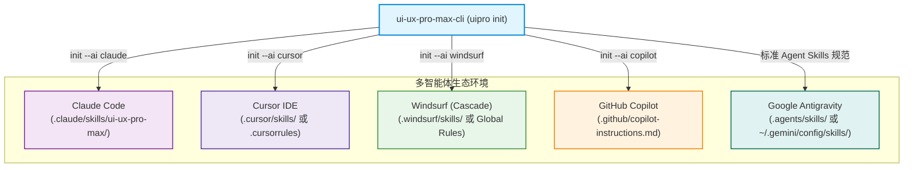

# UI/UX Pro Max 全平台安装与智能体集成指南 (Installation & Integration)

| 属性 | 详情 |
| :--- | :--- |
| **文档类型** | 工程集成与环境配置指南 |
| **当前状态** | 已归档 (Accepted) |
| **作者** | Ateng |
| **创建日期** | 2026-09-29 |
| **关联系统/模块** | Ateng-Agent / UI/UX Pro Max 技能中心 |
| **所属套件** | [UI/UX Pro Max 技能总览](./index.md) |
| **代码仓库** | [nextlevelbuilder/ui-ux-pro-max-skill](https://github.com/nextlevelbuilder/ui-ux-pro-max-skill) |

---

## 1. 环境基线与前置依赖 (Prerequisites)

在安装与接入 UI/UX Pro Max 之前，请确保宿主机开发环境满足以下基础依赖。

### 1.1 核心运行时依赖

| 运行时环境 | 最低版本要求 | 推荐版本 | 关键职责 | 验证命令 |
| :--- | :--- | :--- | :--- | :--- |
| **Node.js** | `>= 18.0.0` | `>= 20.x LTS` | 运行脚手架 CLI (`ui-ux-pro-max-cli`) 与多 Agent 环境初始化 | `node -v` |
| **Python** | `>= 3.8.0` | `>= 3.10.x` | 运行核心 BM25 检索引擎 (`scripts/search.py`) | `python3 --version` 或 `python --version` |
| **Git** | `>= 2.30.0` | 最新稳定版 | 离线克隆、版本跟踪与上游规则资产同步 | `git --version` |

> [!IMPORTANT]
> **Python 零外部库声明 (Zero-PIP Guarantee)**：
> UI/UX Pro Max 的核心运行脚本 `scripts/search.py` **完全基于 Python 原生标准库实现**，无需执行任何 `pip install -r requirements.txt`。但必须保证 `python3`（或 Windows 下的 `python`）已加入系统的全局环境变量 `PATH`，以便 AI 智能体在子进程沙箱中能够随时唤起。

### 1.2 环境联通性自检命令

在终端中执行以下指令，确保环境处于就绪状态：

```bash
# 1. 验证 Node.js 与 npm 环境
node -v
npm -v

# 2. 验证 Python 环境 (Windows 下若未配置 python3，可检查 python)
python3 --version || python --version
```

---

## 2. 官方 CLI 工具链部署实战 (`ui-ux-pro-max-cli`)

Next Level Builder 官方提供了开箱即用的命令行工具 **`ui-ux-pro-max-cli`**（系统注册可执行命令名通常为 `uipro`），用于自动化管理技能资产的下载、环境挂载与多平台配置注入。

### 2.1 全局安装与包管理器选型

推荐使用主流 Node 包管理器进行全局安装：

```bash
# 推荐方式 A：使用 npm 全局安装
npm install -g ui-ux-pro-max-cli

# 推荐方式 B：使用 pnpm 全局安装
pnpm add -g ui-ux-pro-max-cli

# 推荐方式 C：使用 yarn 全局安装
yarn global add ui-ux-pro-max-cli
```

> [!WARNING]
> **历史弃用包辨析警示**：
> 社区早期存在名为 `uipro-cli` 的早期原型包，现已停止维护并废弃。请务必确认安装的是官方包 **`ui-ux-pro-max-cli`**，避免因拉取过期数据导致规则库缺失。

### 2.2 CLI 核心子命令与日常运维

安装完成后，可通过 `uipro` 指令查看所有可用能力：

| 命令格式 | 参数说明 | 典型使用场景 |
| :--- | :--- | :--- |
| `uipro --help` | `-` | 查看命令行帮助文档与版本号 |
| `uipro init --ai <agent>` | `--ai` 指定智能体，如 `claude`, `cursor`, `windsurf`, `copilot` | 在当前项目根目录下初始化技能配置 |
| `uipro init --ai <agent> --global` | `--global` 全局安装参数 | 将技能挂载至操作系统的用户主目录，对所有项目全局生效 |
| `uipro update` | `-` | 同步并拉取上游最新的 192 条规则与调色盘资产 |
| `uipro doctor` | `-` | 诊断当前目录权限、Python 解释器路径及智能体挂载状态 |

#### 快速免安装试用 (npx)
如果不希望在系统全局安装包，也可直接通过 `npx` 临时调用：
```bash
npx ui-ux-pro-max-cli init --ai claude
```

---

## 3. 多主流 AI 智能体生态接入 (Multi-Agent Integration)

不同 AI 编码助手对外部技能（Skills / Instructions / Rules）的加载机制各不相同。UI/UX Pro Max 针对各主流开发环境设计了标准化的挂载拓扑：



### 3.1 Claude Code 集成

Anthropic 的 Claude Code 原生支持通过项目目录下的 `.claude/skills/` 挂载领域技能。

#### 项目级自动化接入
在需要进行前端开发的项目根目录下执行：
```bash
uipro init --ai claude
```
该命令会自动在当前工程创建目录 `.claude/skills/ui-ux-pro-max/`，并将 `SKILL.md`、`data/` 与 `scripts/search.py` 写入其中。

#### 全局用户级接入
若希望本机所有使用 Claude Code 的项目默认共享该技能：
```bash
uipro init --ai claude --global
# 资产将被写入 ~/.claude/skills/ui-ux-pro-max/
```

#### Claude Code 行为自省机制
Claude Code 检测到该技能后，每当用户提出界面开发需求（如“帮我写一个电商首页 Hero 组件”），模型会主动自省执行：
```bash
python3 .claude/skills/ui-ux-pro-max/scripts/search.py "ecommerce store hero" --design-system
```
并在获取设计系统上下文后再输出 TSX / Tailwind 代码。

---

### 3.2 Cursor IDE 集成

Cursor 支持通过 `.cursorrules` 文件或 `.cursor/rules/` 体系为智能体注入指令约束。

#### 1. 初始化技能文件
```bash
uipro init --ai cursor
```

#### 2. 在 `.cursorrules` 中激活触发规则
在项目根目录的 `.cursorrules` 文件中添加以下指引，让 Cursor Agent 明确知晓如何调度本地外脑：

```markdown
// 文件: .cursorrules
## UI/UX Pro Max 领域智能规范 (UI/UX Design Intelligence)

当用户提出任何涉及网页、移动端界面、仪表盘或落地页的前端设计与代码实现需求时：
1. **优先检索设计系统**：绝对不要凭空臆测颜色与布局，首先在终端调用本地检索工具：
   ```bash
   python3 skills/ui-ux-pro-max/scripts/search.py "<产品类型/行业关键词>" --design-system -p "<项目名称>"
   ```
2. **遵从返回的契约**：严格采纳返回结果中的 Pattern（版块结构）、Style（UI风格）、Colors（色盘十六进制值）与 Typography（字体组合）。
3. **强制规避反模式**：检查输出代码，严禁出现该行业禁止的 Anti-patterns（如金融类滥用霓虹渐变、医疗类刺眼警示色）。
4. **质检标准**：确保所有可交互元素包含 `cursor-pointer`，图标必须采用 Lucide/Heroicons SVG，严禁使用 Emoji 代替图标。
```

---

### 3.3 Windsurf (Cascade) 集成

Codeium 推出的 Windsurf 编辑器通过 Cascade Agent 进行全自动开发。

#### 初始化与全局配置
```bash
uipro init --ai windsurf
```
CLI 将会在项目根目录或全局规则注入点配置技能索引。若需手动在 Windsurf 的 **Global Scratchpad** 或项目级 **Rules** 中声明，只需粘贴以下上下文规范：

```text
[UI/UX Design Skill Activated]
For any frontend implementation task (React/Vue/Tailwind/Flutter):
Always run `python3 skills/ui-ux-pro-max/scripts/search.py "<query>" --design-system` to fetch tailored tokens, anti-patterns, and component guidelines before generating code.
```

---

### 3.4 GitHub Copilot 集成

GitHub Copilot 支持在仓库中定义 `.github/copilot-instructions.md` 以定制智能体行为。

在仓库的 `.github/copilot-instructions.md` 中追加以下章节：

```markdown
// 文件: .github/copilot-instructions.md
## 前端设计系统工程规范 (UI/UX Intelligence Protocol)

在为此代码库编写组件与页面时，严禁使用未经论证的随意配色：
1. 涉及界面设计时，参考 `skills/ui-ux-pro-max/` 下的结构化知识库；
2. 遵循 WCAG 2.1 规范，正文与背景对比度必须满足 4.5:1；
3. 遵循项目中配置的调色语义规范（Primary / Secondary / CTA / Background / Text）；
4. 移动端与桌面端必须覆盖 375px、768px、1024px、1440px 响应式断点。
```

---

### 3.5 Google Antigravity / 通用 Agent Skills 开放标准集成

Google Antigravity 及遵循开放 **Agent Skills Specification** 的新型智能体系统，统一采用 `SKILL.md` 作为技能描述元数据载体。

#### 1. 标准物理目录挂载
将技能放置于项目的工作区技能目录：
```text
.agents/skills/ui-ux-pro-max/
├── SKILL.md
├── data/
└── scripts/search.py
```
或全局技能目录（如 `~/.gemini/config/skills/ui-ux-pro-max/`）。

#### 2. `SKILL.md` 元数据契约示例
技能入口 `SKILL.md` 包含标准的 YAML Frontmatter，以便宿主系统智能嗅探与自适应装载：

```markdown
---
name: ui-ux-pro-max
description: 为跨多平台和技术栈构建专业 UI/UX 界面提供设计智能。内置 192 条行业推理规则、79 种风格与 192 套调色盘，可根据项目诉求自动生成确定性设计系统契约与反模式防御。
---

# UI/UX Pro Max Agent Skill

## 何时唤醒此技能
当用户要求设计页面、重构 UI、选择色彩搭配、挑选 Google Fonts 字体或优化用户体验无障碍（Accessibility）时，智能体必须执行本技能提供的脚本检索领域设计系统。

## 调用协议
在终端执行以下命令获取结构化契约：
```bash
python3 scripts/search.py "<关键词/产品形态>" --design-system -p "<项目名称>"
```
```

---

## 4. 离线安装、源码克隆与版本同步 (Offline & Manual Setup)

在金融企业内网、网络隔离沙箱或未安装 npm 的受限服务器环境中，可通过直接克隆官方 Git 源码完成纯手工挂载。

### 4.1 Git 源码直接克隆方式

在终端中执行标准 Git 克隆指令：

```bash
# 1. 克隆官方仓库到指定技能目录
git clone https://github.com/nextlevelbuilder/ui-ux-pro-max-skill.git my-project/.claude/skills/ui-ux-pro-max

# 2. 验证本地 Python 检索引擎是否能够独立运行
cd my-project/.claude/skills/ui-ux-pro-max
python3 scripts/search.py "fintech dashboard" --domain style
```

如果终端成功打印出匹配的风格列表（如 Minimalist Clean、Bento Grid 等），即代表离线安装已 100% 成功。

### 4.2 知识库数据资产同步更新机制

官方团队会持续扩充行业推理规则（由 100+ 演进到 192+）与新兴的前端技术栈（如 Svelte 5、Astro 等）。维护团队应建立定期更新机制：

- **CLI 模式更新**：
  ```bash
  uipro update
  ```
- **Git 模式更新**：
  ```bash
  cd skills/ui-ux-pro-max
  git pull origin main
  ```

---

## 5. 模块小结与演进路线

完成本篇指南中的配置后，开发团队的 AI 智能体便已具备了自主调度 UI/UX Pro Max 本地设计知识库的能力。

下一步，我们将进入最核心的实操环节——详细掌握 `search.py` 的全量参数、三大设计微调旋钮、4 步工程化 AI 工作流以及交付前质量检查清单：
👉 **下一篇：[03-search-engine-and-best-practices.md 检索实战、开发范式与质检清单](./03-search-engine-and-best-practices.md)**。
