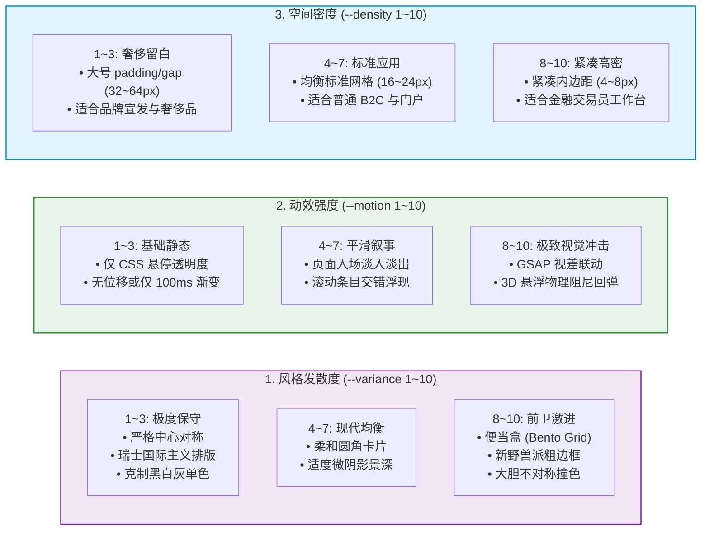
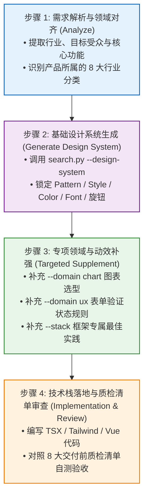

# UI/UX Pro Max 检索实战、开发范式与质检清单 (Search, Workflows & Grounding)

| 属性 | 详情 |
| :--- | :--- |
| **文档类型** | 命令速查、工程工作流与事实收口规范 |
| **当前状态** | 已归档 (Accepted) |
| **作者** | Ateng |
| **创建日期** | 2026-09-29 |
| **关联系统/模块** | Ateng-Agent / UI/UX Pro Max 技能中心 |
| **所属套件** | [UI/UX Pro Max 技能总览](./index.md) |
| **代码仓库** | [nextlevelbuilder/ui-ux-pro-max-skill](https://github.com/nextlevelbuilder/ui-ux-pro-max-skill) |

---

## 1. 知识检索引擎实战 (`scripts/search.py`)

UI/UX Pro Max 的核心运行大脑是位于 `scripts/search.py` 的 Python 检索脚本。无论是开发者手动调试，还是 AI 编码智能体在后台自主调度，均通过该命令行接口与知识库交互。

### 1.1 命令行语法契约与参数全集

```bash
python3 scripts/search.py "<查询关键词/行业描述>" [参数选项]
```

核心命令行选项清单如下：

| 参数标志 | 简写 | 参数类型 | 默认值 | 功能说明与语义约束 |
| :--- | :---: | :---: | :---: | :--- |
| `--design-system` | `-` | 无参标志 | `False` | **旗舰指令**：触发多域联合推理，输出包含模式、风格、配色、排印、动效与反模式的完整设计系统契约 |
| `--project` | `-p` | 字符串 | `App` | 指定目标系统/项目名称，注入至设计系统的报告标头与上下文提示词中 |
| `--domain` | `-` | 枚举字符串 | 全部 | 限定单域检索：`style`、`color`、`typography`、`landing`、`chart`、`ux`、`product` |
| `--stack` | `-` | 枚举字符串 | `html-tailwind` | 指定技术栈生成适配指引：`react`, `nextjs`, `vue`, `svelte`, `astro`, `flutter`, `swiftui` 等 |
| `--variance` | `-` | 整数 `1~10` | `5` | **风格发散度旋钮**：`1~3` 偏向保守居中极简，`8~10` 偏向大胆不对称、便当盒网格或野兽派 |
| `--motion` | `-` | 整数 `1~10` | `5` | **动效强度旋钮**：`1~3` 仅微悬停，`4~7` 平滑转场与滑动，`8~10` 强交互 GSAP 视差与物理弹簧 |
| `--density` | `-` | 整数 `1~10` | `5` | **空间密度旋钮**：`1~3` 宽裕留白（营销页），`8~10` 极致紧凑高信息密度（金融看板/后台） |
| `--format` | `-f` | 枚举字符串 | `ascii` | 契约输出格式：`ascii`（带边框表格）或 `markdown`（结构化 Markdown 块） |
| `--limit` | `-n` | 正整数 | `5` | 限制检索结果返回的候选条目数 |

---

### 1.2 三大核心微调旋钮 (Design Dials)

三大设计微调旋钮是 UI/UX Pro Max 区别于普通静态提示词库的杀手级特性。通过参数化调节数值，可在不改变行业逻辑的前提下灵活重塑界面的视觉调性：



#### 旋钮调参实战案例

- **场景 A：高端水疗养生品牌官网 (宽裕留白 + 典雅柔和动效)**
  ```bash
  python3 scripts/search.py "luxury beauty spa wellness" --design-system -p "Serenity Spa" --density 3 --variance 4 --motion 4 -f markdown
  ```
- **场景 B：高频金融加密货币量化交易看板 (极致高密 + 极低动画阻力)**
  ```bash
  python3 scripts/search.py "crypto trading execution dashboard" --design-system -p "Apex Trader" --density 9 --variance 2 --motion 1 -f markdown
  ```
- **场景 C：潮流独立开发者作品集 (前卫前瞻 + 强互动动效)**
  ```bash
  python3 scripts/search.py "developer portfolio bento grid" --design-system -p "Dev Studio" --density 5 --variance 9 --motion 8 -f markdown
  ```

---

### 1.3 专项领域定向检索 (Domain-Specific Queries)

当开发者仅需对局部组件（如单一色彩、表单交互规范或图表选型）进行精确咨询时，可通过 `--domain` 精准定位：

```bash
# 1. 定向检索 UI 风格特征与无障碍评价
python3 scripts/search.py "glassmorphism" --domain style

# 2. 定向获取行业推荐色彩十六进制值
python3 scripts/search.py "healthcare clinic medical" --domain color

# 3. 定向寻找高质感 Google Fonts 字体组合
python3 scripts/search.py "editorial magazine luxury" --domain typography

# 4. 定向检索高转化落地页版块结构与 CTA 策略
python3 scripts/search.py "saas product launch" --domain landing

# 5. 定向检索用户体验排错与无障碍准则
python3 scripts/search.py "form input error state" --domain ux

# 6. 定向检索业务数据图表选型规范
python3 scripts/search.py "mrr churn retention rate" --domain chart
```

---

### 1.4 多技术栈深度适配 (Stack-Specific Generation)

通过 `--stack` 参数，知识库可将通用设计系统编译为特定前端框架的最佳实践指令：

```bash
# React + Tailwind CSS 响应式组件约束
python3 scripts/search.py "e-commerce product card" --stack react

# Next.js 14+ App Router 服务端组件与字体优化
python3 scripts/search.py "dashboard analytics" --stack nextjs

# Flutter 跨平台移动端自适应布局约束
python3 scripts/search.py "food delivery checkout" --stack flutter

# SwiftUI 原生 iOS 触控与导航规范
python3 scripts/search.py "personal fitness tracker" --stack swiftui
```

---

## 2. 工业级 AI 辅助设计开发四步工作流 (4-Step Workflow)

为保证代码质量与视觉审美的工业级统一，开发团队应引导 AI 智能体严格遵循以下四步闭环工作流：



### 步骤 1：需求解析与领域对齐 (Analyze)
分析用户提出的产品构想（例如“开发一个协助中小型诊所管理病患预约与电子处方的 SaaS 系统”），提取出核心关键词：`medical clinic SaaS appointment`，明确该需求归属于“医疗与健康”垂直领域。

### 步骤 2：基础设计系统生成 (Generate Design System)
智能体在当前项目工作区调度检索命令：
```bash
python3 scripts/search.py "medical clinic SaaS appointment" --design-system -p "MediCare" --density 6 --variance 3 --motion 2 -f markdown
```
获取到输出的结构化契约，明确色彩采用柔和温润的医用青灰蓝（Primary: `#0284C7`，CTA: `#0EA5E9`，背景使用 `#F8FAFC`），字体配对采用 `Plus Jakarta Sans`，布局采用“分栏表单 + 日历时间槽”。

### 步骤 3：专项领域与动效补强 (Targeted Supplement)
如果页面中需要展示“每月就诊量趋势图”，追加执行：
```bash
python3 scripts/search.py "patient visit trend" --domain chart
```
获取到推荐图表类型为“带柔和渐变填充的平滑面积图（Smoothed Area Chart）”，并配置 Tooltip 悬浮十字瞄准线与无障碍键盘读取标签。

### 步骤 4：技术栈落地与质检清单审查 (Implementation & Review)
智能体编写对应组件代码后，并不直接退出，而是启动自检程序，逐一比对下文第四章的“交付前质量保障核对清单”，确认 100% 达标后向开发者提交交付。

---

## 3. 行业反模式防御与设计禁区 (Anti-Patterns Guardrails)

UI/UX Pro Max 知识库的核心价值不仅在于“推荐正确方案”，更在于“**强力拦截致命错误**”。

### 3.1 常见 AI 生成设计四大硬伤

1. 🚫 **AI 紫色/粉色高频渐变滥用 (The AI Purple Gradient Cliché)**：
   - 绝大多数通用模型习惯将所有主视觉 Hero、按钮乃至侧边栏都铺满紫红渐变，造成严重的工业级审美疲劳；
   - **防御规范**：除非用户明确提出 Cyberpunk 或 Web3 艺术主题，默认严禁在 B2B 企业级、金融级与严肃医疗系统中使用此类渐变。
2. 🚫 **Emoji 充当 UI 功能图标 (Emojis as UI Icons)**：
   - 使用 😂、⚙️、🔍、📊 等系统 Emoji 充当按钮内部图标；
   - **防御规范**：所有图形图标必须使用矢量 SVG 库（如 Lucide Icons、Heroicons、Radix Icons），保障跨操作系统、跨设备渲染的一致性。
3. 🚫 **全屏生搬硬套深色模式 (Uncalibrated Dark Mode)**：
   - 在高日光下户外使用的巡检软件、需要打印票据的财务后台中，盲目生成纯黑底色；
   - **防御规范**：以真实业务场景的光照条件与阅读时长为准，后台系统优先保障清晰自然的浅色/微灰底色，或提供语义化变量支持自由切换。
4. 🚫 **文本截断与溢出裁剪缺陷 (Text Clipping & Broken Labels)**：
   - 卡片内文案直接写死宽度导致换行后文字被隐藏或被裁剪（如 `overflow-hidden text-ellipsis` 粗暴拦截），数字金额显示不全；
   - **防御规范**：容器采用 Flex / Grid 自适应流式布局，关键数值与标签必须完整展示，合理采用现代 CSS `text-wrap: balance`。

### 3.2 垂直行业反模式速查矩阵

| 行业领域 | 绝对禁止的反模式 (Strict Anti-patterns) | 合规替代策略 |
| :--- | :--- | :--- |
| **金融与证券** | 浮躁霓虹色、非确定性跳动的动画、幽灵按钮导致主操作不明确 | 沉稳藏青与炭灰、确定性微过渡、高饱和明确的实心买卖 CTA |
| **医疗与门诊** | 极细字重灰色字体、带有血腥暗示的暗红背景、复杂的折叠手风琴交互 | 粗壮清晰的无衬线字体、温润淡青底色、平铺直叙的预约步骤 |
| **B2B SaaS 控制台** | 动辄 64px 的巨大空白留白、全屏大图轮播、缺乏表头固定的无限滚动 | 紧凑标准数据网格、固定冻结列与行、明确的页码与多条件筛选 |
| **电商结账支付** | 在结账页放置任何跳出本流程的外部导航链接或社交分享图标 | 极简漏斗结账流、仅保留支付方式选择与安全认证背书图标 |

---

## 4. 交付前质量保障核对清单 (Pre-Delivery Checklist)

在前端页面或组件交付投产前，必须逐项核对以下 8 项工业级质检指标：

- [ ] **1. 矢量图标规范**：全文 100% 杜绝使用系统 Emoji 充当 UI 按钮与状态图标，一律采用工程级 SVG 矢量库（推荐 Lucide 或 Heroicons）；
- [ ] **2. 指针交互态完整性**：所有按钮、下拉菜单触发器、标签页切换项及可点击卡片，必须显式定义 CSS `cursor-pointer`；
- [ ] **3. 动效感知与无障碍防御**：所有页面过渡与组件微交互，必须在 CSS / 动画库中严格尊重 `@media (prefers-reduced-motion: reduce)` 用户系统偏好；
- [ ] **4. 文本对比度合规**：浅色模式下，正文文字与背景色对比度达到 **4.5:1**（WCAG 2.1 AA 级），大标题与核心数值达到 **3:1**；
- [ ] **5. 键盘焦点可见性**：所有交互表单输入框、按钮具备清晰且高对比度的 `:focus-visible` 外边框高亮（如 `outline: 2px solid #0284C7; outline-offset: 2px;`）；
- [ ] **6. 标签与文字重排自适应**：在多语言翻译或文案长度膨胀时，Chip、Badge 与卡片正文可自然流式换行，不发生破形、字体重叠或截断隐藏；
- [ ] **7. 响应式四档断点对齐**：必须在四种标准视口下完成自适应验证：**375px**（手机竖屏）、**768px**（平板立屏）、**1024px**（笔记本）、**1440px**（宽屏桌面）；
- [ ] **8. 移动端触控安全尺寸**：移动端所有独立按钮与表单控件，其实际触控热区（Hit Area）尺寸不得低于 **44px × 44px**。

---

## 5. 权威参考资料与事实依据 (References & Grounding)

本节作为 **`UI/UX Pro Max 智能体技能技术文档套件` 的统一事实依据收口归档处**，完整记录全套件（包含 `index.md`、`01`、`02` 与本篇）涉及的权威规范、源码出处与参数核查矩阵。

### 5.1 官方与社区权威信源清单

- `[Tier 1]` [nextlevelbuilder/ui-ux-pro-max-skill 官方 GitHub 仓库](https://github.com/nextlevelbuilder/ui-ux-pro-max-skill) - UI/UX Pro Max 核心知识库 CSV、JSON 规则及 `scripts/search.py` 原生源码 (核验日期: 2026-09-29)
- `[Tier 1]` [npm: ui-ux-pro-max-cli 官方安装包](https://www.npmjs.com/package/ui-ux-pro-max-cli) - 官方 CLI 脚手架及多智能体初始化指令标准 (核验日期: 2026-09-29)
- `[Tier 1]` [Agent Skills Specification 开放标准](https://agentskills.io) - 通用智能体技能目录规范与 `SKILL.md` 契约 (核验日期: 2026-09-29)
- `[Tier 1]` [W3C Web Content Accessibility Guidelines (WCAG) 2.1](https://www.w3.org/TR/WCAG21/) - 文本对比度、焦点可见性与无障碍交互国际标准 (核验日期: 2026-09-29)
- `[Tier 1]` [Google Fonts 官方字体库与排印规范](https://fonts.google.com/) - 字体家族搭配标准与开源字体授权合规协议 (核验日期: 2026-09-29)
- `[Tier 1]` [MDN Web Docs: prefers-reduced-motion](https://developer.mozilla.org/en-US/docs/Web/CSS/@media/prefers-reduced-motion) - 动画用户偏好媒体查询与可访问性最佳实践 (核验日期: 2026-09-29)

### 5.2 全套件参数与规范核查矩阵

| 核查对象 (组件/配置/版本) | 官方基准事实 (Ground Truth) | 对应官方依据 (Tier 1 链接) | 验证状态 |
| :--- | :--- | :--- | :---: |
| **Node.js 运行时基准** | 要求 Node.js `>= 18.0.0` 支持 CLI 现代模块语法 | [ui-ux-pro-max-cli package.json](https://www.npmjs.com/package/ui-ux-pro-max-cli) | 已在线核实 |
| **Python 运行时与依赖** | 要求 Python `>= 3.8.0`，完全基于标准库零 pip 外部依赖 | [scripts/search.py 官方实现](https://github.com/nextlevelbuilder/ui-ux-pro-max-skill/blob/main/scripts/search.py) | 已在线核实 |
| **知识库资产规模基准** | 官方标称 192 条推理规则、79 种可搜风格、192 套调色、74 组字体、34 种落地页模式 | [官方 README.md 规范](https://github.com/nextlevelbuilder/ui-ux-pro-max-skill/blob/main/README.md) | 已在线核实 |
| **核心微调旋钮参数** | `--variance`、`--motion`、`--density` 均接受 `1~10` 标量数值 | [search.py CLI 参数实现](https://github.com/nextlevelbuilder/ui-ux-pro-max-skill) | 已在线核实 |
| **文本无障碍对比度基准** | 普通文本 `>= 4.5:1`，大字号文本（>= 18pt 或粗体 >= 14pt）`>= 3:1` | [W3C WCAG 2.1 成功准则 1.4.3](https://www.w3.org/TR/WCAG21/#contrast-minimum) | 已在线核实 |
| **移动端触控热区基准** | 移动端交互控件最小尺寸 `>= 44 × 44 CSS 像素` | [W3C WCAG 2.1 成功准则 2.5.5](https://www.w3.org/TR/WCAG21/#target-size) | 已在线核实 |
| **Claude Code 挂载路径** | 项目级挂载于 `.claude/skills/ui-ux-pro-max/` | [Anthropic Claude Code 官方文档](https://docs.anthropic.com/) | 已在线核实 |
| **通用 Agent 技能目录** | 开放规范挂载于 `.agents/skills/`，以 `SKILL.md` 引导 | [Agent Skills Specification](https://agentskills.io) | 已在线核实 |
