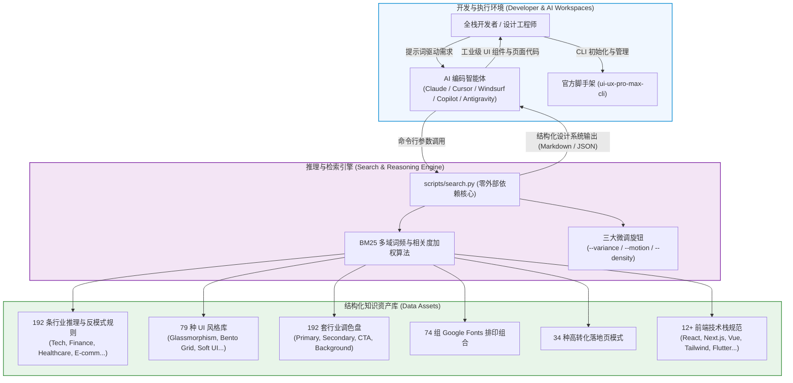

# UI/UX Pro Max 智能体技能技术文档套件总览 (Suite Overview)

| 属性 | 详情 |
| :--- | :--- |
| **文档类型** | 智能体技能全景实战套件 (Agent Skill Suite) |
| **当前状态** | 已归档 (Accepted) |
| **作者** | Ateng |
| **创建日期** | 2026-09-29 |
| **关联系统/模块** | Ateng-Agent / UI/UX Pro Max 技能中心 |
| **所属体系** | [Ateng-AI 技能中心大厅](../index.md) |
| **适用基准** | Node.js >= 18 / Python >= 3.8 / ui-ux-pro-max-cli >= 2.0.0 |
| **代码仓库** | [nextlevelbuilder/ui-ux-pro-max-skill](https://github.com/nextlevelbuilder/ui-ux-pro-max-skill) |

---

## 1. 技能背景与核心定位 (Background & Positioning)

在现代全栈开发与 AI 辅助编程领域，虽然诸如 Claude Code、Cursor、Windsurf、GitHub Copilot 等智能体在生成业务逻辑和基础代码方面表现优异，但在前端 UI/UX 设计决策上长期存在“**自由猜测与样式同质化**”的痛点：
- **色彩与反差失范**：随意采用刺眼的荧光色或低对比度配色，极易破坏 WCAG 2.1 无障碍规范；
- **风格单一与同质**：倾向于生成千篇一律的通用白底卡片或全屏“AI 紫色渐变”，缺乏针对垂直行业的排版美感；
- **组件动效割裂**：随意堆砌非线性的动画持续时间，缺乏对用户偏好（如 `prefers-reduced-motion`）与平台调性的感知。

**UI/UX Pro Max Skill** 由 Next Level Builder 开源推出，是专为 AI 编码智能体设计的一套“**领域设计智能外脑 (Design Intelligence Skill)**”。它依托由 192 条行业推理规则、79 种可检索风格、192 套行业配色、74 组字体搭配与 34 种经过市场验证的落地页模式构成的本地结构化知识库，使 AI 编程助手在输出代码前，能够先执行多维度上下文召回与确定性推理，从而生成工业级、符合设计系统规范且高度适配目标技术栈的专业界面。

---

## 2. 架构全景拓扑 (System Topology)

本套件涵盖开发者、主流 AI 编码环境、本地 Python 检索核心与结构化知识资产之间的完整交互链路：

---

## 3. 全套件交付模块导航矩阵 (Suite Navigation)

为了帮助开发团队与架构师分层掌握该技能的内部原理、环境配置与落地实战，套件划分为以下核心模块：

| 模块序号 | 交付物模块 | 核心内容定位 | 相对直达链接 |
| :---: | :--- | :--- | :--- |
| **01** | 核心概念与设计推理架构 | 解构 192 条规则、79 种风格、调色排印体系与零依赖 BM25 检索引擎算法 | [01-overview-and-architecture.md](./01-overview-and-architecture.md) |
| **02** | 全平台安装与智能体集成指南 | `ui-ux-pro-max-cli` 部署、Claude Code / Cursor / Copilot / Antigravity 接入及版本同步 | [02-installation-and-integration.md](./02-installation-and-integration.md) |
| **03** | 检索实战、开发范式与质检清单 | `search.py` 完整选项、3 大微调旋钮、4 步 AI 工作流、反模式防御、8 项质检清单及**全套件事实依据收口** | [03-search-engine-and-best-practices.md](./03-search-engine-and-best-practices.md#5-权威参考资料与事实依据-references--grounding) |

---

## 4. 推荐阅读路线 (Recommended Reading Routes)

根据工程实施中的不同角色与目标，推荐按以下路线快速切入：

- 🚀 **快速上手实操线 (敏捷开发者)**：
  直达 `[02 全平台安装与智能体集成指南](./02-installation-and-integration.md)` 安装 CLI 并挂载至当前 IDE -> 阅读 `[03 检索实战、开发范式与质检清单](./03-search-engine-and-best-practices.md)` 掌握 `--design-system` 指令与 8 项交付前质检清单。
- 📐 **架构评估与知识库定制线 (前端架构师 / Tech Lead)**：
  通读本总览 -> 深入 `[01 核心概念与设计推理架构](./01-overview-and-architecture.md)` 剖析数据文件结构与 BM25 算法机制 -> 评估将企业内部设计规范注入本地知识库的可行性。
- 🎨 **设计规范与合规审查线 (UI/UX 设计师 / QA 工程师)**：
  重点查阅 `[01 核心概念与设计推理架构](./01-overview-and-architecture.md)` 的风格与配色分类 -> 阅读 `[03 检索实战、开发范式与质检清单](./03-search-engine-and-best-practices.md)` 的行业反模式清单与 WCAG 2.1 对比度标准。

---

## 5. 全局事实依据收口说明 (Grounding Note)

为保证整个技术文档套件的规范性与便携性，前序各业务文档（`01` 与 `02`）在正文一律采用标准外部行内超链接，免除文末冗余参考文献章节。

本套件引用的所有 GitHub 官方仓库源码、npm 发行包版本元数据、技术栈规范基线及事实核查矩阵，统一收敛归档于第三篇章的末尾：
👉 **详见 [03-search-engine-and-best-practices.md 权威参考资料与事实依据](./03-search-engine-and-best-practices.md#5-权威参考资料与事实依据-references--grounding)**。
